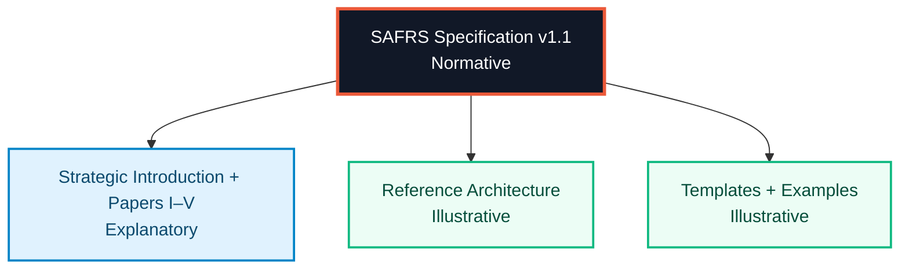
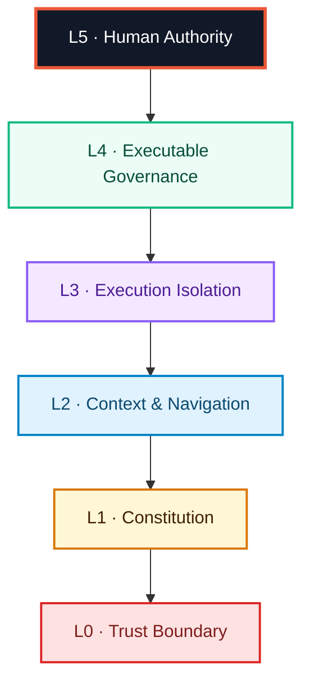
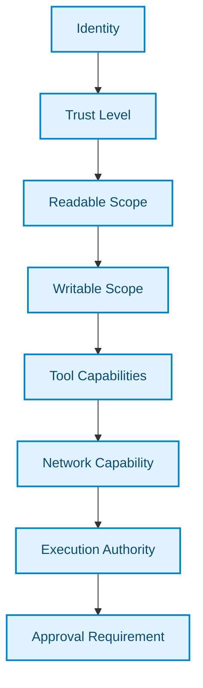
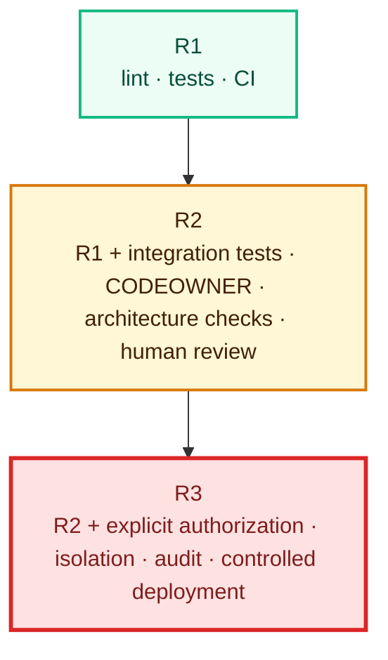
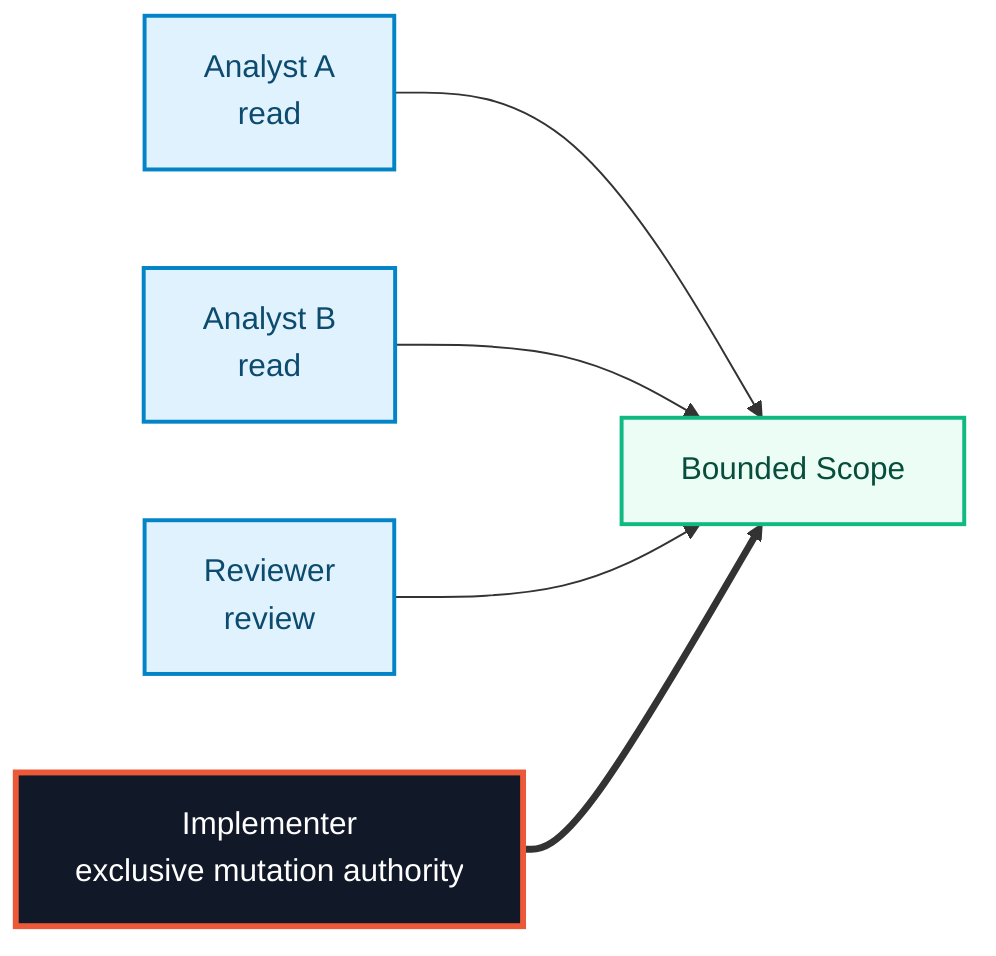

<!--
  Sentra Agent-First Repository Standard (SAFRS) v1.1
  Sentra Artificial Intelligence
  Human-Governed · Agent-Executed · Machine-Enforced

  This README is an explanatory repository entrypoint.
  It does not replace the normative SAFRS Specification.
-->


### Repository Governance for AI-Native Software Engineering

**Sentra Artificial Intelligence**

<p>
  <strong>Human-Governed · Agent-Executed · Machine-Enforced</strong>
</p>

<p>
  <a href="#executive-summary"><strong>Executive Summary</strong></a>
  ·
  <a href="#six-layer-architecture"><strong>Architecture</strong></a>
  ·
  <a href="#risk-model"><strong>Risk Model</strong></a>
  ·
  <a href="#multi-agent-execution-protocol"><strong>Execution</strong></a>
  ·
  <a href="#conformance-levels"><strong>Conformance</strong></a>
  ·
  <a href="#adoption-path"><strong>Adoption</strong></a>
</p>

</div>

---

> [!IMPORTANT]
> This README is an **explanatory repository entrypoint**, not the normative
> standard. SAFRS documentation follows an authority hierarchy:
> **Specification → Explanatory Papers → Illustrative Reference Material**.
> If this README, an essay, a template, or an example conflicts with the
> SAFRS Specification, **the specification prevails**.

## Executive Summary

**SAFRS — the Sentra Agent-First Repository Standard — defines how a software
repository should be structured, governed, and enforced when autonomous
Artificial Intelligence agents perform a substantial share of engineering
work.**

SAFRS starts from one operational premise:

> **Repository structure is a security and governance control, not a matter of
> taste.**

A disorganized repository already creates friction for human engineering teams.
When autonomous agents are allowed to read, decide, modify, execute, and
coordinate inside that repository, the same ambiguity can become a control
failure: an agent can make the correct technical change under the wrong
authority, cross a risk boundary without escalation, act on injected
instructions, or create individually valid changes that become incoherent when
combined.

SAFRS v1.1 addresses that problem through five coupled mechanisms:

1. a **six-layer repository architecture** from Trust Boundary to Human Authority;
2. a **role-based permission model** in which capability never implies trust;
3. a **four-tier risk model** with cumulative mandatory controls;
4. a **multi-agent execution protocol** with explicit task states and one
   mutation owner per bounded scope;
5. a **knowledge governance model** that distinguishes current architecture,
   historical decisions, execution plans, Git history, and running code.

The same architecture is applied at four cumulative assurance levels:
**SAFRS Core**, **Controlled**, **Secure**, and **Regulated**.

| Dimension | Definition |
| --- | --- |
| Standard | Sentra Agent-First Repository Standard |
| Version | SAFRS v1.1 |
| Organization | Sentra Artificial Intelligence |
| Domain | AI-native software repository governance |
| Primary control surface | Repository topology, permissions, execution, CI, documentation |
| Trust principle | Capability does not grant authority |
| Risk tiers | R0 · R1 · R2 · R3 |
| Conformance levels | Core · Controlled · Secure · Regulated |
| Multi-agent invariant | One mutation owner per bounded scope |
| Governance apex | Non-delegable human authority |
| Documentation rule | At most one CANONICAL document per subject |
| Strategic posture | Human-Governed · Agent-Executed · Machine-Enforced |

## Standard Thesis

> An AI-native repository becomes governable when authority, scope, risk,
> execution, verification, and knowledge are explicit enough to be inspected by
> humans and enforced by machines.

SAFRS does not attempt to make agents inherently trustworthy. It makes their
authority **bounded, visible, and auditable**.

The distinction matters:

```text
Capability ≠ Trust
Role       ≠ Identity
Role       ≠ Model
Role       ≠ Vendor
Context    ≠ Permission
Plan       ≠ Architecture
Automation ≠ Human Authority
```

A stronger model may produce better code. That does not justify a larger blast
radius.

## Table of Contents

- [Executive Summary](#executive-summary)
- [Standard Thesis](#standard-thesis)
- [Why SAFRS Exists](#why-safrs-exists)
- [Authority and Documentation Hierarchy](#authority-and-documentation-hierarchy)
- [Design Principles](#design-principles)
- [Six-Layer Architecture](#six-layer-architecture)
- [Trust and Permission Model](#trust-and-permission-model)
- [Agent Roles](#agent-roles)
- [Risk Model](#risk-model)
- [Mandatory Controls](#mandatory-controls)
- [Risk Escalation](#risk-escalation)
- [Multi-Agent Execution Protocol](#multi-agent-execution-protocol)
- [Task Contract](#task-contract)
- [Single-Writer Rule](#single-writer-rule)
- [Knowledge Governance](#knowledge-governance)
- [Executable Governance](#executable-governance)
- [Security Model](#security-model)
- [Conformance Levels](#conformance-levels)
- [Relationship to External Frameworks](#relationship-to-external-frameworks)
- [Adoption Path](#adoption-path)
- [What SAFRS Is Not](#what-safrs-is-not)
- [Known Limitations](#known-limitations)
- [Documentation Architecture](#documentation-architecture)
- [Contributing](#contributing)
- [License and Authority](#license-and-authority)
- [Stewardship](#stewardship)

## Why SAFRS Exists

Coding-agent guidance such as `AGENTS.md` can tell an agent where to look, how
a project is organized, and which commands are useful. That is necessary, but
it does not answer the governance questions that become critical once an agent
can act:

- What may this agent read?
- What may it modify?
- What may it execute?
- Which tools and network destinations may it reach?
- Which changes require human authorization?
- What happens when an R1 task becomes an R2 task during implementation?
- If several agents work in parallel, who owns mutation authority?
- When code and documentation disagree, which artifact is authoritative?
- How can an organization later prove who authorized a high-impact action?

SAFRS treats these as repository-level governance problems.

### Failure Modes SAFRS Is Designed Against

| Failure mode | Example | SAFRS response |
| --- | --- | --- |
| Structural ambiguity | A test fix silently becomes a schema change | Risk classification + mandatory escalation |
| Capability mistaken for trust | A better model receives broader write scope | Role-bound permission envelope |
| Parallel correctness, aggregate incoherence | Several agents produce clean but incompatible changes | Single-writer mutation authority |
| Epistemic drift | Agents follow stale architecture documents | Document lifecycle + canonicality |
| Context-surface injection | Issue, README, dependency, or tool output carries instructions | Trust boundary + constitutional precedence + isolation |
| Unprovable authorization | Git shows the change but not the governing approval | Task contract + audit + human gates |

## Authority and Documentation Hierarchy

SAFRS uses three documentation tiers.

| Tier | Artifact | Function | Authority |
| --- | --- | --- | --- |
| **Normative** | SAFRS Specification v1.1 | Defines requirements | Binding |
| **Explanatory** | Strategic Introduction and Papers I–V | Explains reasoning | Non-binding |
| **Illustrative** | Reference architecture, examples, templates | Demonstrates implementation | Non-binding |



The precedence rule is simple:

```text
SPECIFICATION
    ↓
EXPLANATORY MATERIAL
    ↓
ILLUSTRATIVE MATERIAL
```

The specification always wins.

## Design Principles

SAFRS v1.1 is organized around ten design principles.

| Principle | Decision |
| --- | --- |
| **P1 · Repository topology is a control surface** | Structure is normative, not merely stylistic |
| **P2 · Trust is orthogonal to capability** | Better model performance never grants more authority |
| **P3 · Roles are vendor-neutral abstractions** | Permissions bind to roles, not vendors or models |
| **P4 · Risk is a property of consequence** | Impact, reversibility, privilege, blast radius, and data sensitivity dominate |
| **P5 · Exactly one mutation owner per bounded scope** | Parallel analysis is allowed; uncontrolled parallel writes are not |
| **P6 · Documents are distinct epistemic objects** | ADRs, architecture, plans, Git history, and code carry different kinds of truth |
| **P7 · Governance must be executable** | Machine-checkable controls belong in CI |
| **P8 · Conformance is graduated** | Core, Controlled, Secure, and Regulated are cumulative |
| **P9 · Human authority is non-delegable** | High-impact authority cannot be granted by automation |
| **P10 · Simplicity is a control** | A usable standard is safer than an over-engineered standard nobody adopts |

## Six-Layer Architecture

A SAFRS-compliant repository is governed through six layers.



The organizing rule is:

> **Constraint descends. Authority ascends.**

| Layer | Purpose | Typical contents | Failure without it |
| --- | --- | --- | --- |
| **L0 · Trust Boundary** | Define the repository perimeter | External dependencies, tool endpoints, MCP servers, network destinations, trusted/untrusted inputs | No principled way to constrain external input or egress |
| **L1 · Constitution** | Define non-negotiable repository rules | Prohibitions, authority hierarchy, risk policy, escalation rules | Every rule becomes contextual and negotiable |
| **L2 · Context & Navigation** | Tell agents where things are | `AGENTS.md`, capsule routing, ownership pointers, test/build entrypoints | Agents explore broadly and consume noisy context |
| **L3 · Execution Isolation** | Make scope enforceable | Worktrees, environment separation, credential isolation, resource and egress controls | Scope remains advisory |
| **L4 · Executable Governance** | Enforce mechanically decidable rules | Tests, lint, architecture checks, security checks, documentation integrity, verification integrity | Governance depends on reviewer vigilance |
| **L5 · Human Authority** | Preserve non-delegable authority | R3 authorization, constitutional amendment, incident declaration, conformance changes | Governance becomes a closed machine-controlled loop |

### L0 · Trust Boundary

Every external dependency, tool, MCP server, network destination, and input
channel extends the effective attack surface. SAFRS therefore treats them as
part of repository governance, not as incidental tooling.

### L1 · Constitution

The constitution is intentionally small, human-authored, and non-negotiable.

It should contain rules that remain true regardless of the task, model, prompt,
or tool being used. An agent must not be able to modify the constitution that
constrains it.

### L2 · Context & Navigation

Navigation tells an agent **where** to look. It does not grant permission to act.

This distinction is fundamental:

```text
Navigation answers:    Where is the relevant surface?
Permission answers:    May this role act on that surface?
```

### L3 · Execution Isolation

A permission model is not real if the process can still reach everything.

L3 converts a declared scope into an enforceable boundary through isolated
worktrees, environments, credentials, resources, and network access.

### L4 · Executable Governance

A rule that can be mechanically checked should not depend on memory or review
culture.

### L5 · Human Authority

L5 is the layer no automated system may occupy.

Certain acts are intentionally non-delegable: R3 approval, constitutional
change, incident declaration, conformance-level change, and other actions whose
consequences exceed acceptable autonomous authority.

## Trust and Permission Model

Permission in SAFRS is derived rather than assigned ad hoc.



The combined result is the **permission envelope**.

The permission envelope belongs to a **role occupying a task**. It does not
belong to a model, vendor, or chat session.

### Permission Envelope

```text
Permission Envelope
├── readable scope
├── writable scope
├── tool capability
├── network capability
├── execution authority
└── approval requirement
```

A role cannot write outside its readable scope, invoke undeclared tools, reach
unapproved network destinations, or perform an action above its approval
authority.

## Agent Roles

| Role | Read | Write | Tools | Network | Typical approval |
| --- | --- | --- | --- | --- | --- |
| **Observer** | Repository-wide | None | Read-only | None | None |
| **Analyst** | Repository-wide | None | Analysis and search | Restricted | None |
| **Implementer** | Task scope + dependencies | Task scope only | Build, test, VCS | Restricted | PR review |
| **Reviewer** | Task scope + related | Review artifacts only | Analysis, test | None | None |
| **Maintainer** | Repository-wide | Broad, policy-bounded | Broad | Restricted | Per risk tier |
| **Release Agent** | Release artifacts | Release artifacts | Build, sign, publish | Controlled egress | Explicit human |
| **Security Agent** | Repository-wide, including sensitive surfaces | Security findings only | Scanning, analysis | Controlled | None for findings |

Two asymmetries are deliberate.

First, **read authority is not write authority**. Most analytical work should not
require mutation capability.

Second, a **Security Agent may detect but not silently remediate**. Broad read
scope combined with broad mutation scope would create the ability to both
introduce and conceal a security issue.

## Risk Model

SAFRS classifies risk by consequence rather than diff size.

```text
Impact
  × Reversibility
  × Privilege
  × Blast Radius
  × Data Sensitivity
```

The expression is conceptual, not a numeric formula in v1.1. The factors
compound. A maximum on one factor can dominate the classification.

| Tier | Definition | Typical examples | Human authorization |
| --- | --- | --- | --- |
| **R0** | Read-only | Search, analysis, dependency inspection | None |
| **R1** | Reversible local change | Unit test, local refactor, internal helper rename | Usually not required |
| **R2** | Boundary-affecting change | Database migration, dependency change, public API change, authorization middleware | Required |
| **R3** | High-impact action | Production deployment, credential rotation, critical clinical logic | Mandatory explicit authorization |

### Worked Classification Examples

```text
Rename internal helper              → R1
Add database migration              → R2
Modify authorization middleware     → R2
Rotate production secrets           → R3
Modify critical clinical algorithm  → R3
```

The amount of code is not the measure of risk.

## Mandatory Controls

Controls are cumulative.



### R1

- lint;
- relevant tests;
- continuous integration.

### R2

All R1 controls, plus:

- integration tests;
- CODEOWNER approval;
- architecture conformance checks;
- human review.

### R3

All R2 controls, plus:

- explicit human authorization;
- isolated execution;
- audit record;
- controlled deployment.

## Risk Escalation

Risk classification is provisional at task creation and may only move upward
during execution.

> [!CAUTION]
> If an agent begins an R1 task and discovers that the correct fix requires an
> R2 or R3 action, execution must stop. The task must be reclassified and
> re-authorized before work continues.

This rule prevents the dangerous case in which a low-risk task quietly becomes a
higher-risk task without changing its permission envelope.

```mermaid
flowchart LR
    R1["R1 Task"]
    Discover["Boundary-Affecting Requirement Discovered"]
    Stop["Stop Execution"]
    Reclassify["Reclassify to R2/R3"]
    Human["Human Review / Authorization"]
    Resume["Resume Under New Envelope"]

    R1 --> Discover --> Stop --> Reclassify --> Human --> Resume

    classDef task fill:#E0F2FE,stroke:#0284C7,color:#0C4A6E,stroke-width:2px;
    classDef gate fill:#FEE2E2,stroke:#DC2626,color:#7F1D1D,stroke-width:3px;
    classDef approval fill:#ECFDF5,stroke:#10B981,color:#064E3B,stroke-width:2px;

    class R1,Discover,Reclassify task;
    class Stop gate;
    class Human,Resume approval;
```



## Multi-Agent Execution Protocol

The primary multi-agent risk is not necessarily one agent being wrong. It is
several agents being locally correct while the combined result becomes
architecturally incoherent.

SAFRS addresses this with explicit lifecycle state, bounded ownership, and
atomic handoff.

### Task Lifecycle

```text
PROPOSED
   ↓
CLAIMED
   ↓
PLANNED
   ↓
EXECUTING
   ↓
VERIFYING
   ↓
REVIEW
   ↓
MERGED
   ↓
CLOSED
```

Exceptional or blocking states:

```text
BLOCKED · CONFLICT · FAILED · ABORTED · SUPERSEDED
```

The state model must be queryable. A governance system should be able to answer
which agent owns mutation authority over a capsule at a given time.

## Task Contract

Every task carries an explicit contract.

The serialization format is an implementation choice; the logical content is
the governance requirement.

```yaml
task:
  id: STMS-142
  agent_role: implementer

  scope:
    - projects/stms/attendance/**

  dependencies:
    - STMS-137

  risk: R2

  allowed_actions:
    - read
    - modify
    - test
    - create_pr

  forbidden_actions:
    - merge
    - deploy
```

Explicit `forbidden_actions` are important because silence is ambiguous. A
prohibition should remain visible and auditable.

## Single-Writer Rule

> **Only one agent may hold mutation authority over a bounded task scope at a
> time.**

Many agents may:

- read;
- analyze;
- test;
- review;
- propose alternatives.

Only one may mutate the same bounded scope at a time.



When ownership transfers from Implementer to Reviewer or Reviewer to Maintainer,
the permission envelope changes atomically. The outgoing role does not retain
write authority “just in case.”

## Knowledge Governance

SAFRS treats documentation as governed knowledge rather than undifferentiated
files.

### Epistemic Objects

| Object | Question answered | Authority |
| --- | --- | --- |
| **Architecture documentation** | How does the system work now? | Current truth |
| **ADR** | Why was this decision made? | Historical and immutable once accepted |
| **Execution plan** | How will this change be performed? | Time-bounded; expires on completion |
| **Git history** | What changed and when? | Evidential |
| **Code** | What actually runs? | Ground truth |

A completed plan is not current architecture. A superseded ADR is not a current
decision.

### Document Lifecycles

```text
Documents
DRAFT → ACTIVE → CANONICAL → SUPERSEDED → ARCHIVED

Execution Plans
ACTIVE → COMPLETED → ARCHIVED

Architecture Decision Records
PROPOSED → ACCEPTED → SUPERSEDED
                   ↘ REJECTED
```

### Canonicality Rule

> **At most one document may hold CANONICAL status for any given subject.**

Two canonical documents describing the same subject create a governance
failure, because an agent has no principled basis for choosing between them.

## Executable Governance

SAFRS requires machine-checkable rules to be machine-enforced.

### CI Can Enforce

- broken documentation links;
- invalid ADR references;
- multiple CANONICAL documents for one subject;
- missing architecture updates when protected surfaces change;
- stale references to deleted modules;
- invalid `AGENTS.md` routing;
- missing project README files;
- orphan ACTIVE plans with no owning task;
- missing or unknown governance status;
- missing CODEOWNER coverage for sensitive paths;
- relevant tests and lint;
- architecture and security checks;
- verification-integrity checks.

### CI Cannot Enforce

CI cannot determine whether a document is **semantically true**.

It can verify that an architecture document changed when required. It cannot
prove that the updated document accurately describes the system.

Structural enforcement reduces drift. Human review remains necessary.

## Security Model

SAFRS uses established security frameworks as external anchors instead of
inventing a parallel threat taxonomy.

| Area | Threat | SAFRS control |
| --- | --- | --- |
| **Secrets** | Credential leakage into context or output | L3 credential isolation; secrets excluded from agent-readable scope |
| **Supply chain** | Compromised dependency or build | L0 declaration + provenance requirements at higher conformance levels |
| **MCP / tools** | Over-broad tool capability | Tool trust bound to role and trust level |
| **Prompt injection** | Instructions injected through context surfaces | L1 precedence, L0 input classification, bounded permissions |
| **Data exfiltration** | Broad read scope combined with egress | Network capability constrained independently of tool capability |
| **Credential reach** | Agent reaches credentials outside task scope | Worktree and environment isolation |

### Containment, Not a Claim of Prevention

SAFRS does **not** claim to solve prompt injection.

Its repository-layer objective is to bound the consequence:

- injected instructions cannot expand the role's permission envelope;
- L3 isolation still constrains execution;
- R2 changes still require review;
- R3 actions still require explicit human authorization.

The security posture is **containment plus least privilege**, not a claim of
perfect prevention.

## Conformance Levels

SAFRS uses graduated conformance rather than a binary “compliant / not
compliant” label.

| Level | Requires | Intended for |
| --- | --- | --- |
| **SAFRS Core** | Repository topology, constitution, agent navigation, basic governance | Internal tools, low-consequence systems, early adoption |
| **SAFRS Controlled** | Core + risk tiers, CI enforcement, permission boundaries | Production systems with reversible consequences |
| **SAFRS Secure** | Controlled + execution sandboxing, credential isolation, supply-chain provenance, security controls | Systems handling sensitive data or privileged access |
| **SAFRS Regulated** | Secure + full auditability, mandatory human gates, data governance, domain-specific controls | Clinical, safety-critical, and regulated environments |

Each level is cumulative.


The architecture stays consistent. The assurance intensity changes.

## Relationship to External Frameworks

SAFRS is designed as a **repository implementation layer**, not as a competitor
to organizational, regulatory, application-security, or supply-chain
frameworks.

| External framework | Primary governance surface | SAFRS relationship |
| --- | --- | --- |
| **ISO/IEC 42001** | Organizational AI management system | Repository-level operational evidence can support organizational AI governance |
| **EU AI Act** | High-risk AI systems | SAFRS Regulated is designed to support logging, oversight, documentation, and auditability needs |
| **OWASP guidance for LLM / GenAI security** | Application and model risk | SAFRS constrains repository-layer authority and blast radius |
| **SLSA** | Build and source provenance | SAFRS can bind provenance requirements to conformance level |
| **AGENTS.md** | Agent context and navigation | SAFRS uses agent navigation as L2 and adds trust, risk, isolation, governance, and human authority |

External standards and regulatory statements are time-sensitive and should be
re-verified before external publication or compliance claims.

## Adoption Path

For a team starting from a conventional repository, SAFRS v1.1 recommends
adoption in this order.

1. **Declare the trust boundary — L0.** Enumerate external dependencies, tools,
   MCP servers, and permitted network destinations.
2. **Write the constitution — L1.** Keep it concise; non-negotiables only.
3. **Establish navigation — L2.** Root and per-capsule, human-authored.
4. **Classify existing surfaces by risk.** Identify R2 and R3 surfaces and attach
   ownership controls.
5. **Turn on inexpensive CI checks — L4.** Broken links, canonical uniqueness,
   orphan plans, missing CODEOWNERS, and other structural checks.
6. **Add execution isolation — L3.** Worktrees, environment separation,
   credential isolation, and bounded egress.
7. **Formalize task contracts and lifecycle.** Do this after the underlying
   trust and execution controls are stable.
8. **Declare a conformance level and hold the repository to it.**

> [!NOTE]
> The source concept document describes steps 1–5 as the practical SAFRS Core
> entry point. Steps 6–8 progressively add the controls associated with higher
> assurance.

### Adoption Sequence


## What SAFRS Is Not

SAFRS should not be represented as:

- a certification scheme;
- a model evaluation benchmark;
- a replacement for security engineering;
- a replacement for ISO/IEC 42001;
- a replacement for the EU AI Act or sector-specific regulation;
- a replacement for SLSA;
- a guarantee against prompt injection;
- a claim that every autonomous agent is safe;
- a mandate to govern every repository at the highest possible intensity.

Its scope is narrower: **repository-level governance for agentic software
engineering**.

## Known Limitations

SAFRS v1.1 explicitly acknowledges unresolved questions.

| Limitation | Current boundary |
| --- | --- |
| No controlled empirical validation yet | v1.1 is a design standard; claims about drift reduction remain to be measured |
| Risk classification remains partly judgmental | The five-factor derivation is conceptual, not a numeric decision function |
| Agent identity is asserted, not cryptographically proven | Role attestation remains a future design question |
| Single-writer may be stricter than necessary | Finer-grained safe partitioning requires evidence before relaxation |
| Cross-capsule tasks are underspecified | Ownership across multiple bounded scopes needs a cleaner protocol |
| CI checks are structural, not semantic | Human review remains necessary for truthfulness |
| Prompt injection is contained, not solved | Least privilege and isolation limit consequence |
| Conformance is self-assessed | Independent verification is not defined in v1.1 |

These are candidates for future revision, not hidden implementation assumptions.

## Documentation Architecture

SAFRS separates authoritative requirements from explanation and implementation
examples.

### Asset Model

```text
SAFRS Specification v1.1
│
├── Strategic Introduction
├── Papers I–V
├── Reference Architecture
├── Templates
└── Conformance Checklist
```

### Explanatory Paper Sequence

| Paper | Subject | Defines |
| --- | --- | --- |
| **Paper I** | Repository topology | The system |
| **Paper II** | Trust, identity, authority, permission | Who may act |
| **Paper III** | Risk tiers and mandatory controls | When they may act |
| **Paper IV** | Multi-agent coordination | How agents act together |
| **Paper V** | Documentation lifecycle and CI governance | How knowledge stays trustworthy |

The conceptual progression is:

```text
TOPOLOGY → TRUST → RISK → EXECUTION → KNOWLEDGE
```

### Documentation Governance Rule

The README is a discovery surface. It must remain concise enough to orient
humans and agents without becoming a shadow specification.

Normative requirements belong in the specification.

Detailed reasoning belongs in the explanatory papers.

Implementation examples belong in reference material and templates.

## Contributing

Changes to SAFRS should preserve its authority hierarchy and knowledge
lifecycles.

Minimum contribution workflow:

1. identify whether the change is **normative**, **explanatory**, or
   **illustrative**;
2. identify the affected architecture, trust, risk, execution, security, or
   knowledge-governance surface;
3. classify the change risk before editing;
4. preserve the single-writer rule for the bounded mutation scope;
5. update the canonical architecture documentation when current behavior
   changes;
6. create a new ADR instead of modifying a merged historical decision;
7. run all applicable documentation, architecture, security, lint, and test
   checks;
8. escalate immediately if the required work crosses into a higher risk tier;
9. obtain explicit human authorization for R3 actions and constitutional
   changes.

> [!IMPORTANT]
> A contribution must not weaken or bypass the controls used to verify that
> contribution.

## License and Authority

SAFRS v1.1 is an official concept and standards-development work of
**Sentra Artificial Intelligence**.

The exact license, redistribution rights, trademark policy, certification use,
and external conformance-claim policy should be defined by the authoritative
repository policy before public distribution.

Until such policy is explicitly declared, this README must not be interpreted as
granting certification rights or permission to represent third-party systems as
independently verified SAFRS conformant.

## Stewardship

**Dr. Ferdi Iskandar**  
Lead, CEO & Full Stack Developer  
Sentra Artificial Intelligence

For standards interpretation, repository governance, or formal conformance
questions, use the approved Sentra governance channel associated with the
authoritative SAFRS repository.

---

<div align="center">

### Sentra Agent-First Repository Standard · SAFRS v1.1

**Constraint descends. Authority ascends.**

**Human-Governed · Agent-Executed · Machine-Enforced**

</div>
