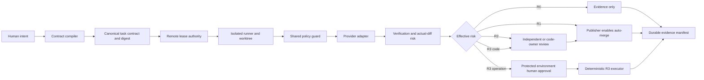

# SAFRS Full Automation Implementation Plan

**Status:** ACTIVE — Phases 1-5 merged; Phases 6-8 are blocked on Chief's Activation Decisions

> **For agentic workers:** REQUIRED SUB-SKILL: Use `superpowers:subagent-driven-development` (recommended) or `superpowers:executing-plans` to implement this plan task-by-task. Steps use checkbox (`- [ ]`) syntax for tracking.

**Goal:** Deliver the governed end-state `human intent -> machine task contract -> exclusive claim -> isolated agent execution -> automatic verification -> risk-based approval -> safe publish/execute -> durable evidence`.

**Architecture:** Extend the existing repository-owned Control Plane v1 instead of creating a competing task system. GitHub is the remote coordination and approval plane; repository code owns canonical contracts, policy evaluation, deterministic verification, evidence generation, and vendor-neutral adapters. Coding agents never hold merge or production-execution authority.

**Tech Stack:** Node.js 24 ESM, pnpm 11, Python 3 governance checks, JSON Schema 2020-12, Git worktrees, GitHub Actions, GitHub rulesets, CODEOWNERS, protected environments, and content-addressed JSON evidence.

## Global Constraints

- Implement from a clean sibling worktree based on the then-current `origin/main`; never use a dirty checkout.
- Use PowerShell on Windows and `pnpm` for all package operations.
- Keep repository documentation and identifiers in concise English.
- Preserve SAFRS v1.1, the existing lifecycle, and the current `tools/task` shared-registry model.
- Treat changes to policy, CI, agent guards, GitHub controls, shared schemas, and verification as R2.
- Treat production execution, credentials, security boundaries, financial actions, and safety-critical actions as R3.
- Do not modify `.agents/knowledge/**`.
- Do not add a dependency without Chief approval and an approved tool-inventory entry.
- Pin every GitHub Action to an immutable 40-character commit SHA.
- Never use `curl | sh`, mutable installer tags, unrestricted autonomous modes, `pull_request_target` with untrusted code, or agent-accessible production credentials.
- Every phase is a separate reviewed PR and must preserve all controls delivered by earlier phases.
- Any phase that changes implementation and its governing verification in the same change requires independent verification-integrity review bound to the exact change set.

---

## 1. Scope and Completion Definition

This plan covers the complete automation control plane, from intent submission through publication or separately authorized execution. It is complete only when all eight phases have landed, live GitHub negative tests pass, R0/R1/R2/R3 simulations pass, and the repository can produce durable evidence for every decision.

The end-state behavior is:

- **R0:** The system may inspect and report. It cannot create a mutating run, branch, PR, merge, deployment, or external side effect.
- **R1:** A valid routine task is claimed exclusively, executed in isolation, verified, opened as a PR, and merged automatically by the publisher after every required gate passes. No human approval is required.
- **R2:** A sensitive task follows the R1 path but stops at `REVIEW`. A current independent/code-owner approval bound to the exact head SHA and diff digest is mandatory. After approval and all gates pass, the publisher enables auto-merge; the coding agent does not merge.
- **R3:** An agent may prepare code, artifacts, a deterministic operation contract, dry-run evidence, and rollback instructions. It cannot execute the consequential operation. Execution requires a named authorized human to approve the exact pending GitHub protected-environment job whose immutable inputs include task ID, commit SHA, operation digest, target, expiry, and idempotency key. Any mismatch, new commit, changed operation, expiry, revocation, or target drift invalidates the approval and requires a new human approval.

## 2. Established Facts at the Planning Baseline

Baseline inspected: `origin/main` at `2f1a1b05851257c66408d79e51ebaae6a3eb6a00` on 2026-08-13.

### Controls already present

- `.safrs/policy.json` defines R0-R3, prepare-only R3, forbidden operations, execution isolation, and autonomous resource-bound dimensions.
- `tools/task` provides local `claim`, `state`, `close`, and `list` commands backed by a Git-common-directory registry and an exclusive file lock.
- `tools/safrs/check_task_ownership.py` validates task shape, safe repository-relative scopes, active overlap, expiry, and coverage of changed paths by the current worktree's claim.
- `tools/status` reports active work, governance status, ownership conflicts, and a plain-language next action.
- `scripts/safrs-verify.sh` and `.ps1` run policy, registry, routing, inventory, topology, action-pin, ownership, sensitive-change, handoff, architecture, and governance tests.
- GitHub workflows are non-deploying, read-only, and SHA-pinned; CI runs governance, lint, typecheck, tests, build, and browser smoke tests.
- `.github/CODEOWNERS` maps R2/R3 paths to `@drferdii`, but its enforcement depends on live GitHub settings.
- `.safrs/reviews/verification-integrity.json` demonstrates one exact-change review-evidence mechanism.
- The declared conformance level is SAFRS Core. The repository explicitly does not claim Controlled, Secure, or Regulated.
- No tracked Droid workflow exists on this baseline. Droid must remain disabled unless Activation Decision 4 selects an exact verified installation method and version.

### Current gaps

- The local task record is not a complete immutable task contract: it lacks operation grants, network/data classification, hard budgets, rollback, verification profile, approval policy, contract digest, and actual-diff risk.
- Ownership is authoritative only for worktrees sharing one Git common directory. There is no remote serialized lease authority for different machines or GitHub runners.
- Local leases have no renewal/heartbeat event log, fencing token, durable terminal event, or automatic safe reconciliation after offline work.
- Adapter hooks differ by provider and do not all enforce one policy decision interface. No parity verdict proves equivalent behavior.
- Runtime, retries, tool calls, model calls, network requests, changed files, diff size, and monetary spend are not enforced as one budget envelope.
- The coding identity is not yet separated from a dedicated publisher identity by a machine-checked contract.
- R1 automatic merge and R2 pause-then-auto-merge behavior are not implemented or live-tested.
- R2 approval is not represented by a canonical record bound to task, head SHA, diff digest, reviewer authority, and expiry.
- R3 has policy language but no inert deterministic executor, operation schema, protected environment, idempotency contract, or approval verifier.
- Evidence is fragmented across Git, workflow logs, task registry state, and review files; there is no content-addressed run manifest linking the entire lifecycle.
- Live GitHub rulesets, required checks, CODEOWNERS enforcement, secret scanning, push protection, dependency controls, code scanning, and drift status are not continuously proven.
- Lifecycle documents can become stale because semantic agreement among task state, PR state, `HANDOFF`, and `PROGRESS` is not fully checked.
- There is no deduplicated incident path for policy drift, stuck runs, orphaned leases, approval mismatch, or evidence-write failure.

## 3. Assumptions and Activation Decisions

### Assumptions used by this plan

- GitHub remains the hosted control plane and supports Actions, rulesets, CODEOWNERS, GitHub Apps or equivalent scoped identities, artifacts, and protected environments.
- `main` remains the protected default branch.
- The first autonomous runner is disposable and has no production network route or production credential.
- Repository automation remains Node ESM plus Python governance checks; no database or dashboard is introduced.
- GitHub issues, checks, workflow runs, artifacts, and repository contracts are sufficient for the first complete version.
- R3 stays inert until a target-specific adapter, dry-run, idempotency rule, postcondition, and tested rollback exist.
- Actual tool/action versions and SHAs are resolved and reviewed during the PR that introduces them; the plan does not approve an unverified external version.

### Four decisions Chief must make before activation

1. **Autonomous provider and budgets:** Choose the first provider/runner and set hard per-run and monthly spend limits. If reliable spend telemetry is unavailable, set the monetary field to `unmetered` and enforce runtime, model-call, tool-call, retry, and concurrency caps.
2. **Control identities:** Approve creation/installation of a read-only control-auditor identity and a separate publisher identity. Their exact GitHub permissions must be reviewed before installation.
3. **R3 authority and retention:** Name the authorized R3 approver and select the retention period for R3 approval, execution, rollback, and incident evidence.
4. **Droid disposition:** Approve an exact verified Droid CLI artifact/version/install method, or keep Droid removed and its adapter `read_only_disabled`.

These choices are activation gates, not implementation blockers for contracts, tests, inert workflows, and dry-run simulations.

## 4. Target Architecture



### Components

1. **Intent ingress:** A SAFRS GitHub issue form and `pnpm saf task submit` collect objective and constraints without granting authority.
2. **Contract compiler:** Canonicalizes paths and fields, resolves requested capabilities against repository policy, computes the contract digest, and rejects ambiguity.
3. **Risk engine:** Computes `effective_risk = max(declared, path, operation, data, capability, actual_diff)`. Agents may raise risk but never lower it.
4. **Lease authority:** A serialized GitHub workflow owns remote claims. Local worktrees retain the existing Git-common registry but must reconcile to a remote fencing token before push.
5. **Isolated executor:** Creates a fresh branch/worktree from the recorded base SHA, provisions disposable resources, and enforces task grants and budgets.
6. **Shared guard:** Returns one vendor-neutral allow/deny/stop decision for filesystem, command, tool, endpoint, environment, and risk checks.
7. **Thin adapters:** Codex, Claude, Cursor, Cline, and Droid translate native events to the shared guard. An adapter without enforceable pre-action hooks remains read-only.
8. **Verification plane:** Produces stable named verdicts for governance, tests, build, security, lifecycle, lease, budgets, approvals, platform state, and evidence integrity.
9. **Approval plane:** Verifies R2 reviews and unlocks a separate R3 protected-environment job only after exact human approval.
10. **Publisher:** A non-agent identity may enable auto-merge only for an exact eligible PR head. It cannot modify source, bypass rules, or deploy.
11. **R3 executor:** A separate identity executes an allowlisted deterministic operation only after approval revalidation. It never accepts free-form shell commands.
12. **Evidence plane:** Writes redacted, content-addressed manifests and artifacts that correlate task, run, attempt, issue, PR, checks, approvals, publication, execution, recovery, and hashes.

## 5. Canonical Schemas and Data Contracts

All schemas use JSON Schema 2020-12, `additionalProperties: false`, UTC timestamps, lowercase SHA-256 hex digests, repository-relative POSIX paths, and explicit schema versions. Canonical JSON for digesting uses UTF-8, lexicographically sorted object keys, preserved array order, no insignificant whitespace, and a trailing newline only in stored files.

### `TaskContractV1`

File: `.safrs/schemas/task-contract.v1.schema.json`

Required fields:

| Field | Contract |
| --- | --- |
| `schema_version` | Literal `1` |
| `task_id` | `TASK-YYYYMMDD-[A-Z0-9-]+` |
| `objective` | Non-empty plain text, maximum 2,000 characters |
| `requester` | Stable human or service identity |
| `accountable_human` | Stable human identity; mandatory for R2/R3 |
| `created_at`, `expires_at` | UTC timestamps; expiry after creation |
| `base_ref`, `base_sha` | Default branch ref and immutable 40-hex commit |
| `declared_risk`, `computed_risk`, `effective_risk` | `R0`, `R1`, `R2`, or `R3` |
| `risk_reasons` | Non-empty array when computed risk exceeds R0 |
| `read_scopes`, `write_scopes` | Normalized repository-relative path prefixes; write scopes empty for R0 |
| `operations` | Allowlisted operation IDs, never raw commands |
| `tools` | Approved tool-inventory IDs and allowed subcommands |
| `network` | `denied` or explicit HTTPS host/port/method entries |
| `data_classification` | `public`, `internal`, `confidential`, or `restricted`; credentials are never contract data |
| `isolation_profile` | Runner class, worktree requirement, disposable resource IDs, and egress policy |
| `budgets` | Runtime, attempts, retries, tool calls, model calls, network requests, changed files, diff lines, concurrent children, and spend |
| `verification_profile` | Stable check IDs required before review/publication/execution |
| `approval_policy` | Exact R0/R1/R2/R3 approval requirements |
| `rollback` | Preservation, revert, cleanup, and target-specific rollback contract IDs |
| `requested_by_evidence` | Issue/comment/event URL and immutable event ID |
| `contract_digest` | SHA-256 of the canonical contract with this field omitted |

Validation rejects absolute paths, `..`, wildcard/negative scopes, symlink escape, Windows case collisions, unknown tools, unapproved endpoints, missing enforceable budgets, expiry beyond policy, risk lowering, and ambiguous operation text.

### `RunContractV1`

File: `.safrs/schemas/run-contract.v1.schema.json`

Required fields: `run_id`, `task_id`, `contract_digest`, `attempt_id`, `provider`, `adapter_version`, `actor_identity`, `base_sha`, `head_sha`, `branch`, `worktree_id`, `lease_id`, `fencing_token`, `runner_class`, `started_at`, `deadline_at`, `budget_snapshot`, `grants_digest`, `heartbeat_at`, `state`, `stop_reason`, `evidence_uri`, and `evidence_digest`.

One task may have multiple attempts. Counters are task-wide unless a budget field explicitly says `per_attempt`; child agents inherit the remaining parent budget and cannot reset counters.

### `LeaseEventV1`

File: `.safrs/schemas/lease-event.v1.schema.json`

Required fields: `event_id`, `sequence`, `event_type`, `task_id`, `lease_id`, `fencing_token`, `actor`, `worktree_id`, `scope_digest`, `scope_prefixes`, `previous_state`, `next_state`, `occurred_at`, `expires_at`, `authority_run_url`, and `event_digest`.

Allowed event types: `CLAIM`, `RENEW`, `TRANSITION`, `RELEASE`, `EXPIRE`, `RECLAIM`. The remote authority increments the fencing token on every successful `CLAIM` or `RECLAIM`. A writer with an older token must stop before modifying or pushing.

### `ApprovalRecordV1`

File: `.safrs/schemas/approval-record.v1.schema.json`

Required fields: `approval_id`, `kind`, `task_id`, `contract_digest`, `subject_sha`, `diff_digest`, `operation_digest`, `target_environment`, `reviewer_identity`, `reviewer_authority`, `author_identity`, `issued_at`, `expires_at`, `source_event_url`, `source_event_id`, `revoked_at`, and `approval_digest`.

Allowed kinds:

- `R2_CODE_OWNER`: a qualifying GitHub approval from a required code owner.
- `R2_INDEPENDENT`: a qualifying designated reviewer who did not author or mutate the subject change.
- `VERIFICATION_INTEGRITY`: required when implementation and governing verification change together.
- `R3_EXECUTION`: a protected-environment approval for one exact deterministic operation.

The verifier rejects self-review, unknown authority, dismissal, revocation, expiry, stale head SHA, changed diff digest, changed contract, changed operation, changed target, or reuse of an R3 approval after its idempotency key reaches a terminal postcondition.

### `EvidenceManifestV1`

File: `.safrs/schemas/evidence-manifest.v1.schema.json`

Required fields: `manifest_id`, `task_id`, `run_id`, `attempt_ids`, `contract_digest`, `lease_event_digests`, `base_sha`, `head_sha`, `diff_digest`, `effective_risk`, `risk_reasons`, `tool_events`, `network_events`, `budget_usage`, `check_verdicts`, `approval_ids`, `publication`, `execution`, `recovery_events`, `artifact_hashes`, `redaction_version`, `created_at`, and `manifest_digest`.

Evidence stores command identifiers, normalized arguments after redaction, exit status, duration, and artifact hashes. It never stores secrets, raw unrestricted prompts, full environment dumps, production payload contents, or unbounded tool output.

### `OperationContractV1`

File: `.safrs/schemas/operation-contract.v1.schema.json`

Required fields: `operation_id`, `adapter_id`, `task_id`, `contract_digest`, `subject_sha`, `target_environment`, `parameters`, `parameters_digest`, `operation_digest`, `dry_run_artifact_digest`, `preconditions`, `postconditions`, `idempotency_key`, `rollback_contract_id`, `requested_at`, `expires_at`, and `status`.

`parameters` must conform to the selected adapter schema. Free-form shell, arbitrary URLs, and user-supplied executable text are forbidden.

### `PlatformAttestationV1`

File: `.safrs/schemas/platform-attestation.v1.schema.json`

Required fields: `repository_id`, `default_branch`, `observed_at`, `observer_identity`, `ruleset_digest`, `required_checks`, `code_owner_review`, `stale_review_dismissal`, `force_push_blocked`, `bypass_actors`, `secret_scanning`, `push_protection`, `dependency_graph`, `dependabot_alerts`, `code_scanning`, `negative_test_evidence`, `expires_at`, and `attestation_digest`.

Publication fails when the latest attestation is missing, expired, reports drift, or has an unapproved bypass actor.

## 6. Exact File Create/Modify Map

### Files to create

| Path | Responsibility |
| --- | --- |
| `.safrs/automation-policy.json` | Machine policy for risk derivation, limits, approval rules, publisher rules, R3 rules, and evidence retention |
| `.safrs/github-controls.json` | Desired GitHub rules, checks, identities, environments, and attestation freshness |
| `.safrs/adapter-capabilities.json` | Enforceable capabilities and activation state for Codex, Claude, Cursor, Cline, and Droid |
| `.safrs/schemas/task-contract.v1.schema.json` | Task contract schema |
| `.safrs/schemas/run-contract.v1.schema.json` | Run contract schema |
| `.safrs/schemas/lease-event.v1.schema.json` | Lease event schema |
| `.safrs/schemas/approval-record.v1.schema.json` | Review/approval schema |
| `.safrs/schemas/evidence-manifest.v1.schema.json` | Evidence schema |
| `.safrs/schemas/operation-contract.v1.schema.json` | Deterministic R3 operation schema |
| `.safrs/schemas/platform-attestation.v1.schema.json` | Live platform attestation schema |
| `.github/ISSUE_TEMPLATE/safrs-task.yml` | Structured human intent ingress |
| `.github/workflows/safrs-task-control.yml` | Serialized remote claim, renewal, transition, release, and reclaim authority |
| `.github/workflows/safrs-pr-gates.yml` | Stable contract/lease/risk/budget/approval/evidence PR checks |
| `.github/workflows/safrs-platform-audit.yml` | Scheduled and pre-publication GitHub control audit |
| `.github/workflows/safrs-autonomous-run.yml` | Disposable R0/R1/R2 orchestration |
| `.github/workflows/safrs-publish.yml` | Publisher-only auto-merge eligibility action |
| `.github/workflows/safrs-r3-execute.yml` | Inert protected-environment R3 execution workflow |
| `.github/workflows/safrs-recovery.yml` | Authorized cancellation, orphan reconciliation, and evidence finalization |
| `tools/automation/AGENTS.md` | Local boundary and verification rules for automation code |
| `tools/automation/package.json` | Workspace scripts without new runtime dependencies |
| `tools/automation/src/cli.mjs` | `pnpm saf` command entry point |
| `tools/automation/src/canonical-json.mjs` | Canonical serialization and digesting |
| `tools/automation/src/contracts.mjs` | Schema loading and contract validation |
| `tools/automation/src/risk.mjs` | Monotonic risk computation and reasons |
| `tools/automation/src/scopes.mjs` | Path normalization, symlink/case checks, overlap checks |
| `tools/automation/src/leases.mjs` | Local/remote lease reconciliation and fencing validation |
| `tools/automation/src/budgets.mjs` | Atomic counters, limits, inheritance, and stop decisions |
| `tools/automation/src/guard.mjs` | Shared policy decision function |
| `tools/automation/src/approvals.mjs` | R2/R3 approval verification |
| `tools/automation/src/evidence.mjs` | Manifest assembly, hashing, and durable finalization |
| `tools/automation/src/redaction.mjs` | Deterministic evidence redaction |
| `tools/automation/src/lifecycle.mjs` | State transitions and cross-surface consistency |
| `tools/automation/src/github.mjs` | Minimal GitHub API client for task, review, check, and platform facts |
| `tools/automation/src/publisher.mjs` | Exact-head publication eligibility and auto-merge request |
| `tools/automation/src/executor.mjs` | Isolated attempt orchestration and stop handling |
| `tools/automation/src/r3.mjs` | Operation validation, approval recheck, idempotency, and postconditions |
| `tools/automation/src/adapters/{codex,claude,cursor,cline,droid}.mjs` | Native-event translators into the shared guard |
| `tools/automation/src/providers/provider.mjs` | Provider interface |
| `tools/automation/src/providers/selected-provider.mjs` | First provider driver selected by Activation Decision 1 |
| `tools/automation/test/*.test.mjs` | Focused contract, risk, scope, lease, budget, guard, approval, evidence, publisher, executor, and R3 tests |
| `tools/safrs/check_automation_policy.py` | Validate policy, schemas, and internal references |
| `tools/safrs/check_task_contract.py` | Validate task/run contracts and actual-diff coverage |
| `tools/safrs/check_adapter_parity.py` | Compare adapter decisions against common fixtures |
| `tools/safrs/check_approval_evidence.py` | Validate approval and evidence bindings |
| `tools/safrs/check_lifecycle.py` | Validate task/PR/HANDOFF/PROGRESS agreement |
| `tools/safrs/check_platform_evidence.py` | Validate current platform attestation |
| `tests/governance/test_automation_contracts.py` | Positive and negative schema/policy fixtures |
| `tests/governance/test_automation_approvals.py` | R2/R3 approval rejection tests |
| `tests/governance/test_automation_platform.py` | Platform drift and freshness tests |
| `tests/fixtures/automation/**` | Versioned valid/invalid R0-R3 contracts and event chains |
| `docs/adrs/0002-safrs-automation-control-plane.md` | Accepted architecture, identity separation, and GitHub control-plane decision |
| `docs/governance/SAFRS_AUTOMATION.md` | Canonical automation behavior |
| `docs/governance/SAFRS_APPROVALS.md` | Canonical R2/R3 approval rules |
| `docs/governance/SAFRS_EVIDENCE.md` | Canonical evidence/redaction/retention rules |
| `docs/governance/SAFRS_AUTOMATION_OPERATIONS.md` | Operator commands and state meanings |
| `docs/runbooks/AUTOMATION_FAILURE_RECOVERY.md` | Cancellation, orphan, drift, and incident recovery |
| `docs/runbooks/R3_EXECUTION.md` | Exact human approval and deterministic execution runbook |
| `docs/evidence/automation/README.md` | Evidence layout and verification instructions |

`tests/fixtures/automation/**` expands to focused files named by behavior, including `valid-r0.json`, `valid-r1.json`, `valid-r2.json`, `valid-r3.json`, `path-escape.json`, `risk-lowering.json`, `stale-approval.json`, `mismatched-operation.json`, `budget-exhausted.json`, and `secret-canary.json`. The implementation PR must list every concrete fixture in its diff; the glob here defines the directory ownership boundary.

### Files to modify

| Path | Required change |
| --- | --- |
| `.safrs/policy.json` | Reference automation policy and add exact remote-authority/publisher/R3 invariants |
| `.safrs/sensitive-paths.json` | Classify all new policies, workflows, automation tools, approval logic, and evidence checkers as verification controls; classify R3 adapters as R3 |
| `.safrs/tool-inventory.json` | Inventory GitHub API, selected provider, runner tools, network endpoints, provenance, versions, and review status |
| `.safrs/document-registry.json` | Register ADR, canonical governance docs, runbooks, and evidence index; regenerate routing only if normativity/scope changes |
| `AGENTS.md` | Add only stable automation rules generated or required by accepted canonical documents |
| `.github/CODEOWNERS` | Assign automation controls, approval rules, publisher workflow, and R3 executor to designated owners |
| `.github/pull_request_template.md` | Add task/contract/lease/evidence fields and R1/R2/R3 declarations |
| `.github/workflows/ci.yml` | Run stable automation checks and preserve evidence without granting write authority |
| `.github/workflows/safrs-governance.yml` | Run all new governance checkers with immutable base/head inputs |
| `package.json` | Add `saf`, `saf:status`, `saf:verify`, and `saf:platform` scripts |
| `scripts/safrs-verify.mjs`, `.ps1`, `.sh` | Add the same deterministic automation checks on every platform |
| `tools/task/src/cli.mjs` | Delegate contract-aware claims/transitions to shared automation modules while preserving current commands |
| `tools/task/src/ownership.mjs` | Add contract digest, fencing token, event-chain, and remote reconciliation invariants |
| `tools/task/src/storage.mjs` | Preserve atomic local registry behavior and add append-only lease event storage |
| `tools/status/src/cli.mjs` | Report contract, lease, budgets, approvals, platform attestation, evidence, and next action |
| `.codex/hooks/guard-tool-use.mjs` | Translate Codex events to the shared guard |
| `.claude/hooks/guard-sensitive-paths.mjs` | Translate Claude events to the shared guard |
| `.cursor/hooks/guard-read-secrets.mjs`, `.cursor/hooks/guard-shell.mjs` | Translate Cursor read/shell events to the shared guard |
| `.cline/hooks/PreToolUse.sh`, `.cline/hooks/PostToolUse.sh` | Replace shell-only enforcement with a pinned Node bridge to the shared guard |
| `.codex/hooks.json`, `.claude/settings.json`, `.cursor/hooks.json` | Route supported native pre/post events through adapter entry points |
| `.safrs/reviews/verification-integrity.json` | Replace the singleton example with the versioned review-record format and exact-change evidence location |
| `docs/governance/SAFRS_AGENT_PERMISSIONS.md` | Document publisher, auditor, and R3 executor identities |
| `docs/governance/SAFRS_CONTROL_MATRIX.md` | Define exact R1/R2/R3 gates and evidence |
| `docs/governance/SAFRS_MULTI_AGENT_PROTOCOL.md` | Define local/remote lease reconciliation, fencing, renewal, and recovery |
| `docs/governance/SAFRS_CONFORMANCE.md` | Claim higher levels only after live evidence satisfies them |
| `docs/governance/PLATFORM_ACTIVATION.md` | Replace manual-only checklist with desired-state application plus retained human authorization and negative tests |
| `.agents/DECISIONS.md` | Append accepted durable decisions after Chief approval |
| `.agents/HANDOFF.md` | Overwrite per implementation session with task, state, evidence, blockers, and next action |
| `.agents/PROGRESS.md` | Update phase status when an implementation area changes |

### Explicitly absent or unchanged

- `.agents/knowledge/**` is never modified by this implementation.
- `.github/workflows/droid-wiki-refresh.yml` remains absent unless Activation Decision 4 approves a separately reviewed exact artifact and installer. If approved, it is introduced in its own R2 PR after adapter parity passes.
- No dashboard, database, queue service, production integration, direct-deploy workflow, or unrestricted agent shell service is added.
- User-owned global Codex model, approval-policy, and sandbox settings remain unchanged.

## 7. Permission and Gate Model

| Risk | Agent execution | Required verification | Approval | Publication or action |
| --- | --- | --- | --- | --- |
| R0 | Read/search/report only; no mutation lease | Contract, scope, tool/network, evidence | None | Evidence publication only; no PR/merge/action |
| R1 | Dedicated branch/worktree and disposable resources | All contract-selected stable checks, clean lease, budgets, evidence, current platform attestation | None | Publisher enables auto-merge for exact eligible head |
| R2 | R1 plus sensitive-path and isolated shared-resource controls | R1 checks plus code-owner/integrity/security checks selected by risk reasons | Current independent/code-owner approval; author cannot satisfy it | Publisher enables auto-merge only after approval is valid for exact head/diff |
| R3 code | Prepare-only code/artifacts in isolated worktree | All R2 checks plus operation-contract and dry-run checks | R2 review for code/artifacts | Code may merge under R2 rules; no consequential action |
| R3 operation | No coding-agent authority | Contract, dry-run, preconditions, target attestation, rollback, idempotency, exact approval | Named human approves protected-environment job for exact task/commit/operation/target before expiry | Separate R3 executor performs one deterministic operation and verifies postcondition |

### Exact R1 automatic gate behavior

1. Contract, claim, base SHA, head SHA, actual diff, risk, budgets, required checks, evidence, and platform attestation are valid.
2. Effective risk remains R1. Any R2/R3 path, operation, data, capability, or actual-diff reason raises the route and cancels R1 publication.
3. The agent opens a PR but has no merge-capable credential.
4. `safrs-publish.yml` runs under the publisher identity, re-fetches the PR head and every required verdict, and compares them to the evidence manifest.
5. The publisher enables GitHub auto-merge for that exact head. It cannot bypass, push, approve, or deploy.
6. GitHub merges only while branch rules and required checks remain satisfied. A new commit invalidates the verdict and forces reevaluation.

### Exact R2 review behavior

1. R2 reaches `REVIEW` only after all pre-review checks pass.
2. Required owners are derived from changed paths and `.github/CODEOWNERS`; risk reasons may add security or verification-integrity reviewers.
3. A qualifying approval must come from a currently authorized reviewer who is not the author and did not mutate the exact subject change.
4. When implementation and its governing verification change together, a separate `VERIFICATION_INTEGRITY` approval is required even if the code owner approved the PR.
5. Approval is bound to task ID, contract digest, head SHA, canonical diff digest, reviewer authority, and expiry. GitHub dismissal or a new commit invalidates it.
6. After approvals and all other gates are valid, the publisher enables auto-merge. Chief does not need a second merge click.

### Exact R3 human approval behavior

1. The coding run produces an immutable `OperationContractV1`, dry-run artifact, rollback contract, precondition report, and operation digest.
2. The R3 workflow creates a pending job targeting a protected GitHub environment selected from an allowlist. The job summary displays task ID, exact commit, operation ID/digest, target, dry-run digest, idempotency key, expiry, and rollback ID.
3. The named authorized human opens GitHub **Review deployments**, verifies those exact values against the reviewed PR/evidence, selects the named environment, and chooses **Approve and deploy**. This UI action is the only accepted R3 authorization event.
4. The workflow records the GitHub actor, run/job/environment IDs, event time, and immutable inputs as `R3_EXECUTION` approval evidence.
5. After unlock and immediately before action, the R3 executor re-fetches the commit, contract, target state, operation digest, approval actor/authority, expiry, revocation state, preconditions, and idempotency record.
6. Any mismatch stops without side effect, writes failure evidence, and requires a fresh pending job and fresh human approval.
7. One approval authorizes one idempotency key. Retry is allowed only when the adapter proves no terminal side effect occurred or proves the same postcondition is already satisfied.
8. The coding agent, publisher, and auditor cannot approve the environment or access the R3 credential.

## 8. Eight Ordered Implementation Phases

### Phase 1: Clean Baseline and Unsafe Automation Exclusion

**Files:**

- Modify: `tests/repository/automation-policy.test.mjs`
- Modify: `tools/safrs/check_actions_pinning.py`
- Modify: `.safrs/tool-inventory.json`
- Modify: `.agents/HANDOFF.md`
- Confirm absent: `.github/workflows/droid-wiki-refresh.yml`

**Interfaces:**

- Consumes: current `origin/main`, existing workflow policy, tool inventory, and SAFRS verification.
- Produces: a clean implementation baseline and deterministic rejection of mutable actions, shell-piped installers, write-all permissions, deployment commands, unrestricted autonomous flags, and unapproved Droid installation.

- [ ] **Step 1:** Fetch `origin/main`, verify `.git/index.lock` is absent, inspect active claims, and create a clean sibling worktree and phase branch.
- [ ] **Step 2:** Run `pnpm install --frozen-lockfile`, `pnpm governance`, `pnpm lint`, `pnpm typecheck`, `pnpm test`, `pnpm build`, and `pnpm test:e2e`; record any baseline failure before changing policy.
- [ ] **Step 3:** Add failing fixtures covering `actions/checkout@v4`, `curl ... | sh`, `permissions: write-all`, a deploy command, Droid `--auto high`, and an unregistered installer endpoint.
- [ ] **Step 4:** Extend existing workflow/tool checks until every unsafe fixture fails and all tracked workflows pass.
- [ ] **Step 5:** Confirm Droid remains absent. If concurrent `origin/main` introduces it, remove it in this PR unless Chief has already approved Activation Decision 4 with exact artifact evidence.
- [ ] **Step 6:** Run focused tests and full governance, review the diff, obtain R2 verification-integrity review, and merge PR 1.

**Acceptance criteria:** clean isolated worktree; baseline evidence recorded; no claim collision; all workflow actions SHA-pinned; no shell-piped installer; no unrestricted autonomy flag; no agent job with write/merge/deploy authority; Droid absent or separately Chief-approved and fully verified.

### Phase 2: Contracts, Policy, and Monotonic Risk

**Files:**

- Create: `.safrs/automation-policy.json`, `.safrs/adapter-capabilities.json`, `.safrs/schemas/*.v1.schema.json`
- Create: `tools/automation/{AGENTS.md,package.json}` and contract/risk/scope modules/tests
- Create: `tools/safrs/check_automation_policy.py`, `tools/safrs/check_task_contract.py`, contract fixtures/tests
- Create: ADR and canonical automation/approval/evidence documents
- Modify: policy, sensitive paths, tool inventory, document registry, CODEOWNERS, root scripts, verification scripts, lifecycle docs

**Interfaces:**

- Consumes: existing R0-R3 policy, sensitive paths, tool inventory, document registry, and task lifecycle.
- Produces: `compileTaskContract(input, context) -> { contract, canonicalJson, contractDigest }` and `computeEffectiveRisk(inputs) -> { risk, reasons }`.

- [ ] **Step 1:** Write invalid/valid schema fixtures for every required field and rejection case.
- [ ] **Step 2:** Run focused tests and confirm failures identify missing schemas/compiler.
- [ ] **Step 3:** Implement canonical JSON, schema validation, path normalization, capability resolution, and monotonic risk.
- [ ] **Step 4:** Add actual-diff classification using immutable base/head SHAs and sensitive-path rules.
- [ ] **Step 5:** Wire Python governance checks and all three platform verification entry points.
- [ ] **Step 6:** Write ADR/canonical docs, register them, regenerate routing only if normative routing changes, and verify registry drift is zero.
- [ ] **Step 7:** Run focused Node/Python tests, full governance, lint, typecheck, test, and build; obtain independent R2/integrity review and merge PR 2.

**Acceptance criteria:** valid R0-R3 contracts pass; malformed data, path escape, symlink escape, case collision, unknown tool/endpoint, missing budget, illegal approval policy, risk lowering, and unknown diff fail closed; contract digest is stable across Windows/Linux serialization; no duplicate source of policy truth is introduced.

### Phase 3: Exclusive Claims, Remote Leases, and Lifecycle

**Files:**

- Create: `.github/workflows/safrs-task-control.yml`
- Create: lease/lifecycle modules and tests
- Modify: `tools/task/**`, `tools/status/**`, multi-agent protocol, PR template, package scripts, lifecycle checker, HANDOFF/PROGRESS integration

**Interfaces:**

- Consumes: `TaskContractV1`, existing local active-task registry, and GitHub serialized workflow state.
- Produces: `claimTask(contract, authority) -> LeaseEventV1`, `renewLease(lease, token)`, `transitionTask(event)`, `releaseLease(event)`, and `reconcileLease(local, remote) -> allow|stop`.

- [ ] **Step 1:** Add failing concurrency tests where two claimants request identical, ancestor, descendant, case-colliding, and non-overlapping scopes.
- [ ] **Step 2:** Add failing transition, expiry, stale-token, offline-push, orphan, renewal, and replay tests.
- [ ] **Step 3:** Extend local storage with append-only lease events while preserving the existing atomic registry and CLI compatibility.
- [ ] **Step 4:** Implement the serialized remote authority, fencing-token issuance, renewal, release, expiry, and authorized reclaim.
- [ ] **Step 5:** Require remote reconciliation before push or autonomous mutation; stop immediately when the fencing token is stale.
- [ ] **Step 6:** Add semantic lifecycle checks among contract, lease, worktree changes, PR state, HANDOFF, and PROGRESS.
- [ ] **Step 7:** Run focused race/recovery tests and full gates; obtain R2/integrity review and merge PR 3.

**Acceptance criteria:** exactly one overlapping claimant wins; non-overlapping claims can proceed; stale or expired writers stop; offline work cannot push before reconciliation; every changed path has exactly one live owner; event replay reconstructs state; terminal evidence is durable before release; lifecycle drift fails verification.

### Phase 4: Shared Guard, Adapter Parity, and Hard Budgets

**Files:**

- Create: guard, budget, adapter, provider-interface modules and parity tests
- Modify: Codex, Claude, Cursor, and Cline hooks/configuration
- Modify: adapter capability and tool inventory records
- Keep: Droid adapter `read_only_disabled` until Activation Decision 4

**Interfaces:**

- Consumes: task/run contracts, policy, inventory, lease token, current counters, and normalized native tool events.
- Produces: `authorize(event, context) -> { decision: allow|deny|stop, reasonCode, remainingBudgets, evidenceEvent }` with identical semantics for every adapter.

- [ ] **Step 1:** Create a shared fixture matrix for allowed reads/writes, secret paths, out-of-scope paths, tools, subcommands, endpoints, versions, worktrees, force push, database destruction, and every budget dimension.
- [ ] **Step 2:** Run parity tests and capture the expected failures from current provider differences.
- [ ] **Step 3:** Implement the pure shared guard and atomic task-wide budget ledger.
- [ ] **Step 4:** Convert each supported provider hook into a thin translator; set unenforceable capabilities to read-only.
- [ ] **Step 5:** Implement child/retry budget inheritance and circuit breakers for repeated failure, secret detection, scope expansion, and target drift.
- [ ] **Step 6:** Run parity, malformed-event, concurrency, budget, redaction, and bypass tests; run all gates and obtain R2/security/integrity review before merging PR 4.

**Acceptance criteria:** all active adapters return the same verdict/reason for the same fixture; denied path/tool/network/version/force-push/destructive action fails before execution; counters survive retry/child boundaries; budget exhaustion stops children and finalizes evidence; an adapter without pre-action enforcement cannot mutate.

### Phase 5: PR Gates, Evidence, Independent Review, and Publisher Separation

**Files:**

- Create: `safrs-pr-gates.yml`, `safrs-publish.yml`, approval/evidence/publisher modules and tests
- Create: approval/evidence governance checkers and evidence index
- Modify: PR template, CODEOWNERS, CI/governance workflows, sensitive paths, permission docs, control matrix, verification-integrity record format

**Interfaces:**

- Consumes: exact task/run/lease chain, immutable PR head/diff, check conclusions, GitHub reviews, platform attestation, and evidence artifacts.
- Produces: stable check verdicts and `evaluatePublication(pr, evidence) -> { eligible, risk, missingGates, headSha }`.

- [ ] **Step 1:** Add failing tests for missing/forged/self/expired/dismissed/stale approvals, changed commits, changed diffs, missing evidence, secret canaries, agent merge tokens, and stale platform attestations.
- [ ] **Step 2:** Implement approval normalization and exact binding.
- [ ] **Step 3:** Implement redacted evidence events, content-addressed artifacts, manifest finalization, and digest verification.
- [ ] **Step 4:** Implement stable PR checks for contract, lease, actual risk, budgets, verification, review, evidence, and platform state.
- [ ] **Step 5:** Implement the publisher as the only identity that may enable auto-merge; deny source mutation, approval, bypass, and deployment permissions.
- [ ] **Step 6:** Prove R1 publishes without approval and R2 remains blocked until qualifying review, then publishes automatically.
- [ ] **Step 7:** Run focused tests, secret-canary validation, full gates, and independent R2/security/integrity review; merge PR 5.

**Acceptance criteria:** R1 exact-head PR auto-merges only when every gate is green; R2 pauses until valid code-owner/independent review and then auto-merges without a second human action; self/stale/forged approvals fail; implementation-plus-verification requires independent integrity approval; coding agents cannot merge; evidence is complete, redacted, hash-verifiable, and durable.

### Phase 6: GitHub Platform Controls and Continuous Drift Audit

**Files:**

- Create: `.safrs/github-controls.json`, platform schema/checker/tests, and `safrs-platform-audit.yml`
- Modify: `PLATFORM_ACTIVATION.md`, conformance docs, tool inventory, CODEOWNERS, package scripts

**Interfaces:**

- Consumes: desired GitHub controls and live GitHub API observations from the read-only auditor identity.
- Produces: `PlatformAttestationV1`, stable `SAFRS Platform` verdict, and one deduplicated incident per drift fingerprint.

- [ ] **Step 1:** Encode desired default-branch rules, required checks, review rules, bypass list, scanning, dependency, code-scanning, environment, and identity permissions.
- [ ] **Step 2:** Add failing fixtures for disabled/renamed checks, bypass actors, force-push allowance, missing code-owner review, disabled scanning, expired attestation, and API failure.
- [ ] **Step 3:** Implement read-only audit and content-addressed attestation.
- [ ] **Step 4:** With Chief authorization, create/install auditor and publisher identities and apply exact desired GitHub controls.
- [ ] **Step 5:** Execute negative tests: direct push, force push, unapproved R2 merge, failing-check merge, secret push, and control drift. Record observed rejections.
- [ ] **Step 6:** Schedule drift audit, gate publication on fresh PASS, and create a deduplicated incident on drift.
- [ ] **Step 7:** Update conformance only to the level demonstrated by live evidence; run full gates and merge PR 6 after designated review.

**Acceptance criteria:** GitHub blocks direct/force push, failed-check merge, and unapproved R2 merge; CODEOWNERS resolves; secret scanning/push protection/dependency controls/code scanning match desired state; drift or audit unavailability fails publication closed; one incident tracks each unresolved drift; Controlled/Secure claims match evidence rather than configuration intent.

### Phase 7: Autonomous R0/R1/R2 Executor

**Files:**

- Create: issue form, autonomous-run workflow, executor/provider modules and tests
- Modify: automation policy, adapter capabilities, tool inventory, status CLI, operations documentation, recovery runbook

**Interfaces:**

- Consumes: structured intent, compiled contract, remote lease, selected provider, shared guard, budgets, verification, approvals, publisher, and evidence plane.
- Produces: `executeTask(contract) -> terminal run/evidence` with R0 report, R1 merged PR, R2 review wait and merged PR, or fail-closed terminal state.

- [ ] **Step 1:** Implement deterministic issue-to-contract compilation and reject ambiguous or unauthorized requests.
- [ ] **Step 2:** Add one provider driver selected by Chief; keep all other providers disabled until they pass the same contract tests.
- [ ] **Step 3:** Provision fresh worktree/branch and disposable test resources from recorded base SHA.
- [ ] **Step 4:** Execute bounded attempts through the shared guard, heartbeat the lease, preserve counters, and stop on every circuit-breaker.
- [ ] **Step 5:** Run required verification, classify actual diff, open/update one PR, request review when R2, and invoke the publisher only after eligibility.
- [ ] **Step 6:** Implement cancellation, timeout, provider failure, scope expansion/re-contracting, retry, and evidence finalization.
- [ ] **Step 7:** Run end-to-end R0, representative R1, representative R2, cancellation, timeout, scope-expansion, provider-failure, and lease-loss simulations; merge PR 7 after R2/security review.

**Acceptance criteria:** R0 remains read-only; representative R1 runs intent-to-merge without human approval; representative R2 stops for review and completes after approval; scope expansion never writes before a new contract/claim; agent lacks merge credentials; timeout/cancel stops children, preserves evidence, and safely finalizes or recovers the lease; hard budgets are observed under failure and retry.

### Phase 8: Inert R3 Executor, Recovery Drills, and Cutover

**Files:**

- Create: `safrs-r3-execute.yml`, `safrs-recovery.yml`, R3 module/tests, R3 runbook
- Modify: automation/GitHub policies, sensitive paths, tool inventory, permission/control/conformance docs, status CLI, HANDOFF/PROGRESS/DECISIONS

**Interfaces:**

- Consumes: reviewed `OperationContractV1`, dry-run/rollback evidence, fresh platform attestation, and exact GitHub protected-environment approval.
- Produces: one deterministic simulated operation, postcondition/rollback evidence, and a fully exercised recovery path. Production targets remain disconnected.

- [ ] **Step 1:** Implement an adapter interface with `validate`, `dryRun`, `checkPreconditions`, `execute`, `checkPostconditions`, and `rollback` methods; add only a disposable simulation adapter.
- [ ] **Step 2:** Add failing tests for agent invocation, missing/mismatched/expired/revoked approval, changed target/commit/operation, duplicate idempotency key, failed precondition, partial failure, target drift, and inaccessible evidence storage.
- [ ] **Step 3:** Implement the protected-environment workflow and exact pre-execution approval revalidation.
- [ ] **Step 4:** Implement idempotency, terminal postcondition records, fail-closed evidence handling, and tested disposable rollback.
- [ ] **Step 5:** Implement authorized recovery for stuck runs, orphan leases, publisher interruption, approval expiry, platform drift, and evidence finalization.
- [ ] **Step 6:** Run full R0/R1/R2 simulations plus R3 deny-without-approval, approve-exact-operation, duplicate-key, partial-failure, and rollback drills.
- [ ] **Step 7:** Enable controls in order: platform audit, task control, PR gates, autonomous runner, publisher, then inert R3 simulation. Keep every production R3 adapter disabled.
- [ ] **Step 8:** Update durable decisions and operational state, run the complete final verification sequence, obtain human R3 design authorization plus R2/security/integrity review, and merge PR 8.

**Acceptance criteria:** coding agent cannot invoke R3; exact human approval is required and revalidated; approval mismatch/expiry/drift fails before side effect; duplicate key never repeats effect; simulated partial failure preserves incident/evidence and exercises rollback; no production secret reaches an agent; `pnpm saf:status` gives one plain-language next action; disaster-recovery evidence is complete; production remains disconnected pending a separate target-specific R3 authorization.

## 9. Failure, Recovery, and Circuit Breakers

### Fail-closed conditions

Stop before mutation/publication/execution on invalid or expired contract, unknown actual diff, unavailable lease authority, stale fencing token, missing enforceable budget, denied capability, stale/missing platform attestation, approval mismatch, policy drift, evidence-write failure, secret detection, or target drift.

### Circuit breakers

- Scope expands outside `write_scopes`.
- Actual risk exceeds contracted risk.
- Sensitive or verification-control path appears unexpectedly.
- A denied tool, subcommand, endpoint, or version is requested.
- Any budget reaches its hard limit.
- Repeated failure reaches the retry ceiling.
- Lease heartbeat or remote reconciliation fails.
- Provider output attempts credential access, force push, direct merge, or R3 invocation.
- Required check name, branch rule, owner, environment, or identity permission drifts.
- Evidence cannot be redacted, hashed, or durably written.

### Recovery rules

- Retry only operations declared idempotent. Retries retain the same task budget and create a new attempt ID.
- On timeout or cancellation, stop child processes, revoke ephemeral grants, snapshot redacted evidence, preserve branch/artifacts, write a terminal or recovery-required event, then release/reclaim the lease.
- Never delete another worktree's lock or task record. Reclaim requires expiry plus remote authority and a new fencing token.
- Never auto-retry an R3 side effect unless the adapter proves the same idempotency key has no terminal effect or the postcondition is already satisfied.
- Never perform automatic consequential rollback. The R3 adapter may execute only a separately modeled, tested rollback under the same approval model unless policy explicitly classifies a disposable simulation rollback below R3.
- Platform drift creates one incident keyed by repository and drift digest; repeated audits update that incident instead of creating noise.
- Evidence failure is operational failure. Preserve local artifacts read-only and require recovery workflow finalization before closing the task.

## 10. Evidence and Observability

Every run must correlate:

`task_id -> contract_digest -> lease_id/fencing_token -> run_id -> attempt_id -> issue -> branch/worktree -> PR/head/diff -> checks -> approvals -> publisher or R3 job -> artifacts -> terminal/recovery event`.

### Required evidence

- Human intent source and immutable event ID.
- Canonical contract and digest.
- Lease event chain and fencing token.
- Base/head SHAs and canonical diff digest.
- Declared/computed/effective risk and reasons.
- Tool/network decisions and budget snapshots.
- Verification commands, stable check IDs, results, durations, and relevant artifact hashes.
- R2/R3 approval IDs and exact bindings.
- Publisher eligibility/rejection and merge commit, or R3 precondition/action/postcondition/rollback outcome.
- Cancellation, timeout, retry, incident, recovery, and final release events.
- Redaction version and evidence manifest digest.

### Operator surfaces

- `pnpm saf:status`: concise human status and one next action.
- `pnpm saf:status --json`: complete machine-readable state.
- Stable GitHub checks: `SAFRS Contract`, `SAFRS Lease`, `SAFRS Risk`, `SAFRS Budgets`, `SAFRS Verification`, `SAFRS Review`, `SAFRS Evidence`, and `SAFRS Platform`.
- One lifecycle issue per task and one deduplicated incident per unresolved drift/failure fingerprint.
- GitHub job summaries link directly to contracts, evidence manifests, approvals, PRs, and recovery actions.

### Metrics

Track lead time, autonomous completion rate, R1/R2/R3 counts, gate catch rate, claim conflicts, retries, budget utilization, human wait time, review load, platform drift, recovery time, and false-positive rate. Metrics contain identifiers and aggregates, not secrets or raw prompts.

## 11. Non-Goals

- No replacement for GitHub with a custom control-plane service.
- No dashboard, database, message queue, or long-running privileged daemon.
- No automatic product deployment in this implementation plan.
- No production R3 target or credential activation.
- No arbitrary shell execution through an R3 operation contract.
- No self-approval, self-merge, branch-protection bypass, or force push.
- No simultaneous activation of multiple autonomous providers.
- No claim that every vendor adapter is equivalent until parity tests pass.
- No claim of Controlled, Secure, or Regulated conformance without current live evidence.
- No modification of `.agents/knowledge/**` or user-global agent configuration.

## 12. Verification Strategy

Every phase follows test-driven development:

1. Add a focused failing fixture/test for one invariant.
2. Run it and capture the expected failure.
3. Implement the smallest policy/code change that satisfies the invariant.
4. Run the focused test to PASS.
5. Run phase-level negative and recovery tests.
6. Run full repository gates.
7. Review the exact diff and evidence before requesting designated review.

### Final commands

Run from the clean implementation worktree:

```powershell
pnpm install --frozen-lockfile
pnpm governance
pnpm lint
pnpm typecheck
pnpm test
pnpm build
pnpm test:e2e
pnpm saf:verify
pnpm saf:platform
pnpm saf:status --json
```

Also run:

- Focused `node --test tools/automation/test/*.test.mjs`.
- Python governance contract, approval, platform, ownership, and classification tests.
- Adapter parity and malformed-event suites.
- Secret-canary redaction tests.
- Lease concurrency, expiry, fencing, offline reconciliation, and recovery tests.
- R1 automatic merge negative/positive test in a scratch PR.
- R2 blocked-before-review and auto-merge-after-review test in a scratch PR.
- GitHub direct-push, force-push, failed-check, stale-review, secret-push, and drift negative tests.
- Full R0/R1/R2 simulations and inert R3 exact-approval/idempotency/rollback simulations.

The final review must confirm no production credential, mutable action/tool version, unapproved endpoint, direct merge authority, deployment command, or unregistered control document exists.

## 13. Recommended PR Sequence

1. `safrs/automation-01-baseline-safety` — clean baseline and unsafe automation exclusion.
2. `safrs/automation-02-contracts-policy` — schemas, contracts, monotonic risk, ADR, and canonical policy.
3. `safrs/automation-03-leases-lifecycle` — remote claims, fencing, event chain, and semantic lifecycle.
4. `safrs/automation-04-guards-budgets` — shared guard, adapter parity, provider interface, and hard limits.
5. `safrs/automation-05-gates-evidence` — PR gates, approvals, evidence, and publisher separation.
6. `safrs/automation-06-platform-controls` — GitHub desired state, identities, negative tests, and drift audit.
7. `safrs/automation-07-autonomous-executor` — bounded R0/R1/R2 end-to-end execution.
8. `safrs/automation-08-r3-recovery-cutover` — inert R3 simulation, recovery drills, and ordered activation.

Each PR must be independently testable, must retain green checks from prior PRs, and must be rejected if it expands its declared scope without a new contract and claim.

## 14. Plan Exit Criteria

The plan moves from `docs/plans/active/` to `docs/plans/completed/` only when:

- All eight PRs are merged.
- R1 automatic and R2 reviewed-automatic publication are live-tested.
- R3 exact human approval is proven against an inert disposable adapter.
- All hard budgets and circuit breakers are negative-tested.
- Platform controls are live-attested and drift detection is active.
- Evidence can reconstruct every simulated lifecycle without secrets.
- Recovery drills cover timeout, cancellation, lease loss, provider failure, platform drift, approval expiry, partial R3 failure, and evidence failure.
- Canonical docs, registry, HANDOFF, PROGRESS, and conformance declaration match the implemented state.
- Chief has made the four activation decisions; any declined optional provider or production target remains explicitly disabled.
