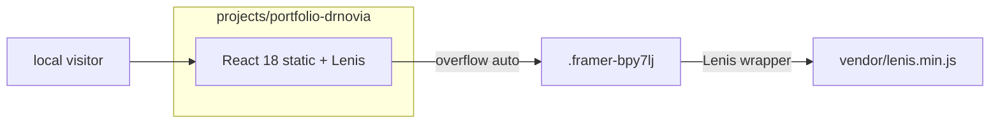

# Portfolio Dr. Novia — Capsule Agent Router

This file is the machine README for `projects/portfolio-drnovia/`. Humans start at
[README.md](README.md). Canonical governance remains root
[AGENTS.md](../../AGENTS.md), [SAFRS_SPEC.md](../../SAFRS_SPEC.md), and
[SECURITY.md](../../SECURITY.md). Do not duplicate or weaken them here.

## Always

- Stay inside `projects/portfolio-drnovia/**` unless Chief explicitly expands scope.
- Treat this capsule as inner-source: it is not a standalone GitHub repository.
- Preserve the Framer visual composition (layout, CSS, class names, assets). Copy and image swaps only when Chief asks.
- Attach Lenis to `.framer-bpy7lj` (Content-Wrapper). Never bind Lenis to
  `window` while that nested element is the real scroller.
- State CURRENT vs TARGET. Do not claim a hosted production URL, a pnpm
  workspace package, or a Vite/Next rewrite.
- Use the local Node static server. Do not add a nested lockfile, Turbo, or
  Biome config.
- Link SSOT instead of copying architecture, security, or SAFRS prose.

## Ask First

- Shared-package, lockfile, CI, or root-rule edits (R2).
- Replacing Framer markup with a component rewrite.
- Adding npm dependencies or joining the pnpm workspace.
- Production deploy, DNS, or any R3 execution.

## Never

- Create nested packages, a nested lockfile, Turbo, or Biome config.
- Redesign colors, type, spacing, or section order of the Novia site.
- Intercept wheel/touch on `window` while `.framer-bpy7lj` owns overflow.
- Weaken tests, token checks, or root SAFRS gates to make a slice pass.
- Invent auth, CMS, analytics pixels, or production URLs.
- Commit unless Chief asks.

## Owned scope

- Project: Sentra portfolio sites (Dr. Novia Anggraini). Human owner: **Chief**. Default risk: **R1**.
- Capsule: `projects/portfolio-drnovia/**`.
- CURRENT runnable site: React 18 + vendored Lenis at root.
- Consumed, not owned: none of the `@safrs/*` runtime packages.
- Durable notes: [.agents/DECISIONS.md](../../.agents/DECISIONS.md) (do not fork).

## Exact commands

Run from the Monorepo root.

```bash
node --test projects/portfolio-drnovia/tests/capsule-paths.test.mjs projects/portfolio-drnovia/tests/lenis-contract.test.mjs
node projects/portfolio-drnovia/server.js
bash scripts/safrs-verify.sh
```

From the site folder:

```bash
node server.js
```

CURRENT: static React 18 + vendored Lenis 1.3.26 on `http://127.0.0.1:4173`.
There is no `lint` / `typecheck` / `build` script. Do not invent them.

## Capsule topology



## Read by task

| Task | Read |
| --- | --- |
| Any change | [README.md](README.md), this file |
| Docs map | [docs/README.md](docs/README.md) |
| Runtime shape | [docs/architecture.md](docs/architecture.md) |
| Data / PII | [docs/data.md](docs/data.md) |
| Tests | [docs/testing.md](docs/testing.md) |
| Run today | [docs/quickstart.md](docs/quickstart.md) |
| Product | [docs/overview.md](docs/overview.md) |
| Security | [SECURITY.md](SECURITY.md), [docs/security.md](docs/security.md) |

## Risk

Default **R1** inside this capsule. Escalate: lockfile, CI, shared packages,
root Biome/governance → **R2**. Hosted production, credentials, DNS → **R3**,
prepare only until Chief authorizes.
