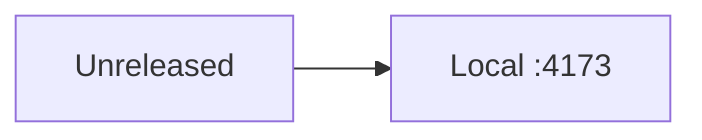

# Changelog

All notable changes to the Portfolio **capsule** are recorded here.
Format: [Keep a Changelog 1.1](https://keepachangelog.com/en/1.1.0/).
This project has **no published version**. Do not invent git tags.

## [Unreleased]

### Added

- Capsule at `projects/portfolio-drnovia/` with Diátaxis docs and community files.
- Runnable NOVIA STUDIO site (React 18, static server on `:4173`).
- Vendored Lenis 1.3.26 bound to `.framer-bpy7lj` (Framer Content-Wrapper).
- Node contract tests under `tests/`.

### Changed

- Unified standalone portfolio into root `projects/portfolio-drnovia/`.
- Scroll ownership: Lenis is the smoother on the nested scroller; native
  fallback remains if the vendor file is missing.

### Security

- Static server rejects resolved paths outside the site root.

