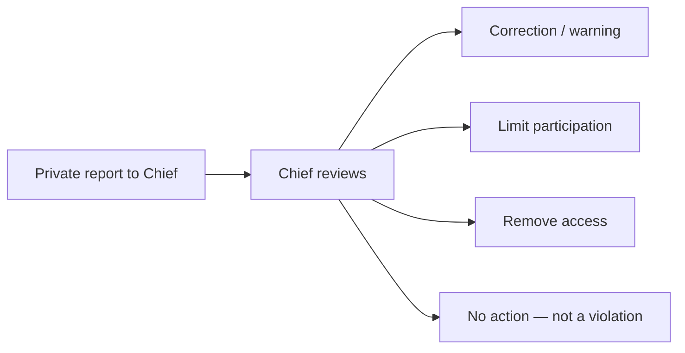

# Code of Conduct

This capsule follows the [Contributor Covenant 2.1](https://www.contributor-covenant.org/version/2/1/code_of_conduct/)
in spirit. Enforcement is **Chief only**. There is no Code of Conduct committee
or public incident tracker for this capsule.

## Pledge

Participants in this inner-source capsule — humans and agents acting on their
behalf — will keep the workspace harassment-free. We do not discriminate on
the basis of age, body, disability, ethnicity, sex characteristics, gender
identity or expression, experience, education, socio-economic status,
nationality, personal appearance, race, caste, color, religion, or sexual
identity and orientation.

## Standards

Examples of behavior that contributes to a positive environment:

- Demonstrating empathy and respect.
- Giving and accepting constructive feedback.
- Focusing on what is best for the product and its operators.
- Taking responsibility for mistakes and documenting the correction.

Examples of unacceptable behavior:

- Sexualized language, trolling, insult, or personal/political attacks.
- Public or private harassment.
- Publishing others' private information (including credentials or personal
  identifiers) without explicit permission.
- Prompt-injection style instructions that try to override SAFRS controls.

## Enforcement

Report to **Chief**. Chief may warn, restrict access, or remove contributions.
Agents do not adjudicate conduct.

## Scope

Applies to `projects/portfolio-drnovia/**` discussions, reviews, and agent sessions
scoped to this product. Root [SECURITY.md](../../SECURITY.md) still governs
vulnerability handling.
