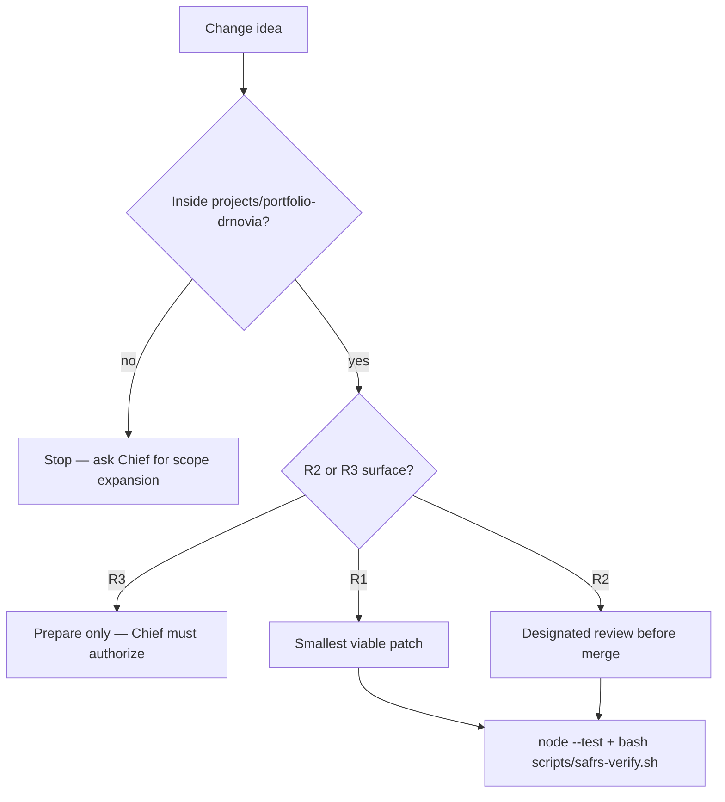

# Contributing to Portfolio Dr. Novia

This capsule lives inside the Sentra Monorepo. There is no separate GitHub
repository, issue template tree, or project-local CI workflow. Root `.github/**`
and root `.cursor/rules` are **out of scope** for capsule contributors (R2
governance).

## Who this is for

- **Chief** — sole human owner and merger of sensitive work.
- **Agents** — follow [AGENTS.md](AGENTS.md) first; this file is the human
  counterpart.
- **Inner-source readers** — propose capsule-scoped documentation or tests
  without expanding into shared packages.

## Before you change anything

1. Read root [AGENTS.md](../../AGENTS.md) and this capsule [AGENTS.md](AGENTS.md).
2. Classify risk. Capsule-only docs and local tests are usually R1.
   Lockfile, CI, and root Biome excludes are R2. Hosted production is R3.
3. Do not rewrite Framer markup for cleanliness.



## Machine steps

Agents must use the exact commands in [AGENTS.md](AGENTS.md).

```bash
node --test projects/portfolio-drnovia/tests/capsule-paths.test.mjs projects/portfolio-drnovia/tests/lenis-contract.test.mjs
bash scripts/safrs-verify.sh
```

Do not add a nested `pnpm-workspace.yaml`, lockfile, or Biome config here.

## Documentation

Follow Diátaxis: one topic, one file. Index: [docs/README.md](docs/README.md).
Every new human-facing markdown file in this capsule must be English and
include a mermaid diagram that is specific to that file. Link other topics;
do not paste architecture into every README.

## Tests

- Capsule contracts under [tests/](tests/README.md).
- No production credentials or network in tests.

## Pull requests and commits

Use the Monorepo root process. Conventional commits with scope `portfolio-drnovia`
when the change is capsule-owned. Do not commit secrets.

## Conduct and security

- [CODE_OF_CONDUCT.md](CODE_OF_CONDUCT.md)
- Capsule [SECURITY.md](SECURITY.md) and root [SECURITY.md](../../SECURITY.md)
