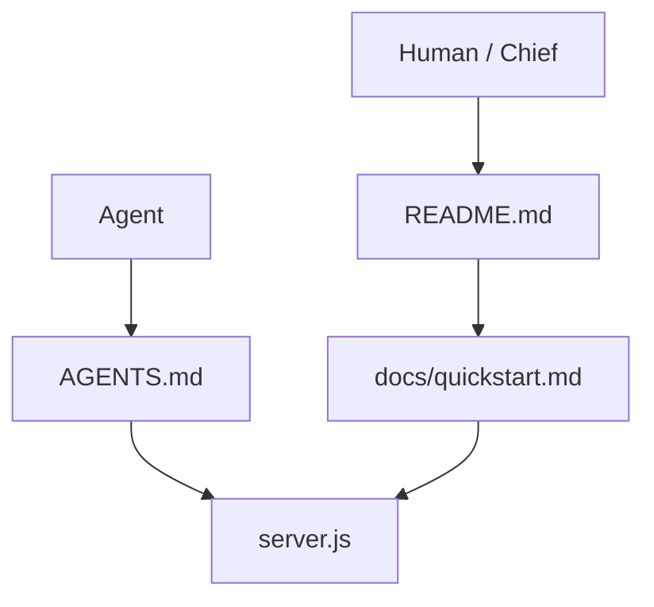

# Portfolio Dr. Novia

Status: **active inner-source capsule**. This directory is a Monorepo
**capsule**, not a standalone GitHub repository.

CURRENT site: **NOVIA STUDIO**.
It is a standalone React 18 build of Novia Dwi Anggraini’s portfolio with the
original Framer visual composition preserved, plus Lenis smooth scroll bound to
the Framer Content-Wrapper.

| | CURRENT | TARGET |
| --- | --- | --- |
| Runtime | Node static server, port `4173` | Same unless Chief asks |
| Toolchain | Vendored React 18 + Lenis 1.3.26 | No Vite/Next rewrite |
| Scroll | Lenis on `.framer-bpy7lj` | Keep nested-wrapper binding |
| Workspace | Not a pnpm package | Stay out of the workspace |
| Hosted production | Not authorized | Later **R3** only |

## Why this capsule exists

Sentra builds client and personal portfolio sites under project capsules so agents
have a command-first router, Diátaxis docs, and a real run path — without
promoting a marketing snapshot into the golden-path Next.js stack.

Product explanation: [docs/overview.md](docs/overview.md).
Architecture: [docs/architecture.md](docs/architecture.md).
Honest run path: [docs/quickstart.md](docs/quickstart.md).

## What is here

- `src/` — runnable application files (`app.js`, `portfolio-markup.js`).
- `assets/`, `styles/`, `vendor/` — visual assets, stylesheets, and local libraries.
- `docs/` — Diátaxis map. Start at [docs/README.md](docs/README.md).
- `tests/` — Node test contracts for capsule files and Lenis wiring.

## Non-goals

Hosted production, auth, CMS, analytics pixels, a second design system, and
joining the pnpm workspace. Do not redesign the Framer layout.

## License and attribution

No separate public license is claimed for this capsule. Root security policy
applies. Lenis is MIT © darkroom.engineering (vendored 1.3.26). The visual
composition originates from a Framer export; Novia’s copy and work images are
product content, not a Sentra redesign.

