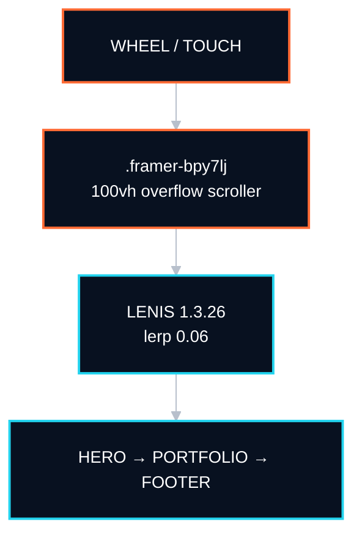
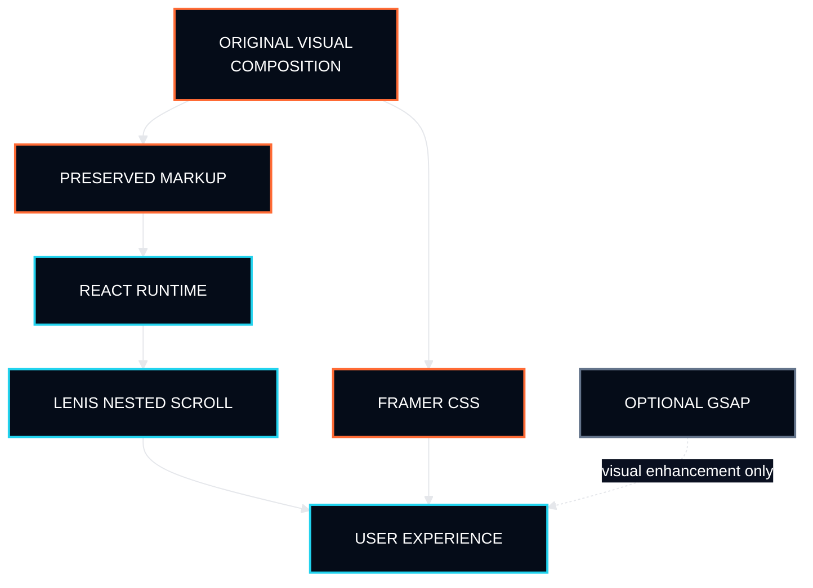
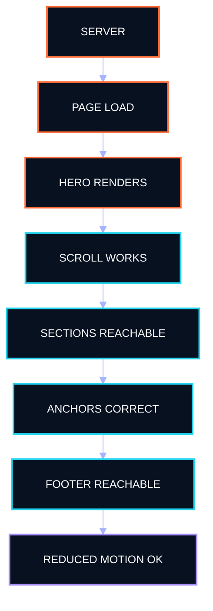

<table width="100%">
<tr>
<td width="34%" align="center" valign="top">

<a href="https://imgbb.com/"></a>

<a href="https://github.com/noviaanggraini0511">
  
</a>
<br />


</td>
<td width="66%" valign="top">

### `NOVIA STUDIO / PORTFOLIO`


<br />


<b>Build signal:</b> standalone React 18 · preserved Framer composition · local-first runtime

<b>NOVIA STUDIO</b><br />
A standalone React reconstruction of the original portfolio experience, preserving the Framer visual composition while replacing the runtime with a controlled, dependency-local implementation that feels smooth, bright, and professional.

<p>
  <a href="https://github.com/noviaanggraini0511" title="GitHub"></a>&nbsp;&nbsp;
  &nbsp;&nbsp;
  &nbsp;&nbsp;
  
</p>

<sub><code>VISUAL COMPOSITION → REACT RUNTIME → CONTROLLED SCROLL → OPTIONAL MOTION</code></sub>

</td>
</tr>
</table>

---

### `01 / ORIGIN SIGNAL`

**NOVIA STUDIO** is a standalone React 18 build of the original portfolio experience.

The objective is intentionally narrow: preserve the existing Framer visual composition, keep the portfolio content and imagery intact, and replace the runtime only where necessary to make the site reliable outside Framer.

This repository does **not** redesign the portfolio.

It provides a controlled implementation of the same experience with:

- a local React runtime;
- preserved Framer markup and styling;
- Lenis attached to the actual nested scroll container;
- optional GSAP visual enhancement;
- graceful native-scroll fallback;
- no package installation requirement.

<p align="center">
  
  
  
  
</p>

<table width="100%">
<tr>
<td width="33%" valign="top">

<b><code>LAYER I · COMPOSITION</code></b>

Original Framer structure, spacing, typography, imagery, section order, and portfolio presentation remain the visual source of truth.

</td>
<td width="33%" valign="top">

<b><code>LAYER II · RUNTIME</code></b>

React 18 mounts the preserved portfolio markup without requiring a framework migration, package manager, or build step.

</td>
<td width="33%" valign="top">

<b><code>LAYER III · MOTION</code></b>

Lenis controls the real nested scroller. GSAP may enhance visual motion, but never owns or intercepts scrolling.

</td>
</tr>
</table>

The operating rule is simple: **fix behavior without redesigning the work.**

---

### `02 / QUICKSTART`

No install step is required.

```bash
node server.js
```

Open:

```text
http://127.0.0.1:4173
```

React, ReactDOM, and Lenis are bundled locally inside `vendor/`.

```mermaid
%%{init: {
  "theme": "base",
  "themeVariables": {
    "background": "#050816",
    "primaryColor": "#0B1220",
    "primaryTextColor": "#FFFFFF",
    "primaryBorderColor": "#22D3EE",
    "lineColor": "#94A3B8",
    "secondaryColor": "#0B1220",
    "secondaryTextColor": "#FFFFFF",
    "secondaryBorderColor": "#FF6B35",
    "tertiaryColor": "#0B1220",
    "tertiaryTextColor": "#FFFFFF",
    "tertiaryBorderColor": "#A78BFA",
    "fontFamily": "JetBrains Mono, monospace",
    "fontSize": "14px"
  },
  "flowchart": {
    "curve": "basis",
    "nodeSpacing": 35,
    "rankSpacing": 35,
    "padding": 18
  }
}}%%
flowchart LR
  START["node server.js"]
  SERVER["LOCAL STATIC SERVER"]
  PAGE["127.0.0.1:4173"]
  REACT["REACT 18 MOUNT"]
  PORTFOLIO["NOVIA STUDIO"]

  START --> SERVER
  SERVER --> PAGE
  PAGE --> REACT
  REACT --> PORTFOLIO

  classDef fixed fill:#081120,stroke:#FF6B35,color:#ffffff,stroke-width:2px;
  classDef runtime fill:#081120,stroke:#22D3EE,color:#ffffff,stroke-width:2px;
  classDef accent fill:#081120,stroke:#A78BFA,color:#ffffff,stroke-width:2px;

  class START,SERVER fixed;
  class PAGE,REACT runtime;
  class PORTFOLIO accent;
```

<details open>
<summary><b><code>BOOT PATH // LOCAL RUNTIME</code></b></summary>



</details>

> [!IMPORTANT]
> Run the portfolio through `server.js`. Do not open the HTML directly from the filesystem if you want the intended local runtime behavior.

---

### `03 / SCROLL ARCHITECTURE`

The preserved Framer layout uses `.framer-bpy7lj` — the original **Content-Wrapper** — as a `100vh` overflow scroller.

That wrapper, not `window`, owns the page scroll.

Lenis **1.3.26** is therefore attached directly to `.framer-bpy7lj`, using:

- `wrapper` → `.framer-bpy7lj`
- `content` → its first child
- `lerp` → `0.06`
- `wheelMultiplier` → `0.9`
- `autoRaf` → `true`
- anchor offset → `24px`
- anchor duration → `1.1`

This is the key correction from the earlier broken implementation.

Window-level Lenis consumed wheel input while the nested Framer wrapper still owned overflow, producing a page that appeared locked around the hero section.

<details open>
<summary><b><code>INPUT PATH // WHEEL → CONTENT</code></b></summary>



</details>

<table width="100%">
<tr>
<td width="50%" valign="top">

<b><code>WHY THIS WORKS</code></b>

Lenis is bound to the element that actually receives overflow. Native layout ownership and smooth-scroll ownership are aligned.

</td>
<td width="50%" valign="top">

<b><code>WHY THE OLD VERSION FAILED</code></b>

`window` received Lenis wheel handling while `.framer-bpy7lj` remained the real scroll surface. Two scroll models competed for one input stream.

</td>
</tr>
</table>

---

### `04 / MOTION DOCTRINE`

> [!IMPORTANT]
> **Scroll reliability outranks animation.** Motion may enrich the composition; it may never make the portfolio harder to navigate.

<table width="100%">
<tr>
<td width="50%" valign="top">

<b><code>LENIS OWNS SMOOTHING</code></b>

Lenis is responsible only for smooth scrolling on the actual Framer content wrapper.

</td>
<td width="50%" valign="top">

<b><code>GSAP IS VISUAL-ONLY</code></b>

GSAP may animate reveals, transforms, or decorative movement. It must not intercept wheel events or replace the scroll container.

</td>
</tr>
<tr>
<td width="50%" valign="top">

<b><code>NATIVE FALLBACK REMAINS</code></b>

If Lenis is unavailable, the original overflow layout remains scrollable and anchor navigation falls back to native `scrollIntoView`.

</td>
<td width="50%" valign="top">

<b><code>REDUCED MOTION IS RESPECTED</code></b>

`prefers-reduced-motion: reduce` disables smoothing so the experience remains accessible and predictable.

</td>
</tr>
</table>

```text
No animation before scroll.
No smoothness before reliability.
No visual enhancement that changes the composition.
No runtime dependency that makes the portfolio fragile.
```

---

### `05 / REPOSITORY MAP`

```text
.
├── assets/
│   └── original visual assets + Novia portfolio work
├── docs/
│   └── quickstart.md
├── src/
│   ├── app.js
│   └── portfolio-markup.js
├── styles/
│   ├── framer.css
│   ├── lenis.css
│   └── novia.css
├── vendor/
│   └── local React runtime + Lenis
├── README.md
└── server.js
```

<table width="100%">
<tr>
<td width="50%" valign="top">

<b><code>src/app.js</code></b>

React mount, Lenis initialization, anchor behavior, reduced-motion handling, and optional GSAP visual motion.

</td>
<td width="50%" valign="top">

<b><code>src/portfolio-markup.js</code></b>

Preserved portfolio markup and project content separated from runtime behavior.

</td>
</tr>
<tr>
<td width="50%" valign="top">

<b><code>styles/framer.css</code></b>

Original Framer visual styling. Treat this as the composition baseline.

</td>
<td width="50%" valign="top">

<b><code>styles/lenis.css</code></b>

Official Lenis 1.3.26 stylesheet required for smooth-scroll state behavior.

</td>
</tr>
<tr>
<td width="50%" valign="top">

<b><code>styles/novia.css</code></b>

Scoped fixes for NOVIA STUDIO text, layout corrections, and coexistence between the preserved Framer structure and the new runtime.

</td>
<td width="50%" valign="top">

<b><code>server.js</code></b>

Minimal local static server. No framework CLI and no install phase required.

</td>
</tr>
</table>

---

### `06 / RUNTIME BOUNDARIES`

<details open>
<summary><b><code>CONTROL MAP // WHAT MAY CHANGE</code></b></summary>



</details>

| Boundary | Rule |
|---|---|
| Visual composition | Preserve |
| Images | Preserve unless explicitly replaced |
| Portfolio content | Edit deliberately, not structurally |
| Framer layout model | Preserve where required by composition |
| Scroll ownership | `.framer-bpy7lj` |
| Smooth scrolling | Lenis 1.3.26 |
| GSAP | Optional, visual-only |
| Reduced motion | Native / unsmoothed |
| Package install | Not required |
| Primary run command | `node server.js` |

---

### `07 / FAILURE MODES`

<table width="100%">
<tr>
<td width="50%" valign="top">

<b><code>SCROLL STOPS AT HERO</code></b>

Confirm that Lenis is attached to `.framer-bpy7lj`, not `window`, and that the wrapper still owns overflow.

</td>
<td width="50%" valign="top">

<b><code>WHEEL FEELS BLOCKED</code></b>

Check for duplicate wheel listeners, a second smooth-scroll controller, or GSAP logic that calls `preventDefault()`.

</td>
</tr>
<tr>
<td width="50%" valign="top">

<b><code>TEXT OVERLAPS</code></b>

Fix only the affected scoped rules in `styles/novia.css`. Do not broadly rewrite the preserved Framer stylesheet.

</td>
<td width="50%" valign="top">

<b><code>LENIS DOES NOT LOAD</code></b>

The portfolio should remain navigable through native overflow. Verify the fallback before changing layout behavior.

</td>
</tr>
</table>

> [!CAUTION]
> If a proposed animation requires changing the scroll container, introducing scroll hijacking, or disabling native fallback, it violates the runtime boundary of this build.

---

### `08 / VERIFICATION`

Before treating a change as complete, verify the whole path:

```text
SERVER
  ↓
PAGE LOAD
  ↓
HERO RENDERS
  ↓
WHEEL / TOUCH SCROLLS
  ↓
PORTFOLIO SECTIONS REMAIN REACHABLE
  ↓
ANCHORS LAND CORRECTLY
  ↓
FOOTER IS REACHABLE
  ↓
REDUCED-MOTION FALLBACK STILL WORKS
```

Recommended manual checks:

```bash
node server.js
```

Then confirm:

- `http://127.0.0.1:4173` loads without a package install;
- scrolling passes the hero and reaches every section;
- wheel input is not captured by `window`;
- anchor navigation respects the `24px` offset;
- optional GSAP motion does not alter scroll ownership;
- the portfolio remains usable with Lenis disabled;
- reduced-motion mode does not enable smoothing;
- visual corrections remain scoped and do not redesign the original composition.

<details open>
<summary><b><code>VERIFICATION PATH // STABILITY CHECK</code></b></summary>



</details>

---

### `09 / DOCUMENTATION`

Capsule documentation:

- [`../README.md`](../README.md)
- [`../docs/quickstart.md`](../docs/quickstart.md)

The repository README describes the runtime contract. The quickstart should remain the shortest path from clone to a working portfolio.

---

### `10 / OPERATING STANDARD`

```text
Preserve the design.
Fix the behavior.
Keep one scroll owner.
Keep motion optional.
Keep fallback native.
Keep the runtime understandable.
```

> [!IMPORTANT]
> **NOVIA STUDIO is composition-first.** The React runtime exists to support the portfolio, not to reinterpret it.

---

<p align="center">
  
</p>

<p align="center">
  <b>NOVIA STUDIO</b><br />
  Original composition. Independent runtime.<br />
  <sub><code>// cheerful, modern, and still reliable</code></sub>
</p>
