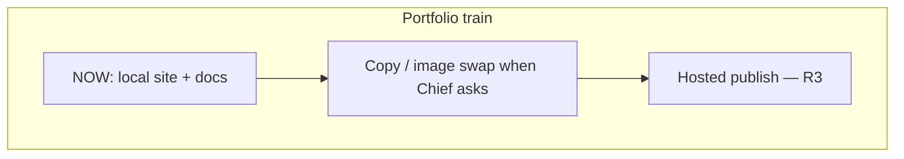

# Roadmap

Owner: **Chief**. Dates are not promised. CURRENT is a local static portfolio
with clean documentation scaffold and Lenis on the Framer scroller.

## 1. Local fidelity (CURRENT)

Keep Framer look, keep Lenis on `.framer-bpy7lj`, keep docs honest.

## 2. Content waves (gated by Chief)

Rebrand, Bahasa copy already present, image-swap one-by-one. No redesign.

## 3. Hosted production (R3)

Not authorized. Prepare only after Chief names host, domain, and review.
