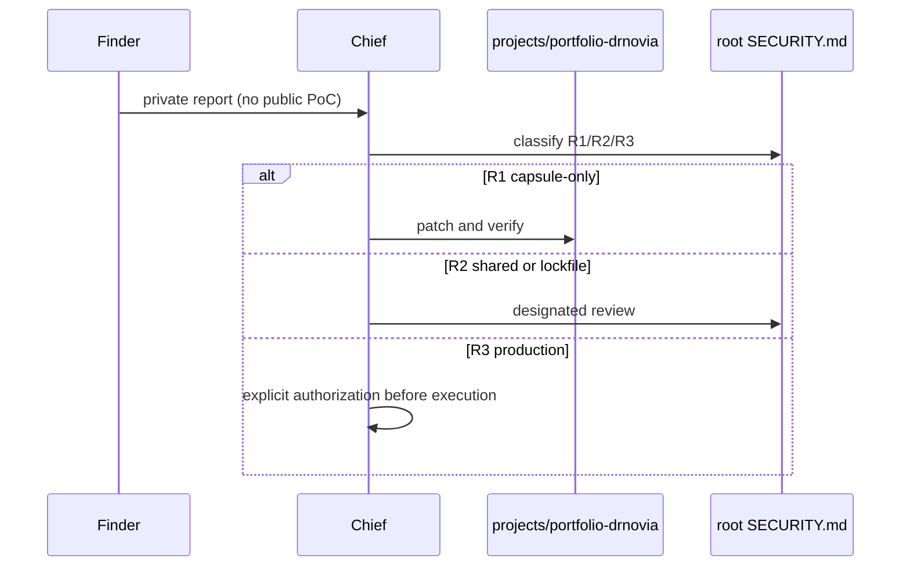

# Portfolio Security

Canonical repository policy is root [SECURITY.md](../../SECURITY.md) and
[SAFRS_SPEC.md](../../SAFRS_SPEC.md). This file names **capsule surfaces**
and how to disclose issues. It does not redefine R0–R3.

## Disclosure

Report findings through the organization's **private** security channel to
**Chief**. Do not file public issues with exploit detail or credentials.

CURRENT: there is no project-specific mailing list, bug bounty, or GitHub
private vulnerability reporting configured for this capsule (those would be
root `.github` R2 work).

## CURRENT surfaces in this capsule

| Surface | What exists | Residual risk |
| --- | --- | --- |
| Static site | React markup + Framer CSS | XSS if markup file is poisoned |
| `server.js` | Local static server | Path traversal (mitigated) |
| Lenis / React vendor | Local minified JS | Supply-chain of the pinned files |
| GSAP CDN | Optional visual motion | Unavailable offline; not required |
| Framer CDN images | Some `srcset` URLs | Broken images if CDN blocks |

Deep model: [docs/security.md](docs/security.md).

## Prohibited without a separate gate

Hosted production, visitor tracking, and production credentials.
