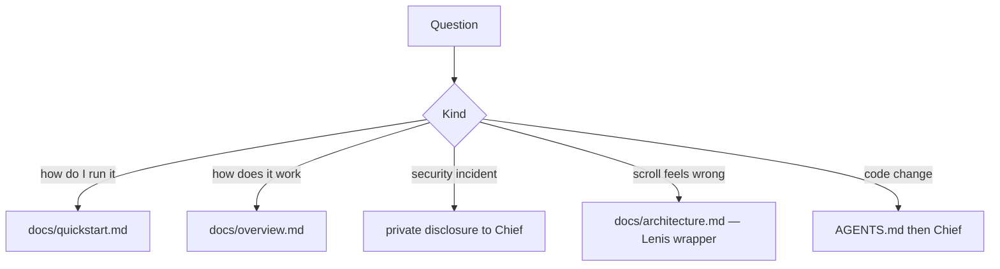

# Support

Portfolio is an inner-source capsule owned by **Chief** (dr. Ferdi Iskandar).
There is no public Discord, Slack, forum, or community mailing list for this
project. Do not invent those channels.

## How to get help

| Need | Where |
| --- | --- |
| Product intent | [docs/overview.md](docs/overview.md) |
| What can run today | [docs/quickstart.md](docs/quickstart.md) |
| Agent / contributor steps | [AGENTS.md](AGENTS.md), [CONTRIBUTING.md](CONTRIBUTING.md) |
| Security | Capsule [SECURITY.md](SECURITY.md), root [SECURITY.md](../../SECURITY.md) |
| Decisions | [docs/decisions.md](docs/decisions.md) |

## Owner

Human owner: **Chief**. Agents do not authorize R2/R3 work or production
access.

## What support cannot do

- Publish a production URL without Chief.
- Redesign the Framer layout as “polish”.
- Replace root verification (`bash scripts/safrs-verify.sh`).
