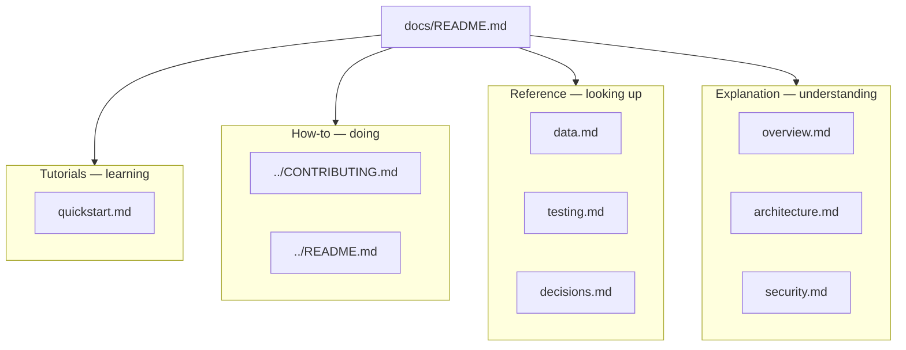

# Documentation map

Portfolio docs follow [Diátaxis](https://diataxis.fr/): tutorials, how-to
guides, reference, and explanation. One topic lives in one file. Architecture
prose is not copied into every page.

This capsule is inner-source. GitHub issue/PR templates stay at the Monorepo
root (out of scope R2).

## Tutorials

| File | Concern |
| --- | --- |
| [quickstart.md](quickstart.md) | What can run today on `:4173` |

## How-to

| File | Concern |
| --- | --- |
| [../CONTRIBUTING.md](../CONTRIBUTING.md) | How humans and agents contribute |
| [../README.md](../README.md) | Site tree and scroll contract |

## Reference

| File | Concern |
| --- | --- |
| [data.md](data.md) | What is stored, what is not |
| [testing.md](testing.md) | Commands that exist |
| [decisions.md](decisions.md) | Index to DECISIONS.md |

## Explanation

| File | Concern |
| --- | --- |
| [overview.md](overview.md) | What this capsule is for |
| [architecture.md](architecture.md) | Runtime, scroll, boundaries |
| [security.md](security.md) | Static-site control intent |

## Capsule root (community)

[README.md](../README.md), [AGENTS.md](../AGENTS.md),
[SECURITY.md](../SECURITY.md), [SUPPORT.md](../SUPPORT.md),
[CHANGELOG.md](../CHANGELOG.md), [CODE_OF_CONDUCT.md](../CODE_OF_CONDUCT.md),
[ROADMAP.md](../ROADMAP.md), [CONTRIBUTING.md](../CONTRIBUTING.md).
