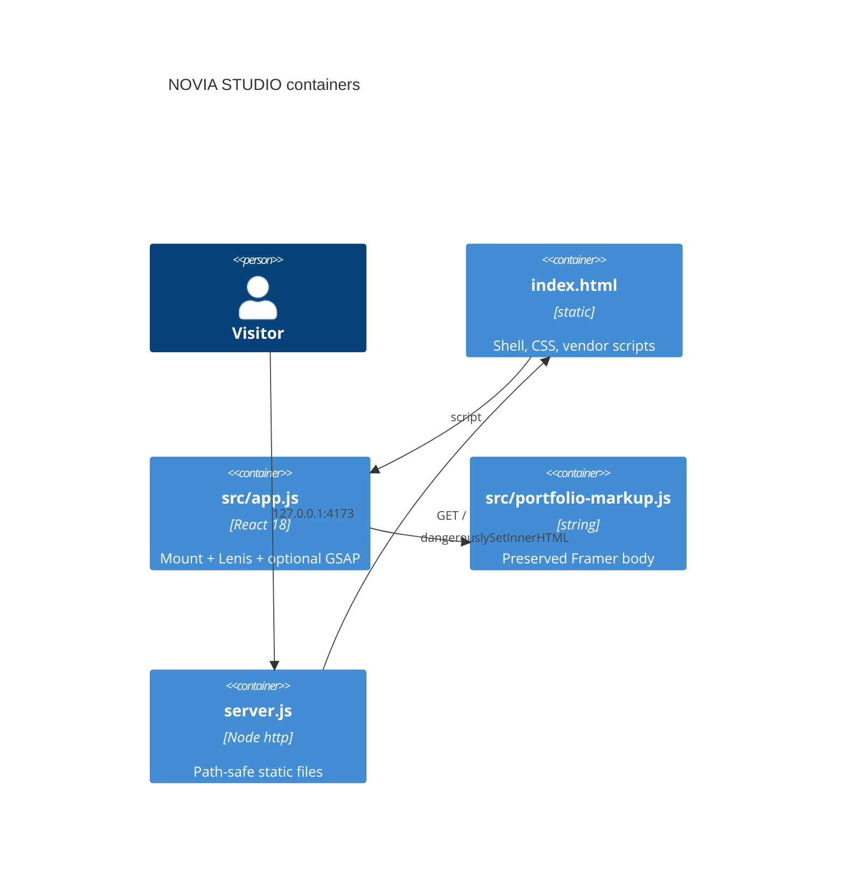

# Architecture

NOVIA STUDIO is one static origin: vendored React 18 hydrates preserved Framer
markup. There is no API, database, or shared-package runtime. Decision index:
[decisions.md](decisions.md). Data: [data.md](data.md).

## CURRENT vs TARGET

| Boundary | CURRENT | TARGET |
| --- | --- | --- |
| Site root | `index.html` + `src/app.js` + `server.js` | Same unless Chief asks |
| Scroll owner | `.framer-bpy7lj` (`overflow: auto`, `height: 100vh`) | Lenis stays on this node |
| Lenis | Vendored `1.3.26`, `wrapper` = Content-Wrapper | Never `window` |
| GSAP | Optional CDN visual fade on project cards | Visual-only; no ScrollTrigger |

## C4 — containers (CURRENT)

## Scroll contract

Framer’s Content-Wrapper (`.framer-bpy7lj`) is the viewport scroller. Binding
Lenis to `window` intercepts wheel input while the nested element still owns
`overflow: auto` — that combination feels broken (dead wheel, fighting native
momentum). CURRENT binds:

- `wrapper`: `.framer-bpy7lj`
- `content`: that node’s first element child (`#hero` section)
- `autoRaf: true`, `lerp: 0.06`, `wheelMultiplier: 0.9`, `anchors.offset: 24`
- `respectReducedMotion: true` (Lenis forces lerp `1` when the user asks)

GSAP must not register ScrollTrigger, wheel handlers, or `preventDefault` on
pointer/wheel events.

## Shared boundaries

Do not import `@safrs/api`, `@safrs/database`, `@sentra/token`, or Next.js.
This is a captured marketing/portfolio surface. Token rules apply only if
Chief asks for a new UI that is not the Framer original.

Do not create nested packages.

## Failure modes

- Missing `vendor/lenis.min.js` → native scroll + hash `scrollIntoView` fallback.
- CDN GSAP timeout → site still fully usable.
- Path traversal in `server.js` → `403` when the resolved path leaves the site root.
