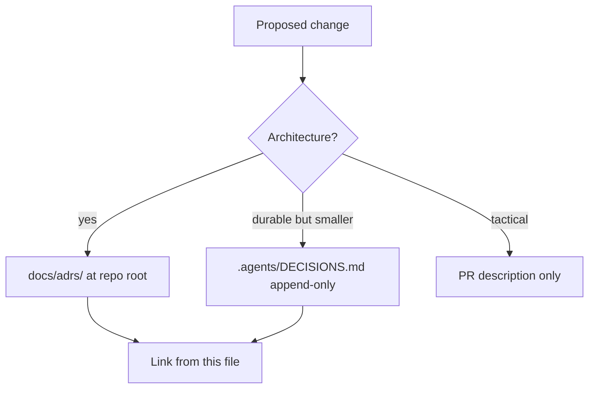

# Decision index

This capsule does **not** keep a second ADR directory. Architectural
decisions go to the Monorepo store. Capsule-local notes belong in this
index as pointers only.

## Binding ADR

None yet. A portfolio-site ADR is not required for a static capture + Lenis
wrapper. If the stack changes to Vite/Next or joins the pnpm workspace, write
an ADR first.

## Durable DECISIONS.md entries (Portfolio)

SSOT: [../../../.agents/DECISIONS.md](../../../.agents/DECISIONS.md)
(append-only, newest first).

| Date | Title |
| --- | --- |
| 2026-08-21 | Portfolio late scaffold + Lenis on Framer Content-Wrapper |

## Capsule-local working choices (not ADRs)

- Nested `packages/`, lockfile, Turbo, and Biome config inside the capsule
  are forbidden.
- Lenis attaches to `.framer-bpy7lj`, never `window`.
- Community GitHub templates stay at the monorepo root (R2).

When a new durable choice is locked, append `.agents/DECISIONS.md` (session
protocol). Do not add `docs/adrs/` files under `projects/portfolio-drnovia/`.
