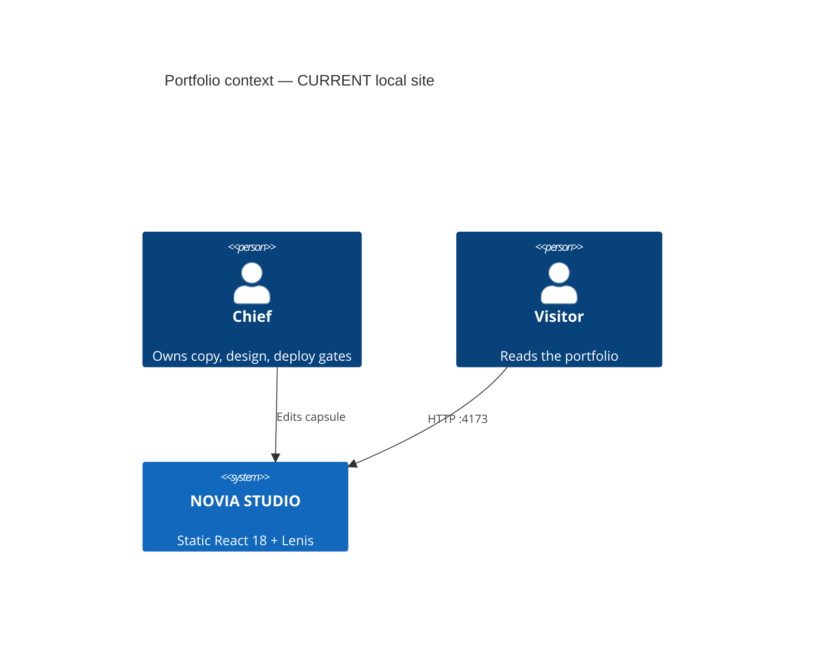

# What this capsule is

`projects/portfolio-drnovia` holds the inner-source portfolio site for
Dr. Novia Dwi Anggraini (AI architecture, web design, system automation, digital products).

This is explanation, not a runbook. How to run CURRENT:
[quickstart.md](quickstart.md). Containers and scroll:
[architecture.md](architecture.md).

## Who it is for

- **Visitors** of the local or later-hosted portfolio page.
- **Chief** as the only human who can authorize redesign, copy swap, deploy,
  or R2/R3 expansion.
- **Agents** working inside `projects/portfolio-drnovia/**`.

It is not a SaaS product, not Golden Path, and not a second design-token app.

## Problem it solves

The site must look like the Framer original and still scroll smoothly on a
nested 100vh overflow container. A clean documentation scaffold gives humans
and agents one map for the runnable static site.

## Non-goals

- Hosted production (later **R3**, not this slice).
- Rewriting Framer markup into React components.
- Auth, CMS, Stripe, or analytics.
- Joining the pnpm workspace.

## CURRENT vs TARGET

| Capability | CURRENT | TARGET |
| --- | --- | --- |
| Site | React 18 + static server | Same stack unless Chief asks |
| Scroll | Lenis 1.3.26 on `.framer-bpy7lj` | Keep wrapper binding |
| Docs | Diátaxis + community files | Keep honest; no badge claims |

