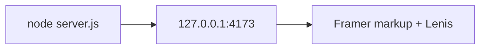

# Quickstart

This is an honest how-to for **what exists on disk today**. It is not a
hosted-production tutorial.

Canonical machine commands: [../AGENTS.md](../AGENTS.md).

## CURRENT — you can do this now

Need Node.js 18 or newer. No `pnpm install` for this site.

From the Monorepo root:

```bash
node --test projects/portfolio-drnovia/tests/capsule-paths.test.mjs projects/portfolio-drnovia/tests/lenis-contract.test.mjs
node projects/portfolio-drnovia/server.js
```

Or from the site folder:

```bash
cd projects/portfolio-drnovia
node server.js
```

Open:

```text
http://127.0.0.1:4173
```

Override bind with `HOST` and `PORT` if needed.



## What you should feel

Wheel and trackpad on the page body should ease to rest (Lenis `lerp: 0.06`
on `.framer-bpy7lj`). Hash links (`#about`, `#project`, …) should animate
inside that scroller. `prefers-reduced-motion: reduce` disables smoothing.

## What this does not start

No Docker, no Postgres, no `pnpm dev` for the monorepo, no Vite.

If Lenis fails to load, native overflow on the Content-Wrapper still works.
