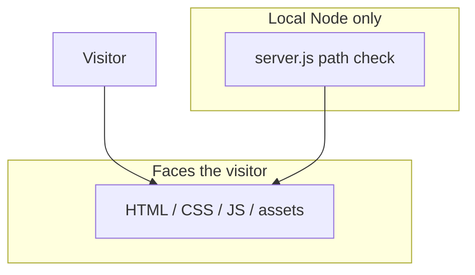

# Security controls (product intent)

Canonical policy: root [SECURITY.md](../../../SECURITY.md) and
[SAFRS_SPEC.md](../../../SAFRS_SPEC.md). Capsule disclosure:
[../SECURITY.md](../SECURITY.md). This page is the **control catalog** for a
static portfolio, not a second SAFRS spec.

This project is mostly R1: public copy, public images, a path-safe static
server. It is not an auth or PHI surface.

## CURRENT controls that exist in code

- `server.js` resolves URLs under the site root; paths that escape return `403`.
- No environment secrets are required or read.
- Lenis and React are vendored (no runtime `eval` of remote app code for the
  scroll/runtime core). GSAP remains an optional CDN enhancement.
- `prefers-reduced-motion` is honored by Lenis and CSS.

## CURRENT gaps (do not hide)

- Some `` `srcset` entries still point at `framerusercontent.com` (network
  at view time). Local `src` fallbacks exist for the primary frames.
- `dangerouslySetInnerHTML` injects the captured markup string. Treat that
  file as trusted-in-repo content; do not pipe untrusted HTML into it.
- There is no CSP header on the static server.

## Prohibited without a separate gate

Hosted production, collecting visitor PII, injecting analytics pixels, and
copying live credentials into this tree.
