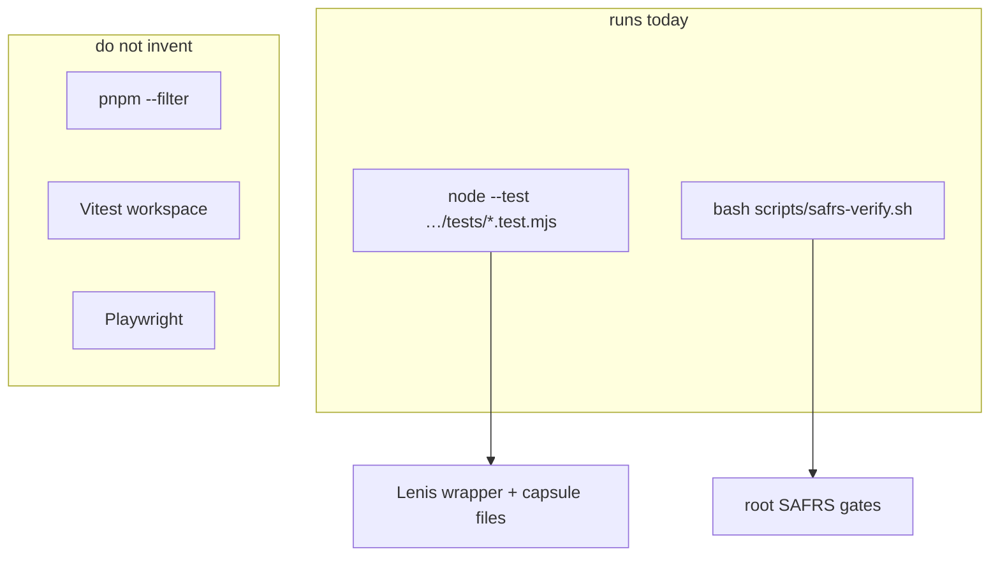

# Testing

Verification is sliced. This capsule is **not** a pnpm workspace package.
Turbo does not own these tests. Commands: [../AGENTS.md](../AGENTS.md).

## Commands that exist

From Monorepo root:

```bash
node --test projects/portfolio-drnovia/tests/capsule-paths.test.mjs projects/portfolio-drnovia/tests/lenis-contract.test.mjs
node projects/portfolio-drnovia/server.js
bash scripts/safrs-verify.sh
```

There is no capsule `lint`, `typecheck`, or `build` script. Do not claim
`pnpm --filter` coverage.



## What the tests cover

- Capsule required paths (`AGENTS.md`, `docs/*`, `src`, `tests`).
- Lenis is vendored at 1.3.26 and referenced from `index.html`.
- `src/app.js` binds Lenis to `.framer-bpy7lj`, not `window`.
- `server.js` keeps resolved files under the site root.

## What they do not cover

Browser momentum, visual pixel diffs, or a running HTTP smoke in CI. Those
need a human look at `http://127.0.0.1:4173` until Chief asks for Playwright.

## Isolated resources

Tests are filesystem reads only. No database, no network, no credentials.
