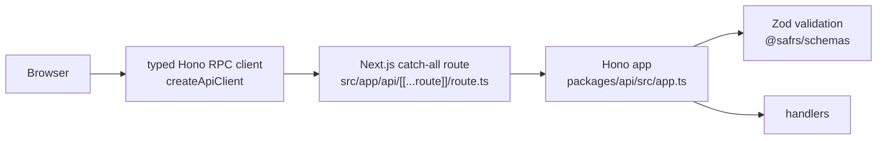

# API

**Purpose**: This page gives an overview of the golden-path HTTP API in the SAFRS Monorepo. It explains how the Hono app is mounted under `/api` inside Next.js, how the typed RPC client keeps the frontend safe from drift, and where the OpenAPI description and interactive docs are served.

## Overview

The API is a typed Hono 4 application owned by the `@safrs/api` package. It is mounted inside the Next.js golden-path app under `/api` and is the reference demonstration of the typed Database → API → Web flow. See [API package](../packages/api.md) for the package details and [architecture](../overview/architecture.md) for the full data flow.



## Mount point: Hono under `/api`

The Next.js app mounts the Hono app through a catch-all route at `projects/golden-path/apps/web/src/app/api/[[...route]]/route.ts`:

```ts
import { app } from "@safrs/api";
import { handle } from "hono/vercel";

const handler = handle(app);
export { handler as DELETE, handler as GET, handler as PATCH, handler as POST, handler as PUT };
```

Because the route is optional (`[[...route]]`), the Hono app handles every path under `/api`. The Hono app itself sets `.basePath("/api")`, so its handlers match the full `/api/*` URLs.

## Typed RPC client

`packages/api/src/client.ts` exports `createApiClient`, a thin wrapper over Hono's `hc<AppType>` typed client. The `AppType` is inferred from the route definitions via `ApplyGlobalResponse` in `packages/api/src/app.ts`, so request and response shapes are checked at compile time. If the API changes, any caller that uses the typed client fails type-check — eliminating silent drift between frontend and backend.

The browser client wrapper lives in `projects/golden-path/apps/web/src/lib/api-client.ts`. It resolves the base URL from `NEXT_PUBLIC_APP_URL` (falling back to the current origin) and exposes typed helpers such as `submitDemo`.

## OpenAPI and docs endpoints

The API serves a schema-driven OpenAPI description and an interactive UI:

- `GET /api/openapi.json` — an OpenAPI 3.1 document built by `packages/api/src/openapi.ts` directly from the Zod schemas in `@safrs/schemas` using Zod 4's `z.toJSONSchema(...)`, so the documentation cannot drift from the validation contracts.
- `GET /api/docs` — a minimal Swagger UI page (loaded from a CDN) that points at `/api/openapi.json`. Safe for local development.

## Endpoints

| Method | Path | Purpose |
| --- | --- | --- |
| GET | `/api/health` | Health check |
| GET | `/api/demos` | List demo records |
| POST | `/api/demos` | Create a demo record |
| GET | `/api/openapi.json` | OpenAPI 3.1 document |
| GET | `/api/docs` | Interactive Swagger UI |

See [REST endpoints](rest-endpoints.md) for request/response shapes, validation, and error envelopes.

## Common behavior

- Every request gets a correlation ID generated in middleware, returned in the `x-correlation-id` response header and (for errors) in the response body. See `packages/api/src/error.ts` and [error handling](../how-to-contribute/patterns-and-conventions.md).
- Unexpected errors are redacted to a generic `INTERNAL_ERROR` envelope so no stack traces or database URLs leak.
- The static Stripe webhook route at `projects/golden-path/apps/web/src/app/api/webhooks/stripe/route.ts` takes precedence over the catch-all and is part of the optional Stripe capability pack.

## Related pages

- [REST endpoints](rest-endpoints.md) — every endpoint in detail
- [API package](../packages/api.md) — the `@safrs/api` package
- [Schemas package](../packages/schemas.md) — the Zod contracts behind validation
- [Architecture](../overview/architecture.md) — the typed data flow
- [Golden-path web app](../apps/golden-path-web.md) — how the frontend uses the client
