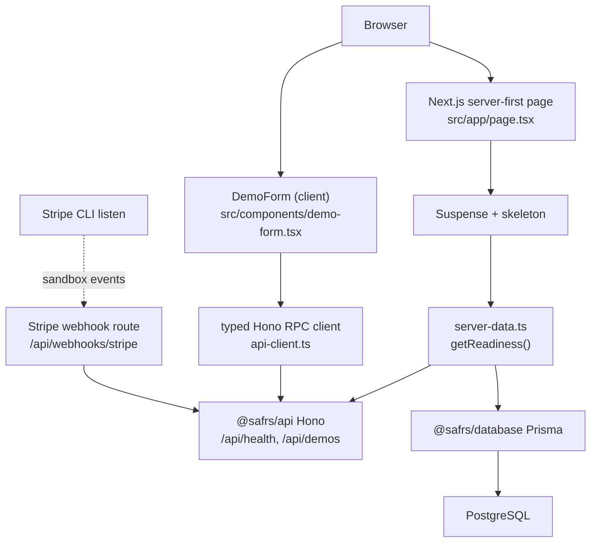
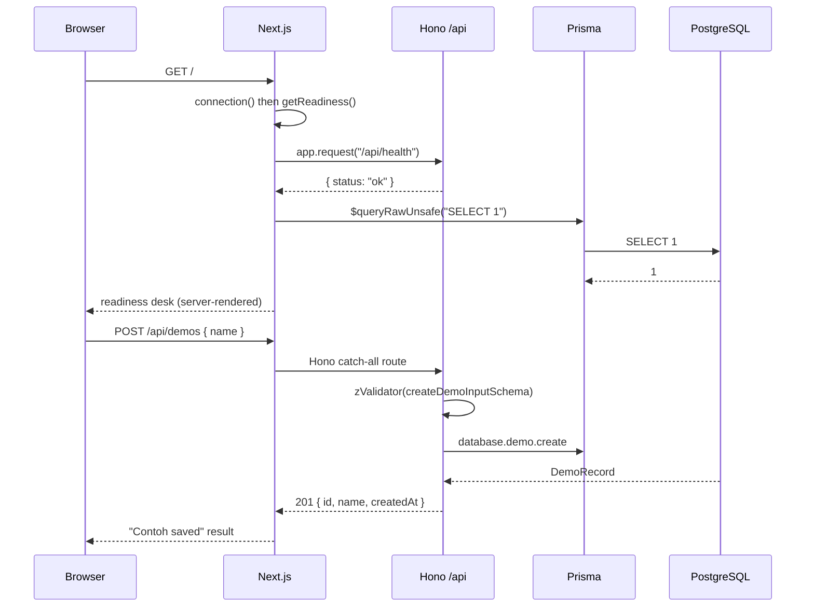

# Golden-path web

The Next.js golden-path application.

**Active contributors:** Dr. Ferdi Iskandar (Chief, human owner)

## Purpose

The golden-path web app at `projects/golden-path/apps/web` is the repository's single deployable demonstrator. It proves the typed Database → API → Web flow: a Next.js 16 App Router application on the Node runtime mounts the package-owned typed Hono API below `/api`, renders a server-first readiness desk, and lets the Chief (or any visitor) create one schema-validated demo record. It intentionally excludes product branding, authentication, payment, email, AI, and production deployment so it remains a safe reference.

## Key source files

| File | Role |
| --- | --- |
| `projects/golden-path/apps/web/src/app/page.tsx` | Server-rendered readiness desk page |
| `projects/golden-path/apps/web/src/app/layout.tsx` | Root layout: language, fonts, metadata |
| `projects/golden-path/apps/web/src/app/globals.css` | Tailwind v4 + Sentra token imports, token-driven styling |
| `projects/golden-path/apps/web/src/app/api/[[...route]]/route.ts` | Hono catch-all mount (GET/POST/PUT/PATCH/DELETE) |
| `projects/golden-path/apps/web/src/app/api/webhooks/stripe/route.ts` | Stripe capability webhook (static route) |
| `projects/golden-path/apps/web/src/components/demo-form.tsx` | Client boundary: demo submission form |
| `projects/golden-path/apps/web/src/lib/api-client.ts` | Browser API client over the typed Hono RPC |
| `projects/golden-path/apps/web/src/lib/server-data.ts` | Server data fetching (readiness status, cache tags) |
| `projects/golden-path/apps/web/src/instrumentation.ts` | OpenTelemetry telemetry hook |
| `projects/golden-path/apps/web/src/email/welcome.tsx` | React Email welcome template (capability) |
| `projects/golden-path/apps/web/playwright.config.ts` | E2E configuration |
| `projects/golden-path/apps/web/e2e/golden-path.spec.ts` | Functional browser journey test |
| `projects/golden-path/apps/web/e2e/visual.spec.ts` | Visual regression baseline test |
| `projects/golden-path/apps/web/package.json` | Workspace manifest (`@safrs/web`) |
| `projects/golden-path/capabilities.json` | Declares the active capability packs |
| `projects/golden-path/docs/architecture.md` | Capsule architecture intent |
| `projects/golden-path/docs/data.md` | Capsule data boundary |
| `projects/golden-path/docs/testing.md` | Capsule testing intent |

## How it works

### Server-first readiness desk

`src/app/page.tsx` renders a readiness desk server-first. Wrapped in a `Suspense` boundary with a skeleton fallback, the page calls `connection()` then `getReadiness()` from `src/lib/server-data.ts`. Readiness checks two dependencies in parallel:

- **API** — `readApiStatus()` calls `app.request("/api/health")` directly against the in-process Hono app and, using `next/cache`, applies `cacheLife("minutes")` and a `safrs:readiness:api` cache tag.
- **Database** — `readDatabaseStatus()` dynamically imports `@safrs/database` and runs `$queryRawUnsafe("SELECT 1")` against PostgreSQL.

Failure of either dependency degrades that card to "attention" instead of breaking the page, keeping the desk useful during local setup.

The page displays a four-step flow rail (Database → API → Web → status), two `StatusCard` widgets from `@safrs/ui`, and the demo form. UI strings and the status card UI come from `@sentra/ui`; all styling uses Sentra tokens from `@sentra/token` via `src/app/globals.css`. The root layout (`src/app/layout.tsx`) sets `lang="id"`, loads Geist fonts through `@sentra/token/fonts`, and provides metadata.

### API mounting

The Hono app from `@safrs/api` is mounted under `/api` through the Next.js catch-all route at `src/app/api/[[...route]]/route.ts`:

```ts
import { app } from "@safrs/api";
import { handle } from "hono/vercel";

const handler = handle(app);
export { handler as DELETE, handler as GET, handler as PATCH, handler as POST, handler as PUT };
```

The package-owned `@safrs/api` app exposes `/api/health`, `/api/demos` (GET/POST), `/api/openapi.json`, and `/api/docs`. The catch-all makes every Hono route reachable as a Next.js route. Prisma and `DATABASE_URL` remain server-only; the browser never sees them.

### Demo form (the small client boundary)

`src/components/demo-form.tsx` is the smallest client leaf. It reads the typed API client from `src/lib/api-client.ts`, which builds a same-origin absolute `/api` URL from `window.location.origin` (or `NEXT_PUBLIC_APP_URL`), then submits:

```ts
client.api.demos.$post({ json: { name } })
```

The typed Hono RPC client (`hc<AppType>`) gives compile-time drift detection between the frontend and backend. The form reports success or a friendly error string without printing technical details, and uses an `aria-live` region for the result.

### Capability hooks (email and Stripe)

This capsule has two active capabilities declared in `projects/golden-path/capabilities.json` (`email` and `stripe`, both R2):

- **Email** — `src/email/welcome.tsx` is a React Email template. It deliberately pulls every colour from `@sentra/token/src/tokens.json` at render time (never raw literals), because email clients require inline styles. Preview locally with `pnpm dev:email`; no real email is sent in development.
- **Stripe** — `src/app/api/webhooks/stripe/route.ts` is a static route that takes precedence over the catch-all. It verifies the `stripe-signature` header with `constructEventAsync`, returns typed error envelopes (`STRIPE_NOT_CONFIGURED` / 503, `SIGNATURE_MISSING` / 400, `SIGNATURE_INVALID` / 400), and acknowledges unknown events so Stripe stops retrying. Local forwarding uses `pnpm stripe:listen`.

### Telemetry

`src/instrumentation.ts` is Next.js's `register()` hook. It loads telemetry config from `@safrs/telemetry` and calls `initTelemetry()` so HTTP and Prisma auto-instrumentation observe the full request chain. It is disabled by default unless a collector is reachable — see `how-to-monitor/tracing.md`.



## Integration points

- **`@safrs/api`** provides the mounted Hono app and the typed RPC client. Full route documentation: [packages/api.md](../packages/api.md).
- **`@safrs/database`** supplies Prisma + local PostgreSQL used by the readiness check and demo create. See [packages/database.md](../packages/database.md).
- **`@sentra/token`** governs all colours, radii, fonts, and layout — see [design tokens](../features/design-tokens.md) and [packages/token.md](../packages/token.md).
- **`@safrs/ui`** supplies the `StatusCard` and React components — see [packages/ui.md](../packages/ui.md) and `packages/ui/AGENTS.md`.
- **`@safrs/telemetry`** powers the instrumentation hook — see [packages/telemetry.md](../packages/telemetry.md) and [tracing](../how-to-monitor/tracing.md).
- **`@safrs/env`** provides `serverEnv` and `clientEnv` (validated environment split).
- Stripe and email are activated via the project's capability records — see [capability packs](../features/capability-packs.md).
- The capsule's risk posture is defined in `projects/golden-path/AGENTS.md` and `projects/golden-path/apps/web/AGENTS.md`.

## Testing and verification

- **Unit tests (Vitest)** cover the page (`src/app/page.test.tsx`), server data (`src/lib/server-data.test.ts`), API client (`src/lib/api-client.test.ts`), the Hono mount route (`src/app/api/[[...route]]/route.test.ts`), and the Stripe webhook (`src/app/api/webhooks/stripe/route.test.ts` — 503/400/400/200 cases). Run with `pnpm --filter @safrs/web test`.
- **Type check and build**: `pnpm --filter @safrs/web typecheck`, `pnpm --filter @safrs/web build`.
- **E2E (Playwright)** in `e2e/` runs the real browser journey against a disposable `_test` PostgreSQL database. `e2e/environment.ts` rejects any non-disposable `DATABASE_URL` via the reset guard. `golden-path.spec.ts` verifies the readiness desk and creates/deletes a demo record; `visual.spec.ts` snapshots the desk to a committed baseline (`pnpm --filter @safrs/web test:e2e`). Run with `pnpm --filter @safrs/web test:e2e:update` to regenerate baselines.



## Related pages

- [Apps overview](index.md)
- [Design tokens](../features/design-tokens.md)
- [Capability packs](../features/capability-packs.md)
- [Architecture](../overview/architecture.md) and [glossary](../overview/glossary.md)
- [Tracing](../how-to-monitor/tracing.md)
