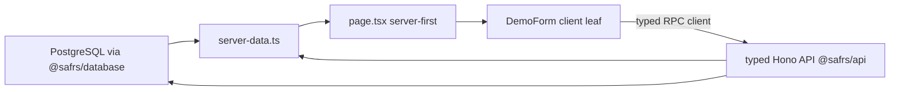

# Golden-path web

## Purpose

Golden-path web is the SAFRS Monorepo's single deployable application: a
Next.js App Router deployment unit that proves the typed Database → API → Web
flow with one safe demo record. It renders a server-first "readiness desk" in
Bahasa Indonesia, checks that PostgreSQL and the typed Hono API are reachable,
and lets the user store a single validated demo record end to end.

It is the golden-path baseline from the root `AGENTS.md`: "the default
demonstrator is `projects/golden-path/apps/web`: one Next.js deployment unit
that mounts the package-owned typed Hono API under `/api`."

Owner: Chief (human). Boundary: `projects/golden-path/apps/web/**`. Default risk
R1; API, dependency, environment, database, architecture, test-control, and CI
changes are R2.

Active contributors: the golden-path capsule is owned by Chief (human owner);
engineering work is executed by agents under the SAFRS multi-agent protocol.

## Architecture

The app is intentionally thin. All real work lives in shared packages; the app
presents it and submits through a typed client.

- **Server-first page** — `src/app/page.tsx` renders the readiness desk and
  streams a dynamic readiness check behind `<Suspense>` with a skeleton. It does
  not send non-serializable server values to the client.
- **Two status cards** — `StatusCard` from `@safrs/ui` shows API and database
  readiness from `src/lib/server-data.ts`.
- **One client leaf** — `DemoForm` (`src/components/demo-form.tsx`) is the
  smallest client component, doing nothing except submitting the demo name and
  rendering the result.
- **Bounded client boundary** — browser code depends only on the public typed
  client (`@safrs/api/client`). Prisma and `DATABASE_URL` are server-only.



## Pages

- **`/`** — the only route. `src/app/page.tsx` renders a readiness flow rail
  (Database → API → Web → aggregate result), two `StatusCard`s, and the demo
  form. Chinese/Indonesian microcopy: "Meja kesiapan", "Siap"/"Perlu perhatian".
- **Root layout** — `src/app/layout.tsx` sets `lang="id"`, metadata, and loads
  the Sentra Geist fonts through `@sentra/token/fonts`.
- **API routes** — served under `/api/*` by the mounted Hono app (see below).

## API mounting

The typed Hono API is mounted on the Node runtime via the Next.js catch-all route
`src/app/api/[[...route]]/route.ts`:

```ts
import { app } from "@safrs/api";
import { handle } from "hono/vercel";

const handler = handle(app);
export { handler as DELETE, handler as GET, handler as PATCH, handler as POST, handler as PUT };
```

Every `/api/*` request is handled by `@safrs/api`. See [API overview](../api/index.md)
and [REST endpoints](../api/rest-endpoints.md).

## Form

`src/components/demo-form.tsx` is a client component that:

1. Reads the demo name from the form.
2. Builds a browser API client with `createBrowserApiClient(window.location.origin)`
   from `src/lib/api-client.ts` (resolving `NEXT_PUBLIC_APP_URL` when set).
3. Calls `client.api.demos.$post({ json: { name } })` — a **typed RPC** call.
4. Renders the success message (`Contoh <name> tersimpan.`) or an error state in
   an `aria-live="polite"` region.

The server never passes non-serializable values to the client; the server data
readiness check lives in `src/lib/server-data.ts`.

## Email

`src/email/welcome.tsx` is a React Email welcome template that consumes **Sentra
design tokens from `@sentra/token/tokens.json`** — never raw literals — so the
emails match the product visual language. It loads the sans font family from the
token JSON and pulls surface, border, and text colours from semantic tokens.

Development only: `pnpm --filter @safrs/web dev:email` runs the React Email
preview server (`email dev --dir src/email`). Per the EMAIL capability, provider
delivery is disabled by default in local development — "no real email is ever
sent from development."

## Stripe webhook

`src/app/api/webhooks/stripe/route.ts` is a static, dedicated route that **takes
precedence over** the optional catch-all `/api/[[...route]]` for that path. It is
the golden-path integration point for the Stripe capability pack.

- Reads `STRIPE_SECRET_KEY` and `STRIPE_WEBHOOK_SECRET` from `serverEnv`; returns
  `503 STRIPE_NOT_CONFIGURED` when unset.
- Requires and verifies the `stripe-signature` header via
  `stripe.webhooks.constructEventAsync`, returning `400 SIGNATURE_MISSING` or
  `400 SIGNATURE_INVALID` on failure.
- Every response carries an `x-correlation-id`.
- For local dev: `pnpm --filter @safrs/web stripe:listen` forwards sandbox events
  to `localhost:3000/api/webhooks/stripe`. No live charge is permitted.

## E2E

Playwright runs in `e2e/` (`playwright.config.ts`), gated by
`resolvePlaywrightEnvironment` (`e2e/environment.ts`), which **rejects** any
non-disposable `DATABASE_URL`: it requires a local disposable PostgreSQL
suffixed `_test` via `assertDisposableTestDatabase`. The dev server starts on
`127.0.0.1:3001`.

- `e2e/golden-path.spec.ts` — journey test: _Chief can see health and create a
  demo record_. Asserts the readiness headings and the stored demo result, then
  deletes the created row after each test.
- `e2e/visual.spec.ts` — visual regression baseline
  (`e2e/screenshots/readiness-desk.png`) for the server-rendered "ready" desk.
  Regenerate intentionally with `--update-snapshots`.

Run with `pnpm test:e2e` (or `pnpm --filter @safrs/web test:e2e`).

## Instrumentation

`src/instrumentation.ts` runs once at server start (before routes are imported)
so HTTP and Prisma auto-instrumentation observe the full request chain. It loads
OpenTelemetry config via `loadTelemetryConfig()` from `@safrs/telemetry` and
calls `initTelemetry(config)`. Disabled by default unless `OTEL_SDK_DISABLED` is
unset and a collector is reachable (local Jaeger via
`docker compose -f compose.telemetry.yaml up -d jaeger`).

## Key source files

- `projects/golden-path/apps/web/src/app/page.tsx`
- `projects/golden-path/apps/web/src/app/layout.tsx`
- `projects/golden-path/apps/web/src/app/api/[[...route]]/route.ts`
- `projects/golden-path/apps/web/src/app/api/webhooks/stripe/route.ts`
- `projects/golden-path/apps/web/src/components/demo-form.tsx`
- `projects/golden-path/apps/web/src/lib/api-client.ts`
- `projects/golden-path/apps/web/src/lib/server-data.ts`
- `projects/golden-path/apps/web/src/instrumentation.ts`
- `projects/golden-path/apps/web/src/email/welcome.tsx`
- `projects/golden-path/apps/web/AGENTS.md`
- `projects/golden-path/AGENTS.md`
- `projects/golden-path/apps/web/package.json`
- `projects/golden-path/capabilities.json` (declares `email` and `stripe` as R2 for this project)

## Integration points

- **API** — `@safrs/api` mounted under `/api` ([API overview](../api/index.md)).
- **Database** — `@safrs/database` for readiness probe and demo persistence.
- **Env** — `@safrs/env` (`serverEnv`, `clientEnv`) guards the environment boundary.
- **UI** — `@safrs/ui` for `StatusCard`.
- **Tokens** — `@sentra/token` for all styling and email colours
  ([Design tokens](../features/design-tokens.md)).
- **Telemetry** — `@safrs/telemetry` for OTLP tracing.
- **Capability packs** — `email` and `stripe` are declared R2 capabilities for
  this project ([Capability packs](../features/capability-packs.md)).

## Related

- [Apps overview](index.md)
- [API overview](../api/index.md)
- [SAFRS governance](../features/safrs-governance.md)
