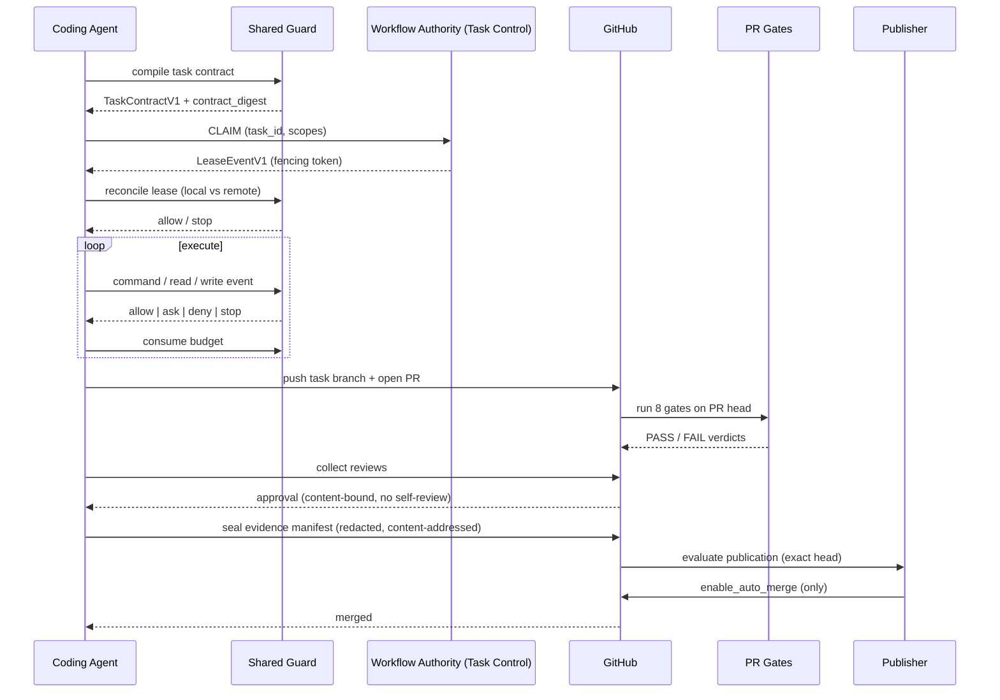

# Automation Control Plane

## Purpose

The automation control plane (ADR 0002) is the cross-cutting SAFRS feature that turns an agent's intent into a machine-checked, reconstructable, published change. It extends the local Control Plane v1 with canonical contracts, monotonic risk, serialized remote leases, budget enforcement, PR gates, sealed evidence, content-bound approvals, and a separated publisher identity. Every automated change is reconstructable from durable evidence: contract digest → lease chain → run → checks → approvals → publication.

Implementation lives in `tools/automation/`; this page describes the feature end to end.

## Key source files

| File | Purpose |
| --- | --- |
| `docs/adrs/0002-safrs-automation-control-plane.md` | The accepted decision that defines the control plane |
| `tools/automation/src/*.mjs` | The control-plane implementation (contracts, risk, guard, leases, budgets, gates, approvals, evidence, publisher, redaction) |
| `.safrs/automation-policy.json` | Machine policy: operations, budgets, approval defaults, verification profile |
| `.safrs/schemas/*.v1.schema.json` | Seven JSON Schema contract documents |
| `tools/task/src/cli.mjs` | Task ownership and local lease recording (`pnpm task`) |
| `tools/status/src/cli.mjs` | Read-only registry/lease/governance report (`pnpm status`) |
| `.github/workflows/safrs-task-control.yml` | Serialized remote lease authority |
| `.github/workflows/safrs-pr-gates.yml` | The eight PR gates as a matrix |
| `.github/workflows/safrs-publish.yml` | Publication eligibility evaluation |

## How it works

The lifecycle is **Contract → Lease → Execute → Gates → Evidence → Approval → Publish**:

### 1. Contract (identity, scope, and risk up front)

A task is compiled into a `TaskContractV1` by `tools/automation/src/contracts.mjs`. The compiler checks scopes, tool grants against `.safrs/tool-inventory.json`, network grants against registered endpoints (HTTPS 443 only), required budget dimensions, and forbids any downgrade of the approval policy or verification profile. Risk is monotonic (`tools/automation/src/risk.mjs`): `effective_risk = max(declared, path, operation, data, capability)`, raised never lowered, with every non-R0 dimension carrying a reason. The contract is sealed with a content-addressed `contract_digest` over canonical JSON.

### 2. Lease (serialized remote authority)

Before executing, the agent obtains an exclusive lease through the remote authority. `tools/automation/src/leases.mjs` models an append-only `LeaseEventV1` chain held as issue comments in GitHub (`.github/workflows/safrs-task-control.yml`). Fencing tokens increment on `CLAIM`/`RECLAIM`; a writer holding a stale token stops. The local `reconcileLease` gate refuses to push or mutate unless the remote chain confirms the local claim.

### 3. Execute

Execution is bound to the task contract, run contract, and lease. The shared vendor-neutral guard (`tools/automation/src/guard.mjs`) authorizes every command, read, and write the agent attempts; adapter translators in `tools/automation/src/adapters/` feed native hook payloads into it. Budgets (`tools/automation/src/budgets.mjs`) are consumed task-wide and a tripped breaker stops the task.

### 4. Gates

On the pull request, `.github/workflows/safrs-pr-gates.yml` runs the eight stable gates (`tools/automation/src/gates.mjs`): `safrs.contract`, `safrs.lease`, `safrs.risk`, `safrs.budgets`, `safrs.verification`, `safrs.review`, `safrs.evidence`, `safrs.platform`. Gates validate the artifacts present in the change set and fail closed; absent artifacts report `not_applicable` and pass.

### 5. Evidence

`tools/automation/src/evidence.mjs` seals an `EvidenceManifestV1` recording the contract digest, lease event digests, base/head SHAs, diff digest, effective risk, tool and network events, budget usage, check verdicts, approvals, publication, and artifact hashes. Redaction (`tools/automation/src/redaction.mjs`) runs first and is deterministic; finalization refuses to emit a manifest that still contains secret-shaped content. The manifest is content-addressed so any later modification fails verification.

### 6. Approval

For R2/R3 work, `tools/automation/src/approvals.mjs` requires a qualifying approval bound to exact content — task, contract digest, subject SHA, diff digest, authority, and expiry — with no self-review. An approval issued for one commit is invalid for a changed head.

### 7. Publish

`tools/automation/src/publisher.mjs` grants the publisher exactly one action: request GitHub auto-merge for an exact, fully verified head. It never merges, pushes, approves, or deploys, and refuses to publish any R3 execution evidence. `.github/workflows/safrs-publish.yml` runs evaluation-only until Activation Decision 2 activates the separate publisher identity (`SAFRS_PUBLISHER_ENABLED`).

## Integration points

- **Repository canon**: policy in `.safrs/automation-policy.json`, schemas in `.safrs/schemas/`, tool inventory in `.safrs/tool-inventory.json`, all enforced by both Node (`tools/automation/`) and Python (`tools/safrs/`) with byte-identical digests.
- **Task and status CLIs**: ownership via `pnpm task`, reporting via `pnpm status` — see [Task CLI](../tools/task.md) and [Status CLI](../tools/status.md).
- **CI workflows**: `.github/workflows/safrs-task-control.yml` (lease authority), `safrs-pr-gates.yml` (gates), `safrs-publish.yml` (publication).
- **Governance**: the feature is checked by the Python governance suite in `tests/architecture/`, `tests/governance/` (including `test_automation_contracts.py` and `test_automation_approvals.py`), `tests/repository/`, and `tools/safrs/`.

## Related pages

- [Automation control plane (tools)](../tools/automation.md) — implementation details and CLI
- [Task CLI](../tools/task.md) and [Status CLI](../tools/status.md)
- [Architecture](../overview/architecture.md) — control plane in the six-layer model
- [SAFRS governance](safrs-governance.md) — risk model, roles, verification
- [SAFRS governance checkers](../tools/safrs.md) — 16 Python checkers
- [Patterns and conventions](../how-to-contribute/patterns-and-conventions.md) — canonical JSON and monotonic risk
- [Security](../security.md) — trust boundaries and secret policy
