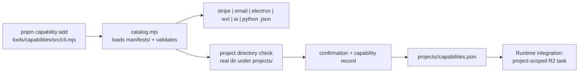

# Capability packs

Optional capability activation in the SAFRS Monorepo.

## Purpose

Capability packs are optional feature modules — **Stripe, email, Electron, WXT, AI, and Python** — that a project can activate on demand via `pnpm capability:add`. They are not part of the runtime baseline; a project declares only the packs it explicitly needs. Activation is a risk-governed operation (every pack is R2), and the tool records the selection in a project `capabilities.json` while leaving runtime integration as a separate project-scoped R2 task.

## Key source files

| File | Role |
| --- | --- |
| `tools/capabilities/manifests/stripe.json` | Stripe pack manifest |
| `tools/capabilities/manifests/email.json` | Email pack manifest |
| `tools/capabilities/manifests/electron.json` | Electron pack manifest |
| `tools/capabilities/manifests/wxt.json` | WXT pack manifest |
| `tools/capabilities/manifests/ai.json` | AI pack manifest |
| `tools/capabilities/manifests/python.json` | Python pack manifest |
| `tools/capabilities/src/catalog.mjs` | Catalog loader + `applyCapability` logic |
| `tools/capabilities/src/schema.mjs` | Manifest/capabilities validation |
| `tools/capabilities/package.json` | Tool workspace manifest (`@safrs/capabilities`) |
| `projects/golden-path/capabilities.json` | The golden-path project's active packs |
| `docs/governance/SAFRS_PROJECT_CAPSULES.md` | Project capsule / capability convention |

## How it works

### The manifest catalog

The catalog in `tools/capabilities/src/catalog.mjs` loads every `.json` file in `tools/capabilities/manifests/`, validates it with `schema.mjs`, and enforces that the filename matches the manifest `id`. Each manifest describes the pack's boundary:

```json
{
  "id": "email",
  "label": "Local email development",
  "description": "React Email preview and provider delivery boundary ...",
  "risk": "R2",
  "dependencies": ["@react-email/components", "react-email", "resend"],
  "environment": ["EMAIL_FROM", "RESEND_API_KEY"],
  "commands": ["pnpm dev:email"],
  "tests": ["render email templates", "block non-local recipients in development"],
  "sensitivePaths": ["projects/<project>/emails/**", "projects/<project>/src/email/**"],
  "sideEffects": ["Provider delivery is disabled by default in local development."],
  "removal": "Remove project email code, environment entries, and the project capability record ..."
}
```

### What `capability:add` does

`pnpm capability:add` runs `node tools/capabilities/src/cli.mjs` (wired in the root `package.json`). The core logic in `applyCapability`:

1. Loads and validates the catalog, finds the manifest for the requested capability.
2. Sanitizes the project slug and verifies the target is a real directory inside `projects/` (rejecting symlinks and escaping paths).
3. Requires an exact confirmation string `ENABLE <id> FOR <slug>` — nothing is written otherwise.
4. For the `python` pack, requires a recorded technical justification that Node.js is unsuitable.
5. Reads the project's existing `capabilities.json`, appends or updates the capability record (`{ id, risk }`, risk raised to `maximumRisk` if already present), sorts, and writes `{ version: 1, capabilities }` back.

Activation **records** the selection; it does not install runtime integration. The manifest's own note is explicit: "Runtime integration is not installed by this selector; it remains a project-scoped R2 task."

### The capability packs

| Pack | Risk | Boundary |
| --- | --- | --- |
| Stripe | R2 | Sandbox-only payment integration with local webhook forwarding (`pnpm stripe:listen`); no live charges permitted; verifies signatures; rejects live keys in local defaults |
| Email | R2 | React Email preview + provider delivery; provider delivery disabled in local development; blocks non-local recipients in dev |
| Electron | R2 | Desktop shell with explicit preload allowlist and IPC validation; requires a project-scoped threat model |
| WXT | R2 | Browser extension with permission-minimized manifest review and content-script isolation |
| AI | R2 | Provider-neutral AI boundary with structured Zod output and deterministic test doubles; explicit request/token bounds |
| Python | R2 | Available only with a recorded technical justification proving Node.js is unsuitable |

All six are R2: they cross the shared-package/dependency boundary and add new runtime capability, so each requires the enhanced review mandated by the SAFRS control matrix.

### Risk classification

Every pack is declared R2 in its manifest because activation touches dependencies, environment keys, and sensitive paths. The golden-path project currently activates exactly two: `email` and `stripe` (`projects/golden-path/capabilities.json`). Sensitive paths for each pack (for example `projects/<project>/src/payments/**`, `src/webhooks/**`, `emails/**`, `apps/desktop/**`, `apps/extension/**`, `src/ai/**`, `python/**`) map into `.safrs/sensitive-paths.json`'s R2 review posture.



## Integration points

- **Golden-path**: `projects/golden-path/capabilities.json` activates email + stripe; see [golden-path-web](../apps/golden-path-web.md) for the email template and Stripe webhook route.
- **Project capsules**: capability selection is part of the capsule convention in `docs/governance/SAFRS_PROJECT_CAPSULES.md`.
- **Tooling**: the catalog tool is documented in [tools/capabilities.md](../tools/capabilities.md).
- **Governance**: activation and its sensitive paths are governed by the risk tiers in [SAFRS governance](safrs-governance.md).

## Related pages

- [Capability catalog tool](../tools/capabilities.md)
- [SAFRS governance](safrs-governance.md)
- [Golden-path web](../apps/golden-path-web.md)
