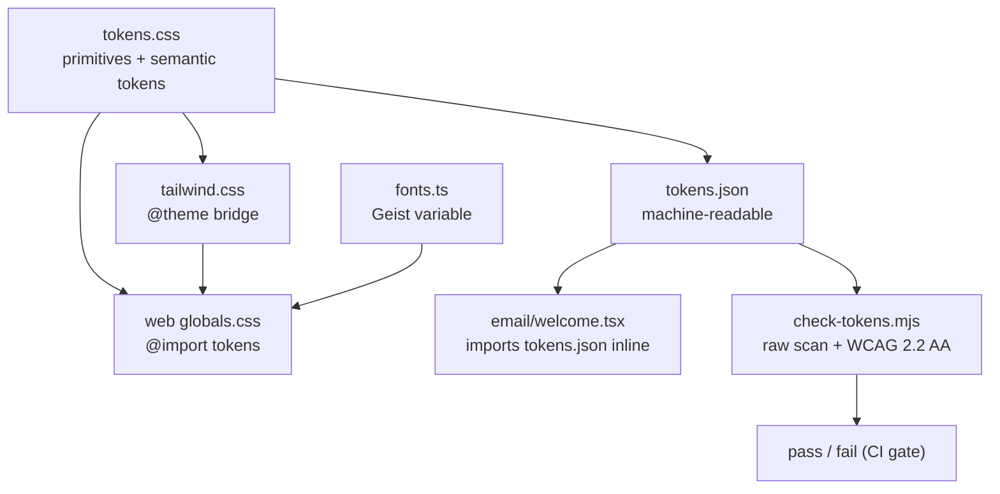

# Design tokens

The Sentra design token system (`@sentra/token`).

## Purpose

The Sentra design token system is the single source of truth for every rendered surface in the repository — websites, dashboards, and email templates alike. Raw colour and radius values are forbidden outside the token package, and every semantic text/background pair is recomputed against WCAG 2.2 AA at build time. This makes brand consistency and accessibility a machine-enforced build condition rather than a review step.

## Key source files

| File | Role |
| --- | --- |
| `packages/token/AGENTS.md` | Token package mandate and rules |
| `packages/token/UI-RULES.md` | Sentraverse UI rules (layout, colour zones, type, states) |
| `packages/token/scope.txt` | Paths under raw-value enforcement |
| `packages/token/src/tokens.css` | The only file allowed to contain hex/radius values |
| `packages/token/src/tokens.json` | Machine-readable token values (generated from CSS) |
| `packages/token/src/tailwind.css` | Tailwind v4 `@theme` bridge |
| `packages/token/src/fonts.ts` | Self-hosted Geist variable fonts (Next.js) |
| `scripts/check-tokens.mjs` | The token gate (raw-value scan + contrast recomputation) |

## How it works

### Three-layer package

`packages/token/src/tokens.css` is the only source of values. It declares private **primitives** (`--p-*`) and the **semantic** tokens (`--color-*`, `--radius-*`, typography, layout) that components actually consume. Semantic tokens alias one or more primitives, so the theme can change without touching component code. A new semantic token must be added to both the `:root` and `[data-theme="dark"]` blocks — the dark theme is authored, never derived.

The three consumption files:

- `src/tokens.css` — the definitions (imported into an app's root stylesheet).
- `src/tokens.json` — the same values in machine-readable form, read by the contrast gate and by `src/email/welcome.tsx` at render time (email clients require inline styles).
- `src/tailwind.css` — a Tailwind v4 `@theme inline` bridge that maps semantic tokens into utility namespaces (`bg-canvas`, `text-primary`, `rounded-structure`, `font-sans`, etc.), each utility pointing at the runtime `var(...)` so the dark theme re-resolves without extra Tailwind config.

Consumption in an app root stylesheet:

```css
@import "tailwindcss";
@import "@sentra/token/tokens.css";
@import "@sentra/token/tailwind.css";
```

### Fonts

`src/fonts.ts` exports `fontSans` and `fontMono` built from self-hosted Geist variable WOFF2 files vendored in `packages/token/assets/fonts/` (OFL). Fonts are never loaded from a CDN at runtime — determinism and privacy. The golden-path layout applies them via `next/font/local` CSS variables.

### The token gate

`scripts/check-tokens.mjs` is the part that actually holds. It runs two blocking checks:

1. **Raw-value scan** — no hex colour or literal radius appears in migrated scope. Scope is opt-in via `packages/token/scope.txt`; a path enters scope when migrated and never leaves. `--audit` reports unmigrated raw values without failing.
2. **WCAG 2.2 AA contrast recomputation** — for both light and dark themes, it computes relative luminance for every declared semantic pair (text on canvas/surface, accent, statuses, button labels, emphasis tiles, control boundaries, data series) and fails below threshold (4.5:1 for text, 3.0:1 for graphics/controls, 1.6:1 between data-ramp steps).

### Design rules (UI-RULES.md)

Beyond the gate, `packages/token/UI-RULES.md` establishes the design language: a chrome/content colour-zone split (vermillion accent vs. crimson status), two radii only (`--radius-structure` 0, `--radius-control` 2px), 12-column layout with column 8 left empty, `--layout-container-text` 68-char measure, tabular figures, 20px/1.5-stroke icons, and six worked reference screens in `docs/design-system/reference/` that screens should match rather than invent from the token list.



## Integration points

- **Golden-path app**: imported in `projects/golden-path/apps/web/src/app/globals.css`; fonts in `src/app/layout.tsx`. See [golden-path-web](../apps/golden-path-web.md).
- **`@safrs/ui`**: the shared UI package consumes tokens for its components (`StatusCard`, etc.).
- **Email**: `projects/golden-path/apps/web/src/email/welcome.tsx` reads `tokens.json` for inline styles.
- **`scope.txt`** currently lists `packages/token`, `packages/ui`, and `projects/golden-path/apps/web/src`.
- **Governance**: the gate runs inside `pnpm check` / `pnpm run governance` — see [SAFRS governance](safrs-governance.md) and [tools/safrs.md](../tools/safrs.md).
- Changing a token value is an **R2** change (shared package + governance control).

## Related pages

- [Design tokens package](../packages/token.md)
- [SAFRS governance](safrs-governance.md)
- [Golden-path web](../apps/golden-path-web.md)
