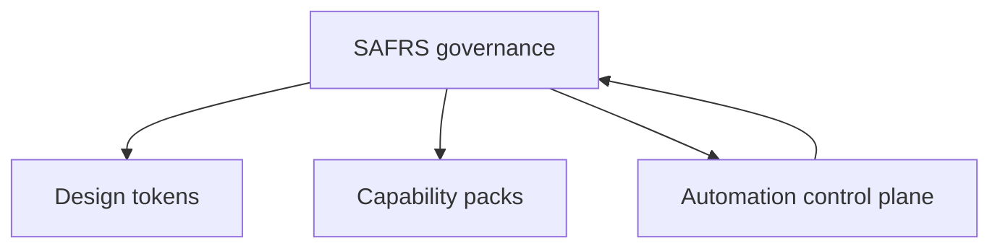

# Features — cross-cutting capabilities

## Purpose

This section documents the four cross-cutting features that span the monorepo
and are not tied to a single app or package. They are product-neutral and are
consumed across the repository.

The four features are:

1. **[SAFRS governance](safrs-governance.md)** — the Human-Governed ·
   Agent-Executed · Machine-Enforced control architecture: six layers, R0–R3
   risk, agent roles, sensitive-path detection, document registry, tool
   inventory, and a 16-checker verification pipeline.
2. **[Design tokens](design-tokens.md)** — the Sentra (`@sentra/token`) design
   token system: `tokens.css`, `tokens.json`, `tailwind.css`, self-hosted
   fonts, and machine-enforced WCAG 2.2 AA contrast.
3. **[Capability packs](capability-packs.md)** — optional, opt-in capability
   boundaries (Stripe, email, Electron, WXT, AI, Python) activated per project.
4. **[Automation control plane](automation-control-plane.md)** — machine-checked
   task contracts, lease chains, PR gates, budget ledgers, and evidence
   manifests (ADR 0002). *This page is maintained separately.*

## How the features relate

- **SAFRS governance** is the umbrella: it owns the risk model that classifies
  every change, including changes to design tokens and capability packs.
- **Design tokens** are a shared package (`packages/token`) whose value changes
  are classified R2 and gated by the contrast checker.
- **Capability packs** are governance-shaped: each manifest declares its own
  risk (`R2`), sensitive paths, environment, tests, and removal procedure.
- **Automation control plane** automates and enforces the governance model with
  machine-readable contracts and gates.

## Key source locations

- Governance specs: `SAFRS_SPEC.md`, `.safrs/policy.json`, `docs/governance/`
- Design tokens: `packages/token/`
- Capability manifests: `tools/capabilities/manifests/`
- Automation control plane: `tools/automation/`, `.safrs/automation-policy.json`

## Related

- [Apps overview](../apps/index.md)
- [API overview](../api/index.md)
