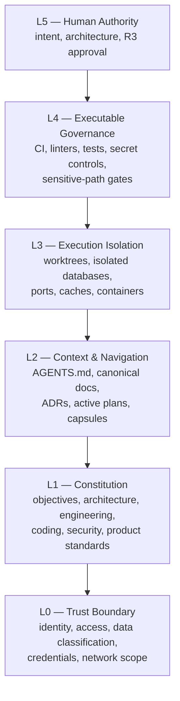
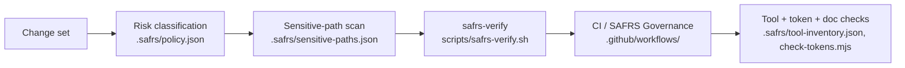

# SAFRS governance

The Sentra Agent-First Repository Standard governance model.

## Purpose

SAFRS v1.1 defines how the repository is structured, governed, and enforced when autonomous AI agents perform a substantial share of engineering work. Its operating model is **Human-Governed, Agent-Executed, Machine-Enforced**: humans set intent and own architecture, agents execute within explicit boundaries, and machines verify deterministically. This page explains the six-layer architecture, the R0–R3 risk tiers, agent roles, sensitive paths, the document registry, the verification pipeline, and the conformance levels.

## Key source files

| File | Role |
| --- | --- |
| `SAFRS_SPEC.md` | Normative specification (sections 3, 6, 7, 8, 10, 12, 19) |
| `AGENTS.md` | Root repository router and non-negotiable rules |
| `.safrs/policy.json` | Policy: risk tiers, roles, verification command |
| `.safrs/sensitive-paths.json` | Path patterns that escalate review (min R2) |
| `.safrs/document-registry.json` | Machine-readable document index |
| `.safrs/tool-inventory.json` | Approved tool/network inventory |
| `scripts/safrs-verify.sh` | Canonical verification entry point (plus `.mjs`/`.ps1`) |
| `docs/governance/SAFRS_AGENT_PERMISSIONS.md` | Role permission envelopes |
| `docs/governance/SAFRS_CONTROL_MATRIX.md` | Control × risk-tier matrix |
| `docs/governance/SAFRS_CONFORMANCE.md` | Conformance levels and declaration |
| `docs/governance/SAFRS_MULTI_AGENT_PROTOCOL.md` | Task state machine, handoff record |
| `docs/governance/SAFRS_DOCUMENT_LIFECYCLE.md` | Document classes and ADR/plan lifecycles |
| `docs/governance/SAFRS_PROJECT_CAPSULES.md` | Project capsule convention |
| `docs/governance/SAFRS_TOOL_INVENTORY.md` | Tool inventory policy |
| `docs/governance/PLATFORM_ACTIVATION.md` | Human-only GitHub enforcement checklist |

## How it works

### Six-layer control architecture

SAFRS is a six-layer architecture, from the trust boundary at the bottom to human authority at the top (`SAFRS_SPEC.md` §3). Each layer adds enforcement on top of the layer below.



- **L0 Trust Boundary** — identity, repository access, data classification, allowed tools/network, credentials. Agents never hold production credentials (SAFRS-01).
- **L1 Constitution** — stable principles in `.agents/knowledge/`.
- **L2 Context & Navigation** — `AGENTS.md` routes agents; the document registry is the machine-readable index.
- **L3 Execution Isolation** — parallel mutation uses separate worktrees; shared mutable state is isolated or serialized.
- **L4 Executable Governance** — CI, Biome, TypeScript, SAFRS verify, token enforcement, supply-chain scanning, architecture checks.
- **L5 Human Authority** — the Chief defines intent, owns architecture, and authorizes R3 actions. Approval is risk-based, not universal.

### Risk tiers R0–R3

Risk is set by impact, reversibility, privilege, blast radius, and data sensitivity (`SAFRS_SPEC.md` §7; configuration in `.safrs/policy.json`).

| Tier | Mutation | Human review | Human authorization | Examples |
| --- | --- | --- | --- | --- |
| **R0** | No | No | No | Read, search, summarize, inspect |
| **R1** | Yes | No (policy-based) | No | Local refactor, unit test, doc fix |
| **R2** | Yes | Required | No | Auth, DB migration, new dependency, shared API/package, CI/CD, architecture change |
| **R3** | Prepare-only | Required | Required | Production data/infra, credential policy, deployment auth, destructive migrations, financial actions |

The default risk is R1. Sensitive-path matches and verification-control changes are minimum R2.

### Agent roles

Roles are independent of model/vendor (`SAFRS_SPEC.md` §6; permission envelopes in `docs/governance/SAFRS_AGENT_PERMISSIONS.md` and `.safrs/policy.json`): Observer (read/search), Analyst (read + plan), Implementer (scoped modify + test + branch/PR), Reviewer (review, no self-approval of own R2/R3), Maintainer (broader modify + policy-permitting merge), Release Agent (prepare releases), Security Agent (scoped security analysis/remediation).

Effective authority is the intersection:

```
identity ∩ assigned role ∩ task scope ∩ environment ∩ repository policy ∩ risk tier
```

Tool availability never implies permission.

### Sensitive paths

`.safrs/sensitive-paths.json` lists patterns whose changes are at least R2, plus a `verification_control_patterns` list (`.safrs/**`, `AGENTS.md`, security/architecture tests, governance scripts, CI workflows) whose modification is minimum R2 even if the textual change looks small. An `risk_overrides` section forces `projects/**/safety-critical/**`, `projects/**/production/**`, and `infrastructure/production/**` to R3.

### Document registry

`.safrs/document-registry.json` is the machine-readable index of every canonical, reference, plan, and ADR document, tracking path, type, status, normativity (MUST/SHOULD/MAY), read order, and task scope. `AGENTS.md`'s Read order block and its routing are generated from this registry. Document classes and ADR/plan lifecycles are defined in `SAFRS_SPEC.md` §13 and `docs/governance/SAFRS_DOCUMENT_LIFECYCLE.md`.

### Verification pipeline



The canonical local entry point is `bash scripts/safrs-verify.sh` (`powershell ... safrs-verify.ps1` on Windows), which must pass before work is declared complete. It wires in the governance checkers under `tools/safrs/` (see [tools/safrs.md](../tools/safrs.md)), the token gate `scripts/check-tokens.mjs` (see [design tokens](design-tokens.md)), and architecture/security checks. Verification-integrity escalation: changing `.safrs/**`, `AGENTS.md`, security/architecture tests, governance scripts, or CI is minimum R2.

### Conformance levels

`SAFRS_SPEC.md` §19 and `docs/governance/SAFRS_CONFORMANCE.md` define four levels:

- **SAFRS Core** — canonical routing, policy, risk tiers, local verification. **Currently declared** (assessed 2026-08-10).
- **SAFRS Controlled** — Core + CI governance checks + protected default branch + R2 review.
- **SAFRS Secure** — Controlled + execution isolation + credential/network/supply-chain controls.
- **SAFRS Regulated** — Secure + auditable approvals + domain invariants + controlled production access + evidence retention.

The repository claims only Core; Controlled and above require platform evidence that only a human administrator can gather and verify (see `docs/governance/PLATFORM_ACTIVATION.md`).

## Integration points

- **Routing**: `AGENTS.md` consumes the document registry to route every session's reads.
- **Workspace**: packages and projects follow the capsule convention in `docs/governance/SAFRS_PROJECT_CAPSULES.md`.
- **Tooling**: the governance checkers live in `tools/safrs/` — see [tools/safrs.md](../tools/safrs.md).
- **Tokens**: `scripts/check-tokens.mjs` runs inside the governance gate — see [design tokens](design-tokens.md).
- **Apps**: the golden-path capsule declares its risk posture and non-goals in `projects/golden-path/AGENTS.md`.
- **Platform**: enforcement lives in GitHub settings via `docs/governance/PLATFORM_ACTIVATION.md`.

## Related pages

- [Architecture](../overview/architecture.md) and [glossary](../overview/glossary.md)
- [Governance tooling](../tools/safrs.md)
- [Security](../security.md)
- [Design tokens](design-tokens.md)
- [Capability packs](capability-packs.md)
