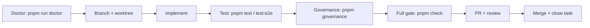

# Development workflow

**Purpose**: This page describes the end-to-end cycle for contributing code: creating the isolated environment, writing and testing changes, opening a pull request, and merging. It covers worktree usage, the `pnpm` scripts you will use, the `pnpm check` gate, and the `pnpm governance` command.

## The cycle



## Branch and isolated worktree

Follow-up to the task lifecycle, the mutation phase must be isolated. Per `AGENTS.md` and `SAFRS_SPEC.md` section 10:

- Create worktrees **outside** the repository working tree, in the sibling directory `../Monorepo.worktrees/<branch>`, for example:
  ```bash
  git worktree add ../Monorepo.worktrees/feat/x feat/x
  ```
- Never create worktrees inside the repository root (`.worktrees/` is legacy and only a gitignored safety net).
- Parallel implementers each use a dedicated worktree. Shared mutable state (databases, ports, caches) is isolated per task or serialized.
- The default branch is `main`. Never push or merge a protected branch without explicit policy and human authorization.

## Code

- Follow the style rules and patterns in [patterns-and-conventions](patterns-and-conventions.md): TypeScript strict, Biome formatting, named exports, schema-first contracts.
- Keep changes small and scoped to the task. Prefer the smallest viable change.
- Raw colour or radius values outside `packages/token/src/tokens.css` are forbidden; the token gate enforces this.

## Test

Run the narrowest relevant test first, then the broader suite. See [testing](testing.md) for details:

```bash
pnpm test        # contract + unit tests (governance-aware runner)
pnpm test:e2e    # Playwright browser smoke against a disposable test DB
```

`pnpm test` runs `scripts/test.mjs`, which sets `DATABASE_INTEGRATION_TESTS=1` and runs contract tests followed by `turbo run test` across the workspace.

## Verify with governance

`pnpm governance` runs `scripts/safrs-verify.mjs`, which invokes `scripts/safrs-verify.sh` (or `.ps1` on Windows). It checks policy, docs, routing, tool inventory, topology, GitHub Action pinning, sensitive-change classification, handoff, and the architecture/governance Python tests. Run it before opening a PR.

## The `pnpm check` gate

`pnpm check` is the full gate that CI runs. From `package.json`, it chains:

```text
pnpm governance -> pnpm check:tokens -> pnpm lint -> pnpm typecheck -> pnpm test -> pnpm build
```

Each stage must pass:

| Stage | Command | What it verifies |
| --- | --- | --- |
| Governance | `pnpm governance` | SAFRS policy, docs, routing, topology, sensitive changes |
| Tokens | `pnpm check:tokens` | No raw colours/radii outside `packages/token` |
| Lint | `pnpm lint` | Biome `recommended` on the whole tree |
| Typecheck | `pnpm typecheck` | `turbo run typecheck`, strict TypeScript |
| Tests | `pnpm test` | Contract + unit + integration tests |
| Build | `pnpm build` | `turbo run build` across the workspace |

## Open a PR and merge

1. Push the feature branch (from its worktree) and open a pull request against `main`.
2. CI runs the `CI` and `SAFRS Governance` workflows (see [tooling](tooling.md)).
3. Required review completes per the risk tier (R2+/R3 require designated review; R3 requires human authorization before execution).
4. After merge, move the task to `MERGED`, then `CLOSED`, and update `.agents/HANDOFF.md`.

## Useful pnpm scripts

From the root `package.json`:

```bash
pnpm run setup      # validate env, start Postgres, generate Prisma, migrate, seed
pnpm dev            # start Next.js dev server (auto-starts Postgres if needed)
pnpm run doctor     # diagnose environment readiness
pnpm db:start       # docker compose up -d --wait postgres
pnpm db:reset       # reset local DB (requires disposable guard)
pnpm project:new    # interactive project wizard
pnpm capability:add # add an optional capability pack
pnpm deps:graph     # render the inter-package dependency graph
pnpm codegen        # generate OpenAPI, mocks, and typed client from Zod schemas
```

## Related pages

- [How to contribute](index.md) — task lifecycle, review, definition of done
- [Testing](testing.md) — how and what to test
- [Debugging](debugging.md) — when things go wrong
- [Tooling](tooling.md) — build system, linters, generators, CI
- [Getting started](../overview/getting-started.md) — setup and daily commands
