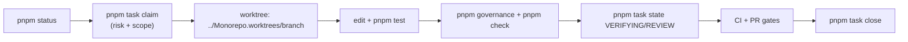

# Development workflow

This page describes the day-to-day cycle of contributing to the Monorepo: how to branch and worktree, which pnpm scripts to run, and how the gates (`pnpm check`, `pnpm governance`) enforce SAFRS. Start from [How to contribute](index.md) and [Getting started](../overview/getting-started.md).

## Purpose

- Document the branch/worktree cycle for parallel mutation under SAFRS execution isolation.
- Map the root `package.json` scripts to their intent.
- Explain the `pnpm check` gate, `pnpm governance`, `pnpm task`, and `pnpm saf` commands.

## Branch and worktree cycle

`SAFRS_SPEC.md` section 10 requires dedicated branches/worktrees for mutation. Parallel mutation work must use isolated worktrees placed **outside** the repository working tree, in the sibling directory:

```text
../Monorepo.worktrees/<branch-name>
```

For example:

```bash
git worktree add ../Monorepo.worktrees/feat/x feat/x
```

Never create worktrees inside the repository root: `.worktrees/` is legacy and stays gitignored only as a safety net.

Typical cycle:



## pnpm scripts

The root `package.json` defines all contributor-facing commands. Key ones:

| Command | Script | Purpose |
| --- | --- | --- |
| `pnpm dev` | `node scripts/dev.mjs` | Start the Next.js dev server (auto-starts Postgres if needed) |
| `pnpm doctor` | `node tools/doctor/src/cli.mjs` | Diagnose environment readiness |
| `pnpm status` | `node tools/status/src/cli.mjs` | Show task registry, lease state, ownership, live governance probe |
| `pnpm task` | `node tools/task/src/cli.mjs` | Claim/transition/close tasks, list registry |
| `pnpm saf` | `node tools/automation/src/cli.mjs` | Automation control-plane CLI |
| `pnpm saf:status` | `node tools/status/src/cli.mjs` | Status CLI alias |
| `pnpm saf:verify` | `node scripts/safrs-verify.mjs` | Run the SAFRS verification suite |
| `pnpm governance` | `node scripts/safrs-verify.mjs` | Same as above — SAFRS local verification |
| `pnpm check` | `pnpm governance && check:tokens && lint && typecheck && test && build` | Full merge gate |
| `pnpm check:tokens` | `node scripts/check-tokens.mjs` | Design-token raw-value + WCAG 2.2 AA scan |
| `pnpm check:security` | `node scripts/check-supply-chain.mjs` | Supply-chain scan (npm audit + optional osv-scanner) |
| `pnpm test` | `node scripts/test.mjs` | Repository + contract + unit tests |
| `pnpm test:e2e` | `node scripts/test-e2e.mjs` | Playwright browser smoke with disposable test database |
| `pnpm typecheck` | `turbo run typecheck` | TypeScript across the monorepo |
| `pnpm lint` / `pnpm format` / `pnpm fix` | `biome ...` | Biome lint / format / auto-fix |
| `pnpm build` | `turbo run build` | Build all packages |

Database, scaffolding, and capability commands are covered in [Getting started](../overview/getting-started.md).

### pnpm task — task management

```bash
pnpm task claim --id TASK-YYYYMMDD-XXX --title "Title" --owner-id <id> --owner-label "<agent>" --risk R0|R1|R2|R3 --scope <path> [--scope <path>...] [--yes]
pnpm task state --id TASK-YYYYMMDD-XXX --to STATE [--yes]
pnpm task close --id TASK-YYYYMMDD-XXX [--yes]
pnpm task list [--json] [--active]
```

- `claim` validates risk, scope prefixes, and ownership overlap before writing the shared registry.
- `state` only allows legal lifecycle transitions and verifies the task belongs to the current worktree.
- Commands are preview-only unless `--yes` is passed; each mutation is mirrored by a local lease event.
- The shared registry is read/written under an atomic lock; a claim that overlaps another active task's scope is refused.

### pnpm saf — automation CLI

```bash
pnpm saf contract compile task.json [--write .safrs/contracts/task.json]
pnpm saf lease verify events.ndjson
pnpm saf lease replay events.ndjson
pnpm saf lease reconcile events.ndjson local.json
pnpm saf gate <gate-id|--all>
pnpm saf evidence verify manifest.json
pnpm saf publish evaluate pr.json evidence.json [platform.json]
```

`lease authority-apply` runs only inside the serialized `safrs-task-control` workflow. See [automation tool](../tools/automation.md).

## pnpm governance

`pnpm governance` runs the local SAFRS verification suite (the same `safrs-verify` described in [index.md](index.md)). It must pass before work is considered complete. A non-trivial change set that does not update `.agents/HANDOFF.md` will fail here.

## pnpm check — the gate

`pnpm check` is the full pre-merge gate:

```text
governance → check:tokens → lint → typecheck → test → build
```

It enforces the design-token rule (no raw colours/radius outside `packages/token/src/tokens.css`, with WCAG 2.2 AA recomputation), Biome formatting/linting, strict type checking, all tests, and a clean build. CI runs the same steps plus `pnpm test:e2e` against a disposable PostgreSQL database.

## Verification integrity

Do not weaken gates to get a pass. Changes to `.github/workflows/**`, `.safrs/**`, `AGENTS.md`, governance scripts, or `tools/automation/**` are minimum R2 and need review. See [index.md](index.md).

## Related pages

- [How to contribute](index.md)
- [Testing](testing.md)
- [Debugging](debugging.md)
- [Tooling](tooling.md)
- [SAFRS governance](../features/safrs-governance.md)
- [Automation control plane](../features/automation-control-plane.md)
