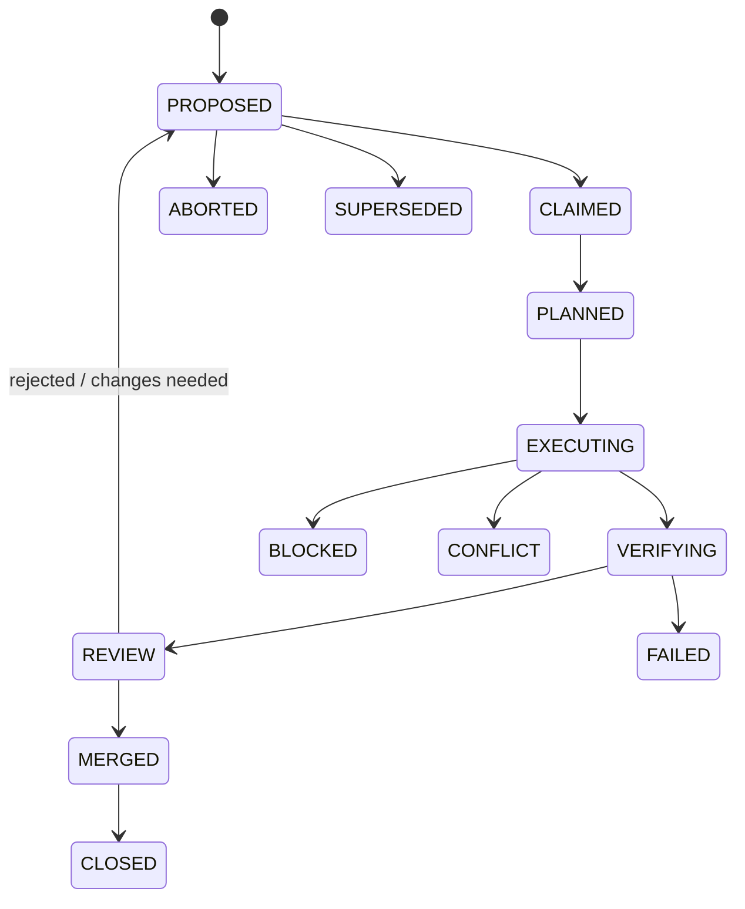

# How to contribute

**Purpose**: This page explains how to pick up, work on, and land changes in the SAFRS Monorepo. It covers the SAFRS task lifecycle, risk-tiered review requirements, the mandatory verification step, and the session protocol every contributor (human or agent) must follow.

All contributions operate under the **Human-Governed, Agent-Executed, Machine-Enforced** model defined in `SAFRS_SPEC.md`. Humans set intent and approve high-impact actions; agents execute; machines verify. See [SAFRS governance](../features/safrs-governance.md) for the full risk model.

## The SAFRS task lifecycle

Every piece of work moves through a fixed state machine from `SAFRS_SPEC.md` section 9. This lifecycle is the contract for picking up and delivering work:

- **PROPOSED** — an issue or task is described with an objective, scope, and risk tier.
- **CLAIMED** — one active mutation owner picks up the bounded scope. Analysis and review may happen in parallel, but a single mutation scope has one owner by default.
- **PLANNED** — the approach, owned paths, and verification are defined before code changes start.
- **EXECUTING** — bounded mutation happens, isolated from other parallel work.
- **VERIFYING** — the change passes the repository's machine-enforced verification.
- **REVIEW** — a designated human or code-owner reviews the change.
- **MERGED** — the reviewed change lands on the target branch.
- **CLOSED** — the task is done and recorded.

Exceptional states are `BLOCKED`, `CONFLICT`, `FAILED`, `ABORTED`, and `SUPERSEDED`. If a task hits one of these, record it and escalate the blocker rather than silently choosing a competing interpretation.

## Work pickup

1. Find a proposed task in `docs/plans/active/` or an issue and read the owning capsule's `AGENTS.md`.
2. Confirm the task's risk tier (R0–R3) against `.safrs/policy.json`. The default is **R1**.
3. Claim the task (single mutation owner), then produce a plan covering the owned paths and verification before editing code.
4. Create the dedicated branch/worktree (see [development workflow](development-workflow.md)) before mutating anything.

## Risk tiers and review expectations

The four risk tiers from `SAFRS_SPEC.md` section 7 decide when review and authorization are required:

| Tier | Mutation | Designated review | Human authorization |
| --- | :---: | :---: | :---: |
| R0 | No | No | No |
| R1 | Yes | Policy-based | No |
| R2 | Yes | **Required** | No |
| R3 | Prepare only | Required | **Required** |

- **R2** changes cross architecture boundaries: authentication, migrations, dependencies, CI/CD, shared APIs/packages, verification controls, or `.safrs/**`. These always need designated review, per `docs/governance/SAFRS_CONTROL_MATRIX.md`.
- **R3** changes affect production infrastructure/data, credentials, security boundaries, or deployment. Agents may prepare them but **cannot execute them without explicit human authorization**.
- Changing verification controls themselves (`.safrs/**`, `AGENTS.md`, CI workflows, governance or security tests) is **minimum R2**, even if the textual change looks small.

Verification-integrity is a hard rule: never delete assertions, widen ignores, skip tests, lower thresholds, or disable gates to make a task pass.

## Review expectations

- Review verifies the change against its originating task: does it match the spec, and does it follow the repository's documented standards?
- A change may not merge before its required review (R2+/R3) has approved it.
- Merge the foundational contracts/migrations before downstream consumers when tasks are dependent — see the integration order in `docs/governance/SAFRS_MULTI_AGENT_PROTOCOL.md`.
- If implementation and its governing verification are changed together, flag the change for **elevated** review.

## Definition of done

Before declaring a task complete, all of the following must hold:

1. **Scope respected** — no unrelated files changed; any necessary scope expansion is recorded.
2. **Verification passed** — `scripts/safrs-verify.sh` (or `pnpm governance`) passes, plus every affected project test.
3. **Diff reviewed** — the final diff is inspected and contains no unintended changes.
4. **Session protocol satisfied** — `.agents/HANDOFF.md` is updated.
5. **Decisions recorded** — durable decisions are appended to `.agents/DECISIONS.md`.

## Session protocol

Every working session **starts** by following the Read order in `AGENTS.md` (the MUST list is small and cheap; load task-scoped documents only for the matching task type).

Every working session **ends** with:

1. Overwriting `.agents/HANDOFF.md` with current state, work in flight, blockers, and next actions (keep under ~1k tokens). Machine-enforced: `scripts/safrs-verify.sh` fails if a non-trivial change set does not touch `.agents/HANDOFF.md`.
2. Appending to `.agents/knowledge/12_LESSONS.md` only per its own rules (real, repeated mistakes, not aspirational rules).
3. Appending durable decisions to `.agents/DECISIONS.md` and updating `.agents/PROGRESS.md` if an area status changed.

## Verification step

`scripts/safrs-verify.sh` runs the full local governance check: policy, docs, routing, tool inventory, topology, action pinning, sensitive changes, handoff, and the architecture/governance Python tests. Run it (or `pnpm governance`) before declaring work complete. Windows users can run `powershell -ExecutionPolicy Bypass -File scripts/safrs-verify.ps1`.

## Related pages

- [Development workflow](development-workflow.md) — branch, code, test, PR, merge cycle
- [Testing](testing.md) — frameworks, patterns, and how to run tests
- [Debugging](debugging.md) — common errors and troubleshooting
- [Tooling](tooling.md) — build system, linters, generators, CI
- [Patterns and conventions](patterns-and-conventions.md) — coding style rules
- [Getting started](../overview/getting-started.md) — setup, build, test, run
- [SAFRS governance](../features/safrs-governance.md) — risk model, roles, verification
