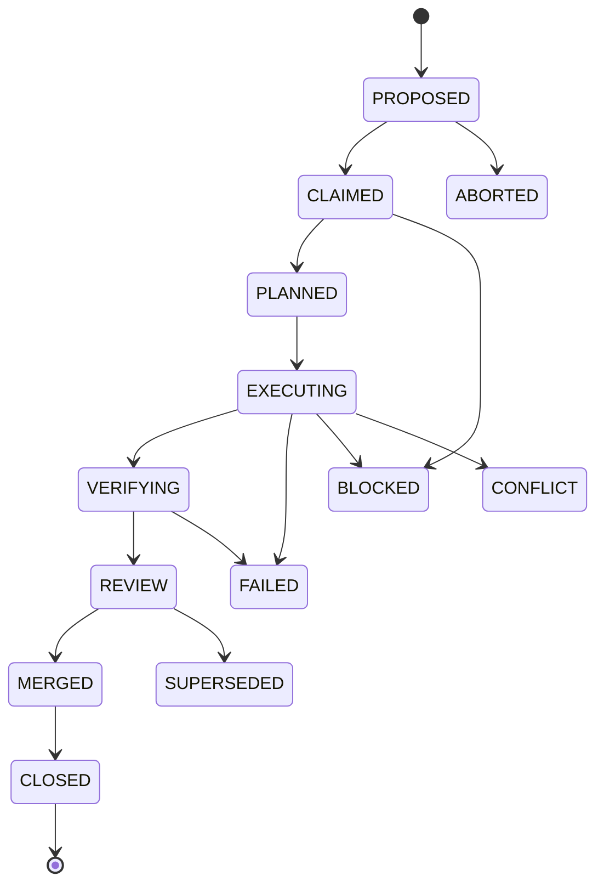

# How to contribute

This section explains the SAFRS contribution workflow in the Monorepo: how work is claimed, executed, verified, and merged under governance. Pages here assume you have completed [Getting started](../overview/getting-started.md) and understand the [Architecture](../overview/architecture.md) and the [SAFRS governance model](../features/safrs-governance.md).

Under SAFRS v1.1 the repository is **Human-Governed · Agent-Executed · Machine-Enforced**. Contributing means operating inside that contract — every mutation task follows a state machine, is owned by exactly one actor, and must pass the verification pipeline before it is merged.

## Purpose

- Explain the SAFRS task lifecycle and how tasks are claimed and tracked.
- Define risk tiers, the R2 review requirement, and when human authorization is needed.
- Document the session protocol (`HANDOFF.md`, `DECISIONS.md`, `LESSONS.md`).
- Describe `safrs-verify` and the definition of done for a contribution.

## Task lifecycle

Every mutation task moves through a governed state machine. The lifecycle is defined in `SAFRS_SPEC.md` section 9 and enforced by the task CLI and the control plane.



Required states: `PROPOSED → CLAIMED → PLANNED → EXECUTING → VERIFYING → REVIEW → MERGED → CLOSED`.

Exceptional states: `BLOCKED`, `CONFLICT`, `FAILED`, `ABORTED`, `SUPERSEDED`.

Only one actor owns mutation authority for the same bounded task scope at a time. Tasks are recorded in the shared task registry, and each transition is mirrored by a lease event. See [Task management](#task-management) and the [automation control plane](../features/automation-control-plane.md).

## Risk handling

Classify every task and every change using `.safrs/policy.json` and the risk model in `SAFRS_SPEC.md` section 7:

| Tier | Meaning | Enforcement |
| --- | --- | --- |
| **R0** | Read-only analysis | Read-only workspace |
| **R1** | Reversible local change | Dedicated branch/worktree |
| **R2** | Boundary-affecting change | Worktree + isolated test resources where shared state exists |
| **R3** | High-impact change | Ephemeral/controlled env; no inherited prod credentials; explicit human authorization before side effects |

Rules:

- Risk is **monotonic** — agents may raise risk, never lower it.
- Every dimension (`declared`, `path`, `operation`, `data`, `capability`, `actual_diff`) must carry a non-empty reason.
- **R2 requires designated review.** Changes to `.safrs/**`, `AGENTS.md`, CI workflows (`.github/workflows/**`), governance scripts, `tools/automation/**`, and security tests are **minimum R2** even when the textual change looks small (`SAFRS_SPEC.md` section 12).
- **R3 may be prepared by an agent but requires explicit human authorization before execution.**

## Session protocol

`AGENTS.md` mandates what agents must read and write at session boundaries, all under the `SAFRS_SPEC.md` v1.1 multi-agent protocol (section 9).

At the **start** of a working session, follow the routing Read order:

1. `.agents/knowledge/00_READ_FIRST.md`
2. `.agents/HANDOFF.md`
3. `.agents/knowledge/02_OBJECTIVES.md`
4. `.agents/knowledge/03_ARCHITECTURE.md`
5. `.agents/knowledge/04_CONTEXT.md`
6. `.agents/knowledge/12_LESSONS.md`

Plus task-scoped docs (engineering/coding for implementation, decisions for planning, etc.) and the nearest nested `AGENTS.md`.

At the **end** of a working session:

1. Overwrite `.agents/HANDOFF.md` with current state, work in flight, blockers, and next actions (keep under ~1k tokens). This is **machine-enforced**: `safrs-verify` fails if a non-trivial change set does not touch it.
2. Append to `.agents/knowledge/12_LESSONS.md` only per its own rules (real, repeated mistakes — not aspirational rules).
3. Record durable decisions in `.agents/DECISIONS.md` (append-only) and update `.agents/PROGRESS.md` if an area status changed.

A handoff must preserve: task ID and objective; current state; risk tier; owned scope; modified files; tests run/results; unresolved decisions/blockers; next permitted action.

## safrs-verify

`scripts/safrs-verify.sh` (bash) and `scripts/safrs-verify.ps1` (PowerShell) run the local SAFRS governance suite — a pipeline of Python checkers in `tools/safrs/` plus Python governance tests in `tests/architecture/` and `tests/governance/`. It is invoked as:

```bash
pnpm governance
```

The suite enforces policy validity, document-registry and routing integrity, tool inventory, repository topology, immutable Action pins, automation policy, task-contract digests, lifecycle agreement, approval/evidence integrity, HANDOFF freshness, and sensitive-change classification. A `PASS` is required before any work is declared complete.

See [tooling.md](tooling.md) and [debugging.md](debugging.md) for what runs and how to fix failures.

## Task management

Mutations are claimed and tracked with the task CLI (see [development-workflow.md](development-workflow.md)):

```bash
pnpm task claim --id TASK-YYYYMMDD-XXX --title "..." --owner-id <id> --owner-label "<agent>" --risk R1 --scope <path>
pnpm task state --id TASK-YYYYMMDD-XXX --to EXECUTING
pnpm task list --active
pnpm task close --id TASK-YYYYMMDD-XXX
```

`pnpm status` reports registry, lease state, ownership conflicts, and a live governance probe.

## Definition of done

A contribution is done when all of the following hold:

1. The task, if a mutation, is claimed and its registry state reflects reality.
2. The smallest viable change fully solves the task within its declared scope prefixes.
3. Verification passes: `pnpm governance` (PASS), plus lint, typecheck, and the affected tests/builds.
4. Verification controls were not weakened to obtain a pass (no deleted assertions, widened ignores, skipped tests, lowered thresholds, or disabled gates).
5. `.agents/HANDOFF.md` is updated, and durable decisions/lessons are recorded where applicable.
6. R2 changes have designated review; R3 changes have explicit human authorization.
7. The final diff contains no unrelated files.

## Related pages

- [Development workflow](development-workflow.md)
- [Testing](testing.md)
- [Debugging](debugging.md)
- [Tooling](tooling.md)
- [Patterns and conventions](patterns-and-conventions.md)
- [SAFRS governance](../features/safrs-governance.md)
- [Automation control plane](../features/automation-control-plane.md)
- [safrs tool](../tools/safrs.md)
- [automation tool](../tools/automation.md)
