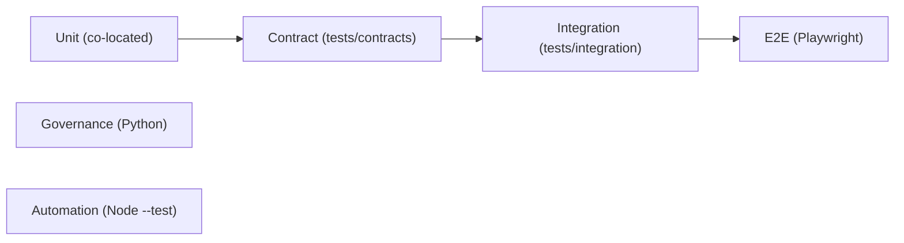

# Testing

This page describes the testing stack and patterns used across the Monorepo, and where each kind of test lives. See [Development workflow](development-workflow.md) for how tests fit into the merge gate.

## Purpose

- Map the test runners: Vitest, Playwright, Python governance tests, and Node `--test` for automation.
- Document the layered patterns: co-located, contract, integration, and E2E.
- Explain the 12 automation test files and property-based testing with `fast-check`.

## Test runners

| Runner | Used for | Entry point |
| --- | --- | --- |
| **Vitest 4** | Unit tests (co-located), contract tests, integration tests | `pnpm test`, `pnpm test:contracts` |
| **Playwright 1.62** | E2E browser smoke + visual regression | `pnpm test:e2e` |
| **Python** | Governance / architecture invariants | `pnpm governance` |
| **Node `--test`** | Automation control-plane internals | `node --test` (via `pnpm test` and CI) |
| **fast-check** | Property-based tests in `@safrs/schemas` | Vitest property tests |

## Test layout

- **Co-located unit tests**: Vitest, next to source (e.g., `app.test.ts` next to `app.ts`).
- **Automation tests**: Node `--test`, 12 files in `tools/automation/test/`.
- **Contract tests**: Cross-package contracts in `tests/contracts/`.
- **Integration tests**: Database integration in `tests/integration/`.
- **Governance tests**: Python in `tests/architecture/`, `tests/governance/`, `tests/repository/`.
- **E2E tests**: Playwright in the golden-path web app with Git LFS baselines.

`vitest.workspace.ts` defines the repository-contracts workspace covering `tests/contracts/**/*.test.ts` and `tests/integration/**/*.test.ts`.

## pnpm test

`scripts/test.mjs` runs three stages in order and stops on the first failure:

1. `node --test tests/repository/*.test.mjs` — repository-level tests (e.g., the automation policy test).
2. `pnpm test:contracts` — `tsc --project tests/tsconfig.json && vitest run --config vitest.workspace.ts` (contract + integration).
3. `turbo run test` — package-local unit tests across the workspace.

It loads the canonical environment (via `tools/doctor/src/checks.mjs`) and sets `DATABASE_INTEGRATION_TESTS=1`.

## pnpm test:e2e

`scripts/test-e2e.mjs` runs Playwright browser smoke with a **disposable** database, governed by the reset guard:

- If no `DATABASE_URL` is set, it derives a unique `safrs_e2e_<32 hex>_test` database from the canonical URL, creates it, runs migrate + seed, then runs `turbo run test:e2e`, and drops the database in a `finally` block.
- If `DATABASE_URL` is set, it must point to a local PostgreSQL database ending in `_test` (enforced by `assertDisposableTestDatabase`); failure raises `[E2E] DATABASE_URL DITOLAK`.
- Playwright artifacts (`playwright-report/`, `test-results/`) are preserved on failure.

## Automation tests (Node --test, 12 files)

The automation control plane uses zero runtime dependencies, so its tests run on Node's built-in test runner. The 12 files in `tools/automation/test/`:

| File | Covers |
| --- | --- |
| `adapters-parity.test.mjs` | Agent adapter parity |
| `approvals.test.mjs` | Content-bound, time-limited approvals; no self-review |
| `canonical-json.test.mjs` | Deterministic canonical JSON and content-addressed digests |
| `contracts.test.mjs` | Task contract compilation and validation |
| `evidence.test.mjs` | Evidence manifests |
| `gates.test.mjs` | PR gate verdicts |
| `guard.test.mjs` | Shared vendor-neutral guard |
| `lease-integration.test.mjs` | Lease chain integration |
| `leases.test.mjs` | Lease chain state machine and fencing tokens |
| `publisher.test.mjs` | Publication eligibility |
| `risk.test.mjs` | Monotonic risk computation |
| `scopes.test.mjs` | Scope ownership rules |

These are invoked as part of `pnpm test` and, for contract/digest parity, mirrored by the Python governance checkers. See [automation tool](../tools/automation.md).

## Property-based tests

`@safrs/schemas` uses `fast-check` with a deterministic seed for property-based testing of schema-derived contracts, providing broader coverage than hand-written cases.

## Governance tests (Python)

Python tests enforce structural invariants and live under `tests/architecture/`, `tests/governance/`, and `tests/repository/`, including `test_safrs_topology.py`, `test_sensitive_classification.py`, `test_task_ownership.py`, `test_automation_contracts.py`, and `test_automation_approvals.py`. They are part of `pnpm governance` and CI. See [SAFRS governance](../features/safrs-governance.md).

## When to use each pattern

- **Unit** for isolated functions/components next to source.
- **Contract** for cross-package boundaries and schema drift detection.
- **Integration** for database/real-service behavior.
- **E2E** for browser flows and visual regression.
- **Governance/Automation** for SAFRS invariants and the control plane.

## Verification integrity

Do not weaken or skip tests to make a build pass. Tests and runner configuration that validate security- or business-critical behavior are verification controls and are minimum R2 to change. See [index.md](index.md) and [patterns-and-conventions.md](patterns-and-conventions.md).

## Related pages

- [Development workflow](development-workflow.md)
- [Debugging](debugging.md)
- [Patterns and conventions](patterns-and-conventions.md)
- [Automation control plane](../features/automation-control-plane.md)
