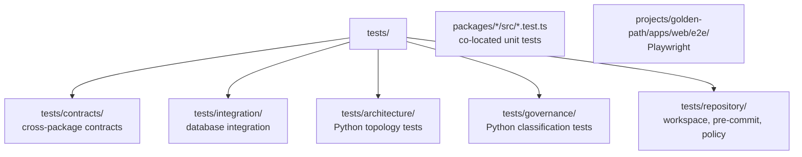

# Testing

**Purpose**: This page describes the test frameworks used in the SAFRS Monorepo, the directory conventions for where tests live, how to run each kind, and the mocking approaches used. Testing is designed so that cross-package contracts are verified automatically and CI never flakes on nondeterminism.

## Frameworks

| Framework | Where used | Purpose |
| --- | --- | --- |
| Vitest 4 | Packages, web app, `tests/contracts`, `tests/integration` | Unit, component, contract, and integration tests |
| Playwright 1.62 | `projects/golden-path/apps/web/e2e/` | Browser end-to-end smoke and visual regression |
| Python (`pytest`-style, plain scripts) | `tests/architecture/`, `tests/governance/` | Enforce monorepo topology and sensitive-path classification |
| fast-check 4 | `@safrs/schemas` | Property-based testing of schema invariants |

## Test layout



- **Unit tests** are co-located next to source, e.g. `packages/api/src/app.test.ts` next to `app.ts`, and `projects/golden-path/apps/web/src/app/page.test.tsx`.
- **Contract tests** live in `tests/contracts/` and verify cross-package boundaries: `hono-rpc-contract.test.ts` (typed RPC), `environment-boundary.test.ts`, `build-time-environment.test.ts`, and `playwright-environment.test.ts`.
- **Integration tests** live in `tests/integration/database.test.ts`, gated by `DATABASE_INTEGRATION_TESTS=1` (the `pnpm test` runner sets it).
- **Architecture/governance tests** are Python scripts in `tests/architecture/test_safrs_topology.py` and `tests/governance/test_sensitive_classification.py`.
- **Repository tests** are Node tests in `tests/repository/` (workspace config, pre-commit, operator commands, automation policy).
- **E2E** tests live in `projects/golden-path/apps/web/e2e/` (`golden-path.spec.ts`, `visual.spec.ts`).

## How to run

```bash
pnpm test        # contracts + unit + integration (sets DATABASE_INTEGRATION_TESTS=1)
pnpm test:e2e    # disposable-DB Playwright smoke; cleans up its own DB
pnpm governance  # runs the Python governance/architecture tests too
```

Focused package tests:

```bash
pnpm --filter @safrs/api test
pnpm --filter @safrs/web test
node --test tools/codegen/test/*.test.mjs
python3 tests/architecture/test_safrs_topology.py
```

The `vitest.workspace.ts` config includes `tests/contracts/**/*.test.ts` and `tests/integration/**/*.test.ts` under the `repository-contracts` name; the `test:contracts` script also runs `tsc --project tests/tsconfig.json` first.

`pnpm test:e2e` (from `scripts/test-e2e.mjs`) creates a uniquely named disposable test database (`safrs_e2e_<uuid>_test`), guarded by the reset guard in `packages/database/src/reset-guard.ts`, then migrates, seeds, runs `turbo run test:e2e`, and drops the database in a `finally` block.

## Patterns

- **Contract tests** assert the typed boundary between packages, e.g. that the Hono RPC client's inferred request/response types match the API, so drift fails the type-check.
- **Integration tests** hit real PostgreSQL and are gated behind an environment flag so they do not run in plain unit runs.
- **Property tests** in `packages/schemas/src/demo.property.test.ts` set a deterministic seed (`fc.configureGlobal({ seed: 42, numRuns: 200 })`) so generated inputs are reproducible and CI never flakes.
- **E2E** uses Playwright's chromium against a disposable database, with visual regression baselines tracked via Git LFS (`test:e2e:update` regenerates snapshots deliberately).

## Mocking approaches

- **API unit tests** pass a fake `getStore` into `createApp`, so the Hono app is exercised against an in-memory store with no database. See `packages/api/src/app.test.ts`, which also proves error redaction and correlation-ID propagation.
- **Environment** validation is tested by varying env shape and asserting fail-fast behavior.
- **Browser/SDK** integration (e.g., Stripe) is validated at the route test level without live network calls.
- Mocking must never be used to skip assertions or hide real failures — that violates verification integrity.

## Playwright guidance

Follow Playwright best practices for authoring and fixing E2E tests: prefer user-visible queries, avoid hard-coded sleeps, use the repository's `playwright.config.ts`, and keep the browser journey tests focused on the golden-path flow.

## Related pages

- [Patterns and conventions](patterns-and-conventions.md) — testing patterns summarized from the coding side
- [How to contribute](index.md) — lifecycle and verification expectations
- [Development workflow](development-workflow.md) — where tests sit in the gate
- [API package](../packages/api.md) — API test coverage
- [Schemas package](../packages/schemas.md) — property-based contract tests
