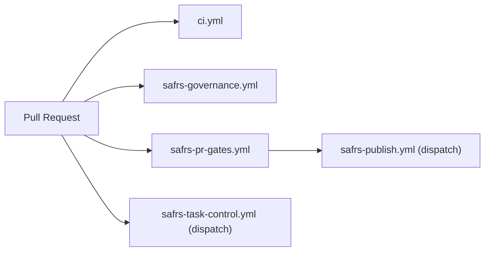

# Tooling

This page documents the developer tooling in the Monorepo: Turborepo, Biome, codegen, dependencies graph, the GitHub Actions workflows, the pre-commit hook, and the pnpm catalog. See [Development workflow](development-workflow.md) for the scripts that drive these tools.

## Purpose

- Map the build, lint, and task orchestration tools.
- Document the 5 GitHub Actions workflows and their triggers.
- Explain generated artifacts, the pre-commit hook, and the shared dependency catalog.

## Turborepo

`turbo.json` defines remote-cacheable tasks and their dependency ordering across the workspace (`build`, `lint`, `typecheck`, `test`, `test:e2e`, `dev`). `pnpm build`, `pnpm typecheck`, and package tests run through Turbo.

- `build` depends on upstream `^build`; env (`DATABASE_URL`, `APP_URL`, `NODE_ENV`) is tracked.
- `test` depends on `^build` and outputs `coverage/**`.
- `test:e2e` and `dev` are uncached / persistent.

## Biome

Biome 2 handles formatting and linting with the `recommended` preset (`biome.jsonc`). Double quotes, semicolons, trailing commas, 2-space indent. Commands:

```bash
pnpm lint      # biome check .
pnpm format    # biome format --write .
pnpm fix       # biome check --write .
```

## Codegen

`pnpm codegen` runs `tools/codegen/src/cli.mjs` to generate OpenAPI documents, mocks, and typed client code from the Zod schemas in `@safrs/schemas`. See [architecture](../overview/architecture.md) for the schema-first contract model.

## Dependencies graph

`pnpm deps:graph` runs `tools/deps-graph/src/cli.mjs` to render the monorepo dependency graph, useful for understanding package boundaries and verifying topology constraints.

## pnpm catalog

`pnpm-workspace.yaml` centralizes dependency versions in its `catalog` section so packages reference `catalog:` instead of pinning versions. It also enforces supply-chain policy:

- `minimumReleaseAge: 1440` (minutes = 1 day) with excludes for `resend` and `stripe`.
- `allowBuilds` limits build scripts (`@prisma/engines`, `esbuild`, `prisma`, `protobufjs`, `sharp`).
- `overrides` force transitive copies onto patched releases (e.g., Dependabot GHSA remediation for `postcss`, `sharp`).

See `pnpm check:security` (`scripts/check-supply-chain.mjs`) for the audit scan.

## GitHub Actions workflows

The repository runs **5 workflows** in `.github/workflows/`:

| Workflow | Trigger | Purpose |
| --- | --- | --- |
| `ci.yml` | pull_request | Full verification: governance, policy test, lint, typecheck, test, build, e2e against a disposable PostgreSQL service |
| `safrs-governance.yml` | pull_request, push to main | Runs the SAFRS Python checkers and governance tests (Windows) |
| `safrs-pr-gates.yml` | pull_request, push to main | 8 PR gates (contract, lease, risk, budgets, verification, review, evidence, platform) as matrix jobs |
| `safrs-task-control.yml` | workflow_dispatch | Serialized remote lease authority applying lease events |
| `safrs-publish.yml` | workflow_dispatch | Publication eligibility evaluation (evaluation-only until the publisher identity is activated) |



### safrs-pr-gates

`tools/automation/src/gates.mjs` computes the 8 named verdicts. Each gate validates the change set's artifacts and fails closed; absent artifacts report `not_applicable` and pass. All decision logic lives in `gates.mjs`, never in the workflow file.

### safrs-publish

Evaluates publication eligibility for one exact PR head. The publisher may only request auto-merge for a head whose gates are green — it never merges, pushes, or approves. Until the separate publisher identity is approved (Activation Decision 2), it is **evaluation-only**; flip the `SAFRS_PUBLISHER_ENABLED` repository variable to `true` only once that identity exists.

### safrs-task-control

The serialized remote lease authority. The ledger is one GitHub issue per task (title `SAFRS-LEASE: <task_id>`, label `safrs-lease`); every granted event is an immutable issue comment holding canonical `LeaseEventV1` JSON. GitHub keeps one in-progress and one pending run per group, so clients must read the ledger back and treat a missing event as deny.

## Pre-commit hook

`.husky/pre-commit` runs Biome on staged files with a dependency-install guard:

- Aborts if any file is partially staged (staged + unstaged changes at once).
- Runs `biome check --write --staged` with `--config.verify-deps-before-run=false` so the formatter never triggers an implicit install.
- Re-stages the formatted files.

## New automation tooling

Three CLIs back the SAFRS control plane and are exposed as root scripts:

- **`pnpm status`** (`tools/status/`) — task registry, lease state, ownership, live governance probe.
- **`pnpm task`** (`tools/task/`) — claim/state/close tasks against the shared registry, with `--yes` for writes.
- **`pnpm saf`** (`tools/automation/`) — contracts, leases, gates, evidence, and publication. `pnpm saf:status` and `pnpm saf:verify` are aliases for status and the SAFRS verification suite.

See [Development workflow](development-workflow.md) and [automation tool](../tools/automation.md).

## Tool boundary

Repository-wide tooling lives in `tools/**` and is owned by `tools/AGENTS.md`. Tool, governance, generated-project, dependency, or verification-control changes are **R2** and need review. Tools must treat external input as data, validate paths, preserve user-owned files, and avoid secrets/network access unless authorized.

## Related pages

- [Development workflow](development-workflow.md)
- [Debugging](debugging.md)
- [Automation control plane](../features/automation-control-plane.md)
- [SAFRS governance](../features/safrs-governance.md)
- [safrs tool](../tools/safrs.md)
- [automation tool](../tools/automation.md)
