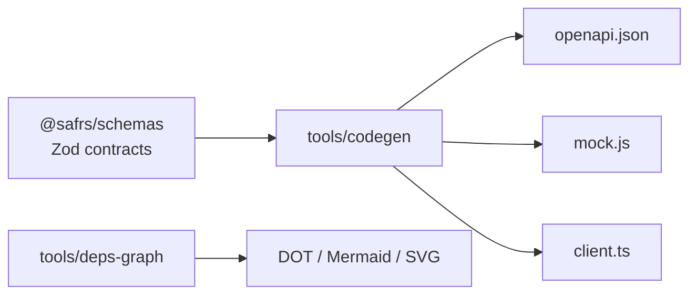

# Tooling

**Purpose**: This page describes the developer tooling that powers the SAFRS Monorepo: the Turborepo build system, the Biome linter/formatter, the schema-driven code generators, the CI workflows, and the pnpm catalog system. Understanding these tools explains how the `pnpm check` gate and CI are wired together.

## Build system: Turborepo

`turbo.json` defines the task graph. Remotely cacheable, dependency-aware tasks run across the workspace:

| Task | Behavior |
| --- | --- |
| `build` | Depends on `^build`; env `DATABASE_URL`, `APP_URL`, `NODE_ENV`; outputs `.next/**`, `dist/**`, `build/**` |
| `lint` | No cache outputs |
| `typecheck` | Depends on `^typecheck` |
| `test` | Depends on `^build`; outputs `coverage/**` |
| `test:e2e` | `cache: false`; env-scoped; outputs `playwright-report/**`, `test-results/**` |
| `dev` | `cache: false`, persistent |

Package-local commands run through `pnpm --filter <pkg> <script>`, for example `pnpm --filter @safrs/api test` or `pnpm --filter @safrs/web lint`.

## Linter and formatter: Biome

`biome.jsonc` configures Biome 2 with the `recommended` preset, `ignoreUnknown` enabled, 2-space indentation, and double quotes with semicolons and trailing commas. Biome handles both formatting and linting for `.ts`, `.tsx`, `.mjs`, and more, and it drives the `git` pre-commit hook (see below).

```bash
pnpm lint       # biome check .
pnpm format     # biome format --write .
pnpm fix        # biome check --write .
```

## Code generators

Two generators are packaged as root scripts:

- **`pnpm codegen`** runs `tools/codegen/src/cli.mjs`. It reads the Zod schemas in `@safrs/schemas` and produces, deterministically: an OpenAPI 3.1 document (`--openapi`), mock data factories (`--mock`), and a typed fetch wrapper over the Hono client (`--client`). Output is fully determined by the input schemas — same schema in, same bytes out.
- **`pnpm deps:graph`** runs `tools/deps-graph/src/cli.mjs`, a read-only inter-package dependency graph visualizer. It renders DOT, Mermaid, ASCII, or SVG (`--format`), can write to a file (`--output`), and can detect circular dependencies (`--cycles`). It never mutates packages and is not a governance gate.



## CI tooling: GitHub Actions

Two workflows enforce the gates on every pull request:

- **`.github/workflows/ci.yml`** — runs on PR and `workflow_dispatch`. Provisions a PostgreSQL 17 service, installs with `--frozen-lockfile`, generates/migrates/seeds the database, installs Playwright chromium, then runs: `pnpm governance`, the policy test, `pnpm lint`, `pnpm typecheck`, `pnpm test`, `pnpm build`, and `pnpm test:e2e`. On failure it uploads Playwright evidence.
- **`.github/workflows/safrs-governance.yml`** — runs on PR and push to `main`. Runs the SAFRS Python checkers: policy, docs, routing, tool inventory, topology, action pinning, sensitive changes, plus the architecture and governance tests. It enforces immutable GitHub Action SHA pins (`tools/safrs/check_actions_pinning.py`).

#### Pre-commit hook

`.husky/pre-commit` runs Biome on staged files and blocks a commit if a file is only partially staged (to avoid committing incomplete edits). It is wired up by the `prepare` script (`husky`).

## pnpm catalog system

`pnpm-workspace.yaml` defines a **catalog** of pinned dependency versions (e.g. `"next": 16.2.12`, `"hono": 4.13.1`, `"vitest": 4.1.10`, `"zod": 4.4.3`, `turbo: 2.10.9`). Workspace packages reference dependencies as `"catalog:"` so a single source controls a version across every package, preventing drift. The `allowBuilds` list gates postinstall build scripts (Prisma engines, esbuild, sharp, protobufjs), and `minimumReleaseAgeExclude` handles a couple of version-age exceptions.

Add a new dependency through `pnpm add <pkg>@catalog:` to the catalog rather than hard-coding per-package versions.

## Related pages

- [Development workflow](development-workflow.md) — how the tools fit the gate
- [Debugging](debugging.md) — troubleshooting tool and gate failures
- [Getting started](../overview/getting-started.md) — the commands these tools back
- [SAFRS governance](../features/safrs-governance.md) — the governance checkers
- [Schemas package](../packages/schemas.md) — input to `codegen`
