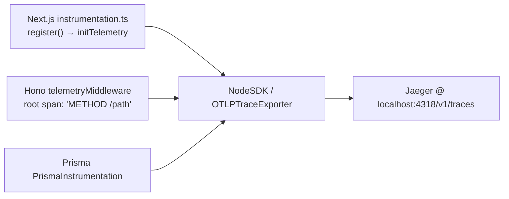

# How to monitor

This page covers the shared OpenTelemetry tracing setup for the `Next.js → Hono → Prisma → PostgreSQL` chain. The instrumentation lives in the `@safrs/telemetry` package, detailed in [packages/telemetry](../packages/telemetry.md).

## OpenTelemetry tracing setup

`@safrs/telemetry` initializes the OpenTelemetry Node SDK in `packages/telemetry/src/instrumentation.ts` with:

- an OTLP HTTP trace exporter;
- HTTP instrumentation (client and server);
- Prisma query instrumentation.

`initTelemetry()` must run before any instrumented path (HTTP, Prisma) is imported, so the web app calls it from Next.js's `instrumentation.ts` `register()` hook. It is idempotent (subsequent calls return the existing SDK) and returns `null` when disabled.

Configuration is loaded by `loadTelemetryConfig()` in `packages/telemetry/src/config.ts`:

| Variable | Purpose | Default |
| --- | --- | --- |
| `OTEL_SERVICE_NAME` | Service name reported to the collector | `safrs-app` |
| `OTEL_EXPORTER_OTLP_ENDPOINT` | OTLP HTTP endpoint | `http://localhost:4318/v1/traces` |
| `OTEL_SDK_DISABLED` | Set to `1`/`true` to disable the SDK | unset (enabled) |

No credentials are accepted; the OTLP endpoint is a plain HTTP URL.

## Jaeger local collector

A local Jaeger all-in-one collector is defined in the optional compose file `compose.telemetry.yaml`:

```bash
docker compose -f compose.telemetry.yaml up -d jaeger
```

Then point the app at `OTEL_EXPORTER_OTLP_ENDPOINT=http://localhost:4318/v1/traces` and open the Jaeger UI at `http://localhost:16686`. Ports: `16686` (UI), `4317` (OTLP/gRPC), `4318` (OTLP/HTTP).

## Tracing a request end-to-end



1. **Boot**: Next.js `register()` calls `initTelemetry()` before routes load, so SDK auto-instrumentation sees the chain.
2. **Request**: `telemetryMiddleware()` in `packages/telemetry/src/hono-middleware.ts` opens a root span for the request.
3. **Chain**: HTTP and Prisma auto-instrumentation create child spans as the request flows through Hono handlers and database queries.
4. **Inspect**: open the Jaeger UI, search by service name (`safrs-app`) or correlation ID, and read the trace timeline.

## Span naming conventions

The shared tracer is named `safrs.hono` (see `packages/telemetry/src/hono-middleware.ts`). Each request span is named **HTTP method + path**, e.g. `GET /api/health` or `POST /api/records`, and carries the standard semantic-convention attributes:

- `http.request.method`
- `http.route`
- `url.full`
- `http.response.status_code`

No payload data, credentials, or PII is recorded; span attributes are limited to operation names and safe metadata.

## Correlation ID propagation

A correlation ID is set earlier in the Hono middleware chain and stored in the Hono `Variables`. `telemetryMiddleware()` reads it and writes it as the `safrs.correlation_id` span attribute, so a request's trace can be correlated with the corresponding error envelope. The correlation ID is not logged as payload data — it only tags the span.

## Related pages

- [packages/telemetry](../packages/telemetry.md)
- [Overview / architecture](../overview/architecture.md)
- [Configuration reference](../reference/configuration.md)
