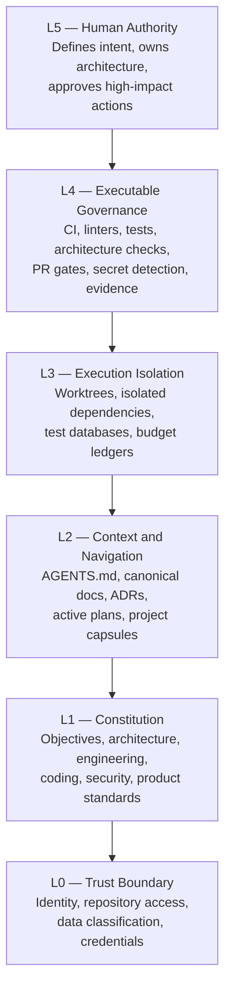
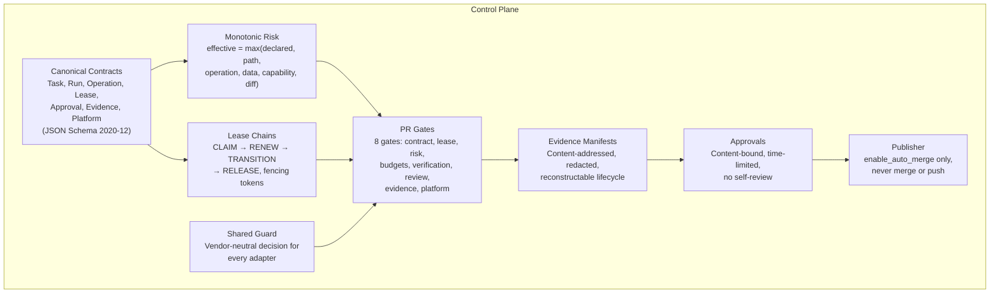
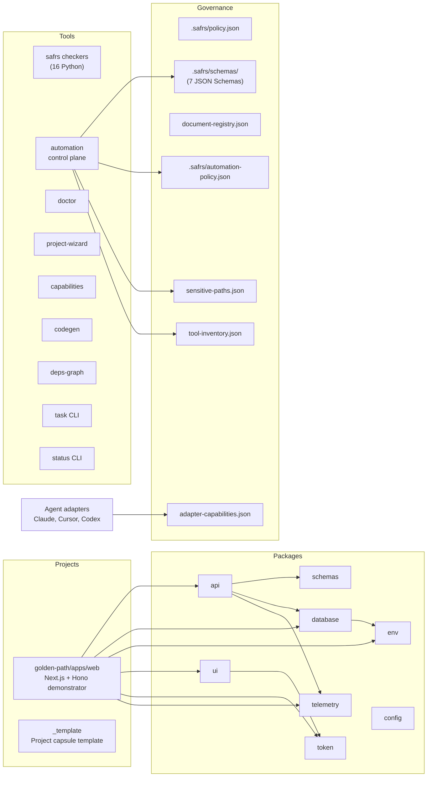
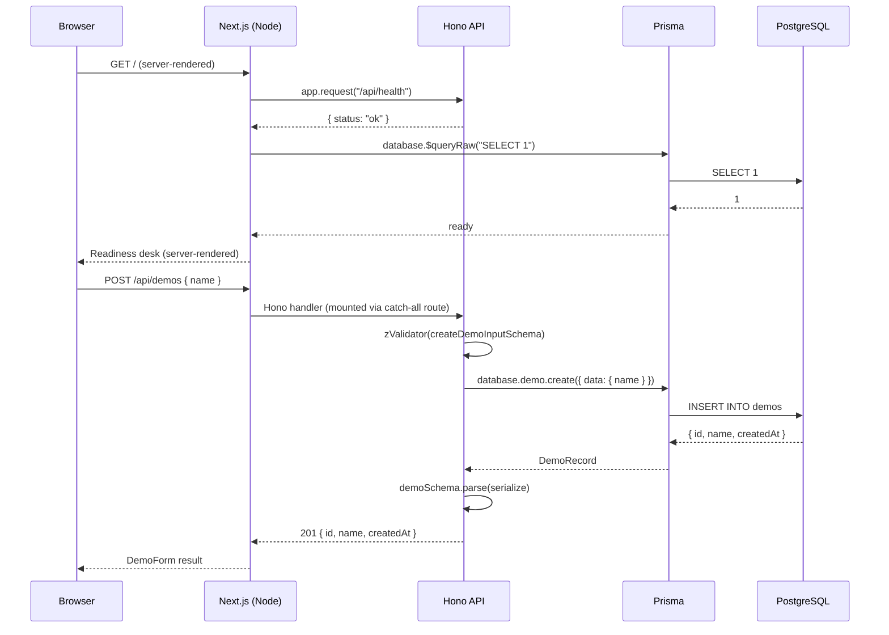
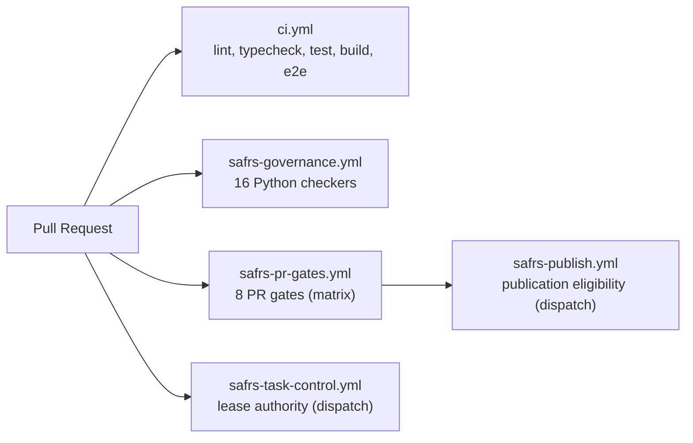

# Architecture

The SAFRS Monorepo follows a six-layer control architecture defined in `SAFRS_SPEC.md`. Each layer adds enforcement from trust boundaries at the bottom to human authority at the top. On top of this, an automation control plane (ADR 0002) adds machine-checked task contracts, lease chains, PR gates, evidence manifests, and a separated publisher identity.

## Six-layer control architecture

## Automation control plane

The automation control plane extends L4 (Executable Governance) with machine-checked enforcement. It was introduced in ADR 0002 and implemented across 5 phases.

## Repository topology

## Golden-path data flow

The golden-path application proves the typed Database to API to Web flow:

## CI pipeline

The repository runs 5 GitHub Actions workflows:

| Workflow | Trigger | Purpose |
| --- | --- | --- |
| `ci.yml` | pull_request | Full verification: governance, lint, typecheck, test, build, e2e |
| `safrs-governance.yml` | pull_request, push to main | 16 Python governance checkers |
| `safrs-pr-gates.yml` | pull_request, push to main | 8 PR gates as matrix jobs |
| `safrs-task-control.yml` | workflow_dispatch | Serialized remote lease authority |
| `safrs-publish.yml` | workflow_dispatch | Publication eligibility evaluation |
