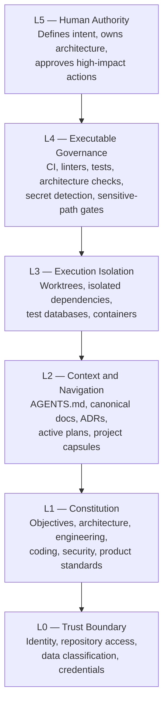
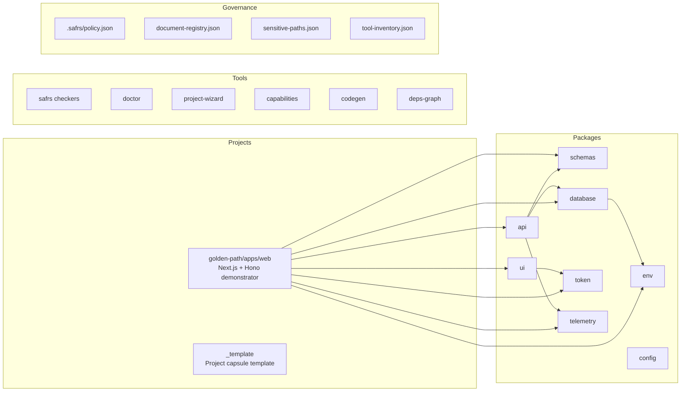
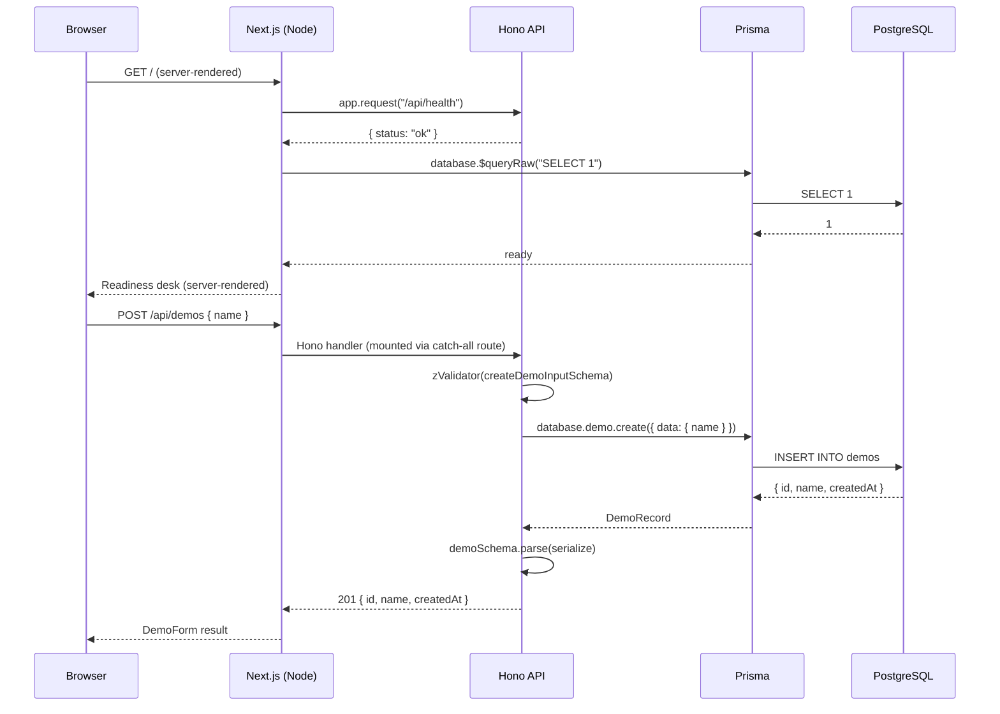
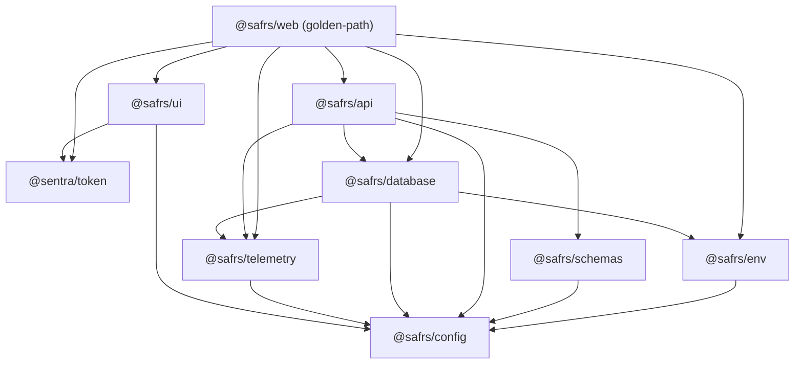

# Architecture

The SAFRS Monorepo follows a six-layer control architecture defined in `SAFRS_SPEC.md`. Each layer adds enforcement from trust boundaries at the bottom to human authority at the top. The repository topology separates product work, shared capabilities, tooling, and governance.

## Six-layer control architecture

- **L0 (Trust Boundary)**: Defines who can access the repository, what data classification applies, and which credentials are allowed. Agents never hold production credentials (SAFRS-01).
- **L1 (Constitution)**: Stable principles in `.agents/knowledge/` covering objectives, architecture, engineering, coding, security, and product decisions.
- **L2 (Context and Navigation)**: `AGENTS.md` routes agents to the right documents. The document registry in `.safrs/document-registry.json` is the machine-readable index.
- **L3 (Execution Isolation)**: Parallel mutation work uses separate worktrees in `../Monorepo.worktrees/<branch>`. Shared mutable state (databases, ports, caches) is isolated per task.
- **L4 (Executable Governance)**: CI workflows, Biome linting, TypeScript checking, SAFRS verify scripts, token enforcement, supply-chain scanning, and architecture tests.
- **L5 (Human Authority)**: The Chief (Dr. Ferdi Iskandar) defines intent, owns architecture, and authorizes R3 actions. Human approval is risk-based, not universal.

## Repository topology

## Golden-path data flow

The golden-path application proves the typed Database to API to Web flow:

The Hono API is mounted inside Next.js via a catch-all route at `projects/golden-path/apps/web/src/app/api/[[...route]]/route.ts`. The browser never imports Prisma or `DATABASE_URL` directly. The typed Hono RPC client (`hc<AppType>`) provides compile-time drift detection between frontend and backend.

## Package dependency graph

All packages depend on `@safrs/config` for shared tsconfig presets. `@safrs/schemas` owns the Zod contracts that both the API and the web app consume. `@sentra/token` is the only package allowed to contain raw colour values.
