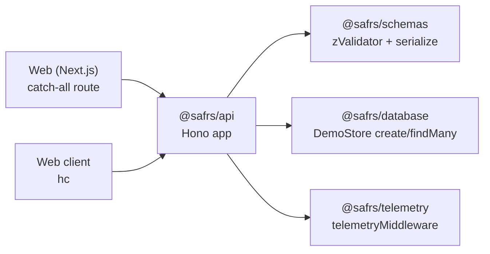

# @safrs/api

## Purpose

`@safrs/api` provides the typed Hono REST API: routes validated against `@safrs/schemas`, a correlation-ID error envelope on every response, a re-exported OpenAPI 3.1 document and Swagger UI page, and a typed RPC client for the frontend. Mounting the Hono app inside Next.js gives the golden-path app a single typed boundary where the browser consumes `hc<AppType>` and schema changes become compile-time errors.

## Key source files

| File | Role |
| --- | --- |
| `packages/api/src/index.ts` | Barrel: exports `AppType`, `app`, `createApp`, `DemoStore`, `ApiClient`, errors, OpenAPI |
| `packages/api/src/app.ts` | `createRoutes`/`createApp`, the Hono app and `AppType` |
| `packages/api/src/client.ts` | `createApiClient` factory around `hc<AppType>` |
| `packages/api/src/error.ts` | `ApiError`, `internalError`, `validationError` |
| `packages/api/src/openapi.ts` | `buildOpenApiDocument`, `openApiDocsHtml` (Swagger UI) |
| `packages/api/package.json` | Manifest with `.` and `./client` subpath exports |

## Routes and contract

Built in `packages/api/src/app.ts` with a base path of `/api`:

| Route | Method | Behavior |
| --- | --- | --- |
| `/api/health` | GET | Returns `{ status: "ok" }` |
| `/api/openapi.json` | GET | Returns the generated OpenAPI 3.1 document |
| `/api/docs` | GET | Returns a Swagger UI HTML page |
| `/api/demos` | GET | Lists demos via `DemoStore.demo.findMany` |
| `/api/demos` | POST | Validates with `zValidator("json", createDemoInputSchema)` and creates a demo (201) |

Two global middlewares run on every request: the first generates a UUID per request, stores it as `correlationId` on the Hono context, and returns it in the `x-correlation-id` response header; the second is `telemetryMiddleware()` from `@safrs/telemetry`. The `.onError` handler returns `internalError` (500) for unexpected exceptions.

A `DemoStore` interface (`demo.create` / `demo.findMany`) decouples the routes from Prisma; the default store lazily imports `@safrs/database`. Tests inject a fake store through `createApp({ getStore })`.

## Error envelope

`packages/api/src/error.ts` builds every error with `apiErrorSchema.parse()` from `@safrs/schemas`:

- `validationError(...)` → `{ code: "VALIDATION_ERROR", message, correlationId, fieldErrors? }` with a 400 status.
- `internalError(correlationId)` → `{ code: "INTERNAL_ERROR", message, correlationId }` with a 500 status.

Every response (success or error) carries the `x-correlation-id` header, and the same ID is set on the telemetry span (see [telemetry](./telemetry.md)).

## Operation

The web app mounts the Hono app through the catch-all route at `projects/golden-path/apps/web/src/app/api/[[...route]]/route.ts` using `app.request(...)`. The typed client is created in the browser via `createApiClient(...)` from `@safrs/api/client` (see `projects/golden-path/apps/web/src/lib/api-client.ts`). The web app never imports Prisma or `DATABASE_URL`.

## Integration points

- **Schemas**: request validation and response/error serialization via `@safrs/schemas`.
- **Database**: lazy `import("@safrs/database")` provides the default `DemoStore`.
- **Telemetry**: `telemetryMiddleware()` opens a root span per request and sets `safrs.correlation_id`.
- **Frontend**: the exported `AppType` and `@safrs/api/client` give the browser a typed client, enabling compile-time drift detection.
- **OpenAPI**: the document is derived from the Zod schemas so it cannot drift from validation.

## Related pages

- [Hono API REST endpoints](../api/rest-endpoints.md)
- [@safrs/schemas](./schemas.md)
- [@safrs/database](./database.md)
- [@safrs/telemetry](./telemetry.md)
- [Coding patterns and conventions](../how-to-contribute/patterns-and-conventions.md)
