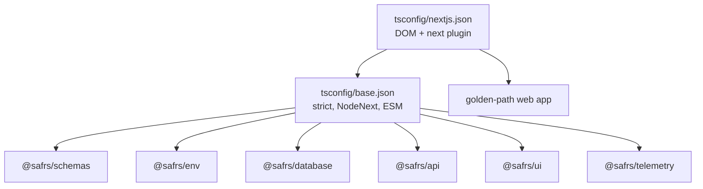

# @safrs/config

## Purpose

`@safrs/config` is the shared compiler-configuration package for the monorepo. It centralizes TypeScript strictness so every workspace package inherits the same compiler settings instead of re-declaring them. It currently publishes two tsconfig presets — a strict base and a Next.js-specific preset — consumed by every package and by the golden-path web app.

## Key source files

| File | Role |
| --- | --- |
| `packages/config/package.json` | Manifest exporting the `tsconfig/base.json` and `tsconfig/nextjs.json` subpaths |
| `packages/config/tsconfig/base.json` | The strict TypeScript base for all packages |
| `packages/config/tsconfig/nextjs.json` | Extends `base.json` for Next.js apps |

## The presets

**`packages/config/tsconfig/base.json`**:

| Option | Value | Notes |
| --- | --- | --- |
| `target` | `ES2024` | Modern ES output |
| `module` | `NodeNext` | Works with the packages' `"type": "module"` |
| `moduleResolution` | `NodeNext` | Resolves ESM-style imports |
| `strict` | `true` | Strict type checking everywhere |
| `noEmit` | `true` | Type-check only (packages are consumed as TS source) |
| `skipLibCheck` | `true` | Skips `.d.ts` checking |
| `verbatimModuleSyntax` | `true` | Enforces `import type` where needed |

**`packages/config/tsconfig/nextjs.json`** extends `base.json` and adds DOM libraries, `"jsx": "preserve"`, and the `next` TypeScript plugin — used by the golden-path web app.

Because packages export raw TypeScript source (e.g. `".": "./src/index.ts"`), consumers rely on this shared strict configuration consistently.

## Integration points

- **Every package**: `@safrs/schemas`, `@safrs/env`, `@safrs/database`, `@safrs/api`, `@safrs/ui`, and `@safrs/telemetry` all depend on `@safrs/config` and extend `tsconfig/base.json`.
- **Web app**: the golden-path Next.js app uses `tsconfig/nextjs.json`.
- **Tooling**: the monorepo's `pnpm typecheck` (via Turbo) runs `tsc --project tsconfig.json` in each package using these presets.

## Related pages

- [Packages index](./index.md)
- [Coding patterns and conventions](../how-to-contribute/patterns-and-conventions.md)
- [System architecture and data flow](../overview/architecture.md)
