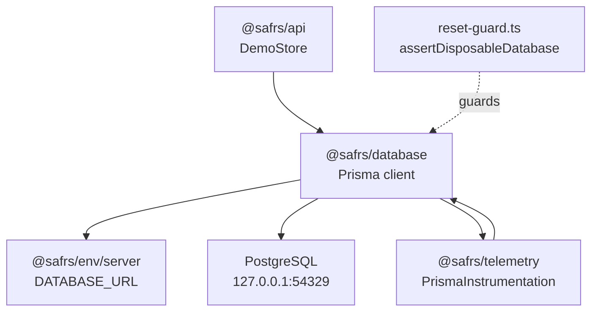

# @safrs/database

## Purpose

`@safrs/database` owns the persistence boundary: the Prisma schema, migrations, generated client, local seed data, and the destructive-operation guards that keep database work local-only. It connects to PostgreSQL through a `PrismaPg` driver adapter and exposes a singleton Prisma client that the API resolves for reads and writes. Safety is enforced by the reset guard, which rejects any database URL that is not a disposable local or test database.

## Key source files

| File | Role |
| --- | --- |
| `packages/database/prisma/schema.prisma` | The Prisma data model (`Demo`, `TransactionSample`) |
| `packages/database/src/client.ts` | Singleton `database` export using `PrismaPg` + `@safrs/env/server` |
| `packages/database/src/index.ts` | Barrel: exports `database` and `assertDisposableDatabase` |
| `packages/database/src/reset-guard.ts` | `assertDisposableDatabase` / `assertDisposableTestDatabase` |
| `packages/database/src/local-tooling.ts` | `resolveLocalToolingDatabaseUrl` for CLI tooling |
| `packages/database/src/seed.ts` | Safe demo + transaction seed records |
| `packages/database/src/reset.ts` | Local-only reset entry point |
| `packages/database/package.json` | Scripts: generate, migrate, seed, reset, studio |

## The data model

Defined in `packages/database/prisma/schema.prisma`:

- **`Demo`** — `id` (UUID), `name`, `createdAt`, mapped to table `demos`. Has many `TransactionSample`s.
- **`TransactionSample`** — `id` (BigInt autoincrement), `demoId` (FK to `Demo`, cascading delete), `amount` (Decimal 14,2), `currency` (Char 3), `occurredAt`, `createdAt`, mapped to table `transaction_samples` with an index on `demo_id`.

The generator uses Prisma's new `prisma-client` provider, emits ESM into `packages/database/src/generated/prisma`, and uses the `client` engine type. The generated client is committed and imported directly (e.g. `packages/database/src/client.ts` and `packages/database/src/seed.ts`).

## Scripts and safety

There are commands from the repository root (see `packages/database/package.json` and the root `package.json`):

| Command | Package script | Purpose |
| --- | --- | --- |
| `pnpm db:generate` | `generate` | Generate the Prisma client via `scripts/run-local-prisma.mjs` |
| `pnpm db:migrate` | `migrate` | Create/apply migrations (R2) |
| `pnpm db:seed` | `seed` | Upsert a fixed safe demo + transaction record |
| `pnpm db:reset` | `reset` | Local-only reset, gated by explicit reset authorization |
| `pnpm db:studio` | `studio` | Open Prisma Studio against the local database |

Start PostgreSQL with `pnpm db:start` (`docker compose up -d --wait postgres`) and stop it with `pnpm db:stop`.

**Reset guard** (`packages/database/src/reset-guard.ts`): `assertDisposableDatabase()` rejects any URL that is not `postgresql://` on `127.0.0.1`/`localhost` port `54329` with a single path segment ending in `_local` or `_test` and no query string. `assertDisposableTestDatabase()` additionally requires the `_test` suffix. `resolveLocalToolingDatabaseUrl()` in `packages/database/src/local-tooling.ts` applies this guard to URLs read from the environment or from `.env`/`.env.example`.

**Seed** (`packages/database/src/seed.ts`): upserts a demo with the fixed UUID `00000000-0000-4000-8000-000000000001` named "Sentra Demo" and one `TransactionSample`, then re-syncs the serial sequence so future inserts continue correctly.

## Integration points

- **Env**: `packages/database/src/client.ts` reads `serverEnv.DATABASE_URL` from `@safrs/env/server`.
- **API**: `packages/api/src/app.ts` imports the store lazily via `await import("@safrs/database")` and uses `database.demo.create` / `findMany` (through its `DemoStore` interface).
- **Telemetry**: `@safrs/database` depends on `@safrs/telemetry`, whose `PrismaInstrumentation` traces Prisma queries.
- **Server-only boundary**: the web app imports `@safrs/database` only in server contexts; `DATABASE_URL` is never exposed to the browser.

## Related pages

- [Hono API REST endpoints](../api/rest-endpoints.md)
- [@safrs/api](./api.md)
- [@safrs/env](./env.md)
- [@safrs/telemetry](./telemetry.md)
- [Risk model, roles, and verification](../features/safrs-governance.md)
