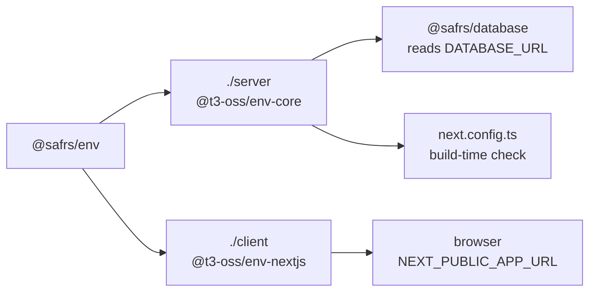

# @safrs/env

## Purpose

`@safrs/env` validates the application's environment at startup so misconfigured or missing variables fail fast with an explicit error naming the offending variable. It separates server and client concerns: server variables (such as `DATABASE_URL`) are validated with `@t3-oss/env-core`, while `NEXT_PUBLIC_*` variables are validated with `@t3-oss/env-nextjs`. The package exports two entry points, `@safrs/env/server` and `@safrs/env/client`, so browser code can never accidentally import server secrets.

## Key source files

| File | Role |
| --- | --- |
| `packages/env/src/server.ts` | `createServerEnv` / `serverEnv` using `@t3-oss/env-core` |
| `packages/env/src/client.ts` | `createClientEnv` / `clientEnv` using `@t3-oss/env-nextjs` |
| `packages/env/package.json` | Package manifest with the `./server` and `./client` subpath exports |

## What is validated

**Server** (`packages/env/src/server.ts`), validated with `@t3-oss/env-core`:

| Variable | Validation |
| --- | --- |
| `DATABASE_URL` | `z.url()` — required |
| `NODE_ENV` | `z.enum(["development", "test", "production"])` |
| `APP_URL` | `z.url()` — required |
| `STRIPE_SECRET_KEY` | optional, must start with `sk_` |
| `STRIPE_WEBHOOK_SECRET` | optional, must start with `whsec_` |

The Stripe variables are optional so the baseline builds without keys; the `startsWith` prefix checks catch swapped or truncated values early. On validation failure, `onValidationError` throws an error naming every invalid variable.

**Client** (`packages/env/src/client.ts`), validated with `@t3-oss/env-nextjs`:

| Variable | Validation |
| --- | --- |
| `NEXT_PUBLIC_APP_URL` | `z.url()` — optional |

Both factories accept an `environment` argument (defaulting to `process.env`) and set `emptyStringAsUndefined` so empty strings are treated as unset.

## Integration points

- **Database**: `packages/database/src/client.ts` reads `serverEnv.DATABASE_URL` to construct its Prisma `PrismaPg` adapter.
- **Web build**: `next.config.ts` (in the golden-path web app) imports `@safrs/env/server` to enforce build-time validation before the server boots.
- **Web client**: browser code imports `@safrs/env/client` (e.g. `packages/golden-path`-consuming code via `projects/golden-path/apps/web/src/lib/api-client.ts`) to resolve `NEXT_PUBLIC_APP_URL` — never the server module.
- **Config**: `@safrs/env` extends the shared tsconfig base from `@safrs/config`.

## Related pages

- [@safrs/database](./database.md)
- [@safrs/api](./api.md)
- [Coding patterns and conventions](../how-to-contribute/patterns-and-conventions.md)
- [System architecture and data flow](../overview/architecture.md)
