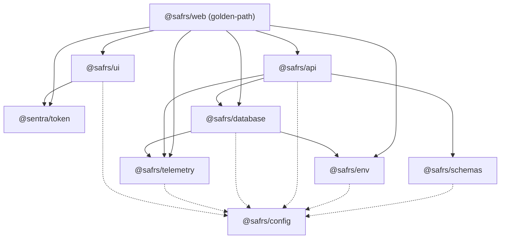
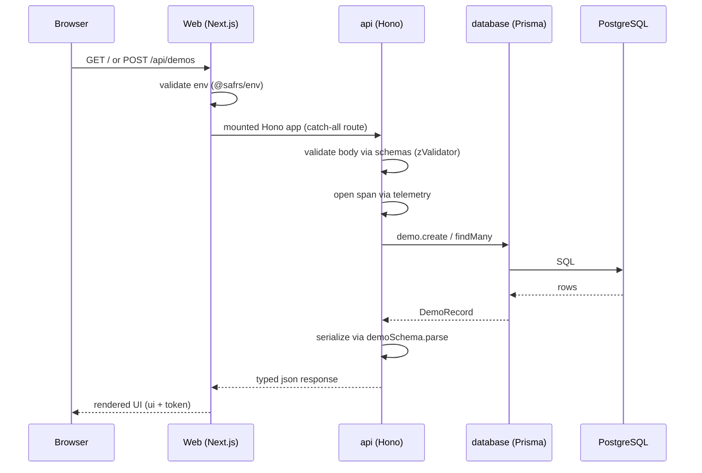

# Packages

The SAFRS Monorepo ships eight shared workspace packages under `packages/`. They are the reusable, product-neutral capabilities consumed by the golden-path application (`projects/golden-path/apps/web`) and by future projects. Each package follows the same baseline: TypeScript strict, Biome for linting, Vitest for testing, and the shared tsconfig base from `@safrs/config`.

## Purpose

This index maps every package, what it owns, and how the pieces connect into the typed Database → API → Web flow. It is the navigation hub for all package-specific pages; each package page below describes its own contracts, source files, and integration points in detail.

## The eight packages

| Package | Directory | Owns |
| --- | --- | --- |
| `@safrs/schemas` | `packages/schemas` | Zod contracts shared by API and web |
| `@safrs/env` | `packages/env` | Server and client environment validation |
| `@safrs/database` | `packages/database` | Prisma schema, migrations, seed, reset guard, generated client |
| `@safrs/api` | `packages/api` | Hono routes, typed RPC client, error envelopes, OpenAPI |
| `@safrs/ui` | `packages/ui` | Reusable presentation primitives (e.g. `StatusCard`) |
| `@safrs/telemetry` | `packages/telemetry` | OpenTelemetry instrumentation |
| `@sentra/token` | `packages/token` | Sentra design tokens, the only raw-colour source |
| `@safrs/config` | `packages/config` | Shared tsconfig presets |

## Key source files

| File | Role |
| --- | --- |
| `packages/README.md` | One-line description of every package |
| `packages/config/tsconfig/base.json` | Shared TypeScript strict base for all packages |
| `packages/database/prisma/schema.prisma` | Source of the Prisma data model |
| `packages/api/src/app.ts` | The Hono app (`AppType`), the single typed API surface |

## Package relationships

Every package depends on `@safrs/config` for its tsconfig preset. `@safrs/schemas` owns the Zod contracts that both the API and the web app consume. `@sentra/token` is the only package allowed to contain raw colour values, and it is consumed by `@safrs/ui` and the web app.

## How the packages connect

The Hono API is mounted inside Next.js through a catch-all route at `projects/golden-path/apps/web/src/app/api/[[...route]]/route.ts`. The browser never imports Prisma or `DATABASE_URL`; it only consumes the typed RPC client from `@safrs/api`. This keeps `@safrs/env`/`@safrs/database` server-only while `@safrs/api` provides compile-time drift detection between frontend and backend.

## Integration points

- **Schemas → API**: `@safrs/api` imports `createDemoInputSchema`, `demoSchema`, and `apiErrorSchema` from `@safrs/schemas` to validate requests, serialize responses, and shape errors (`packages/api/src/app.ts`).
- **Schemas → OpenAPI**: `buildOpenApiDocument()` in `packages/api/src/openapi.ts` derives the OpenAPI 3.1 document from the same Zod schemas, so docs cannot drift from validation.
- **Env → Database**: `packages/database/src/client.ts` reads `serverEnv.DATABASE_URL` from `@safrs/env/server` to construct the Prisma client.
- **Env → Web**: `next.config.ts` imports `@safrs/env/server` for build-time validation; the browser imports `@safrs/env/client`.
- **Database → API → Telemetry**: the API resolves its store from `@safrs/database` and both the web layer and the API route spans through `@safrs/telemetry`.
- **Token → UI → Web**: `@safrs/ui`'s `StatusCard` is styled with semantic token classes, and the web app imports `@sentra/token` stylesheet in its root layout.
- **Config → all**: every package's `tsconfig.json` extends `@safrs/config/tsconfig/base.json` (and `nextjs.json` for the web app).

## Related pages

- [System architecture and data flow](../overview/architecture.md)
- [Sentra design token system and WCAG enforcement](../features/design-tokens.md)
- [Risk model, roles, and verification](../features/safrs-governance.md)
- [Coding patterns and conventions](../how-to-contribute/patterns-and-conventions.md)
