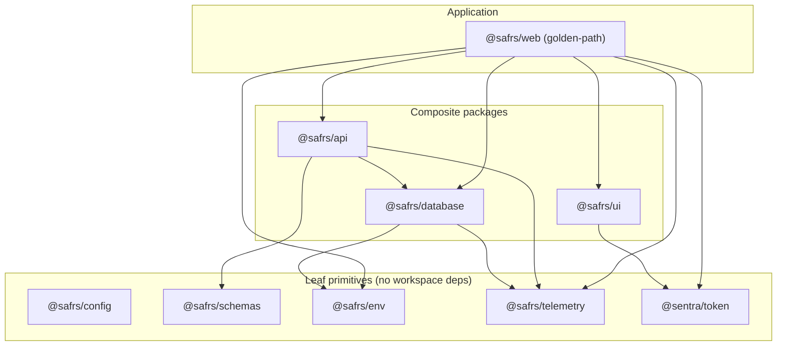
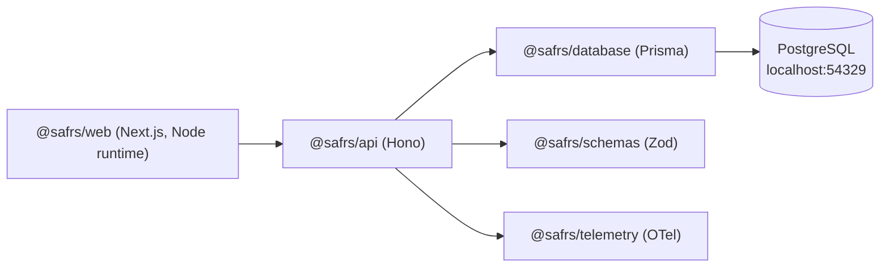

# Shared packages

## Purpose

`packages/<package>/` holds only reusable, product-neutral capabilities with a clear owner and real consumers. These are the shared boundaries that projects (and the golden-path application) build against. Because a change can affect multiple project capsules, every package change is at minimum R2 and requires designated review (see root `AGENTS.md`).

There are eight shared packages:

| Package | Directory | Role |
| --- | --- | --- |
| `@safrs/config` | `packages/config/` | Shared strict TypeScript `tsconfig` presets (`base.json`, `nextjs.json`) |
| `@safrs/schemas` | `packages/schemas/` | Zod contracts — the single source of truth for data shapes |
| `@safrs/env` | `packages/env/` | Runtime environment validation, split client vs server |
| `@safrs/telemetry` | `packages/telemetry/` | OpenTelemetry SDK init + Hono request middleware |
| `@sentra/token` | `packages/token/` | Sentra design tokens — the only place raw colour/radius values may appear |
| `@safrs/ui` | `packages/ui/` | React primitives built on the design tokens (`StatusCard`) |
| `@safrs/database` | `packages/database/` | Prisma + PostgreSQL client, reset guard, local seed |
| `@safrs/api` | `packages/api/` | Hono routes, typed RPC client, OpenAPI endpoint |

## Dependency graph

Packages are deliberately layered so the lower primitives carry no workspace dependencies:

The golden-path web app (`projects/golden-path/apps/web/package.json`) consumes `@safrs/api`, `@safrs/database`, `@safrs/env`, `@safrs/telemetry`, `@safrs/ui`, and `@sentra/token`. `@safrs/config` is a dev-only dependency used by every package's `typecheck`.

## Data flow

A request to the golden-path app flows through exactly one package-owned API boundary and one database boundary:

The browser only ever rides the public typed client from `@safrs/api/client`; Prisma and `DATABASE_URL` stay server-only. This is enforced by the boundary rules in each package's `AGENTS.md` and by the repository's `check_topology.py` gate.

## Integration points

- **Golden-path web app** (`projects/golden-path/apps/web`) is the primary consumer and the reference integration (see [the web app](../apps/golden-path-web.md)).
- **`@safrs/api`** is the single typed HTTP boundary exposed under `/api`; the OpenAPI document is generated from `@safrs/schemas` so validation and documentation cannot drift.
- **`@sentra/token`** is mandatory for all UI work — raw colour or radius values outside `packages/token/src/tokens.css` fail the governance gate (`node scripts/check-tokens.mjs`).
- **`@safrs/database`** owns the Prisma schema and migrations; destructive operations are guarded by the reset guard (`src/reset-guard.ts`) so only disposable local/test databases can be reset.

## Governance note

`packages/*/AGENTS.md` files declare each boundary's scope, safety rules, and exact commands. Shared schema, dependency, package, or architecture changes are R2; anything touching credentials, payment, healthcare-critical logic, or production execution is R3 and requires explicit human authorization.

## Related pages

- [Schemas](schemas.md) — Zod contracts
- [Environment](env.md) — validated env, client/server split
- [Database](database.md) — Prisma, reset guard, seed
- [API](api.md) — Hono, typed client, OpenAPI
- [UI](ui.md) — StatusCard primitive
- [Telemetry](telemetry.md) — OpenTelemetry instrumentation
- [Token](token.md) — design tokens and WCAG enforcement
- [Config](config.md) — shared tsconfig presets
- [Shared packages (root README)](../../packages/README.md)
- [Tools](../tools/index.md) — developer tooling that operates on these packages (e.g. `codegen`, `deps-graph`)
- [Architecture](../overview/architecture.md)
