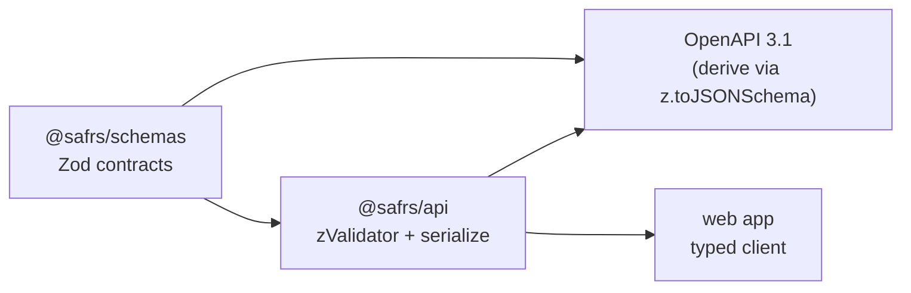

# @safrs/schemas

## Purpose

`@safrs/schemas` is the single source of truth for the API's Zod contracts. It defines the request input, the response payload, and the error envelope that both the Hono API and the web client share, so a change to a contract is caught by the type-checker everywhere it is used. Keeping Zod schemas here — rather than inside `@safrs/api` — avoids duplicating contracts across packages and lets the OpenAPI document be derived from the same source.

## Key source files

| File | Role |
| --- | --- |
| `packages/schemas/src/index.ts` | Barrel that re-exports the three schemas |
| `packages/schemas/src/demo.ts` | Defines `createDemoInputSchema`, `demoSchema`, `apiErrorSchema` |
| `packages/schemas/package.json` | Package manifest (Zod 4 dependency, lint/test/typecheck scripts) |

## The contracts

Defined in `packages/schemas/src/demo.ts` using Zod 4:

- **`createDemoInputSchema`** — request body for creating a demo. Example: `{ name: z.string().trim().min(1).max(80) }`.
- **`demoSchema`** — the serialized response shape. Example: `{ id: z.string().uuid(), name: z.string(), createdAt: z.string().datetime() }`.
- **`apiErrorSchema`** — the correlation-ID error envelope. Example: `{ code, message, correlationId, fieldErrors? }`.

Property-based tests using `fast-check` (with a deterministic seed) live alongside the schemas to verify Zod invariants, matching the testing patterns in [patterns-and-conventions](../how-to-contribute/patterns-and-conventions.md).

## Integration points

- **API validation**: `@safrs/api` feeds `createDemoInputSchema` to `@hono/zod-validator` in `packages/api/src/app.ts` and serializes responses through `demoSchema.parse()`.
- **Error envelope**: `packages/api/src/error.ts` builds every error with `apiErrorSchema.parse()`, producing `VALIDATION_ERROR` and `INTERNAL_ERROR` shapes.
- **OpenAPI**: `packages/api/src/openapi.ts` calls `z.toJSONSchema(...)` on these schemas to build the OpenAPI 3.1 document, guaranteeing docs stay in sync with validation.
- **Typed client**: the response type inferred from these schemas flows through `@safrs/api`'s `AppType` into the typed Hono RPC client (`hc<AppType>`), so the web app sees compile-time drift if a contract changes.

## Related pages

- [Hono API REST endpoints](../api/rest-endpoints.md)
- [@safrs/api](./api.md)
- [System architecture and data flow](../overview/architecture.md)
- [Coding patterns and conventions](../how-to-contribute/patterns-and-conventions.md)
