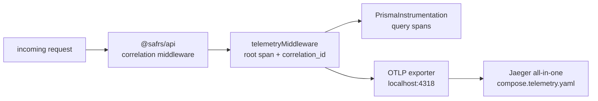

# Telemetry (`@safrs/telemetry`)

## Purpose

Shared OpenTelemetry instrumentation for the `Next.js → Hono → Prisma → PostgreSQL` chain. It initializes the Node SDK with an OTLP trace exporter, HTTP instrumentation, and Prisma query tracing, and it exposes a Hono middleware that opens a root span per request. The package is server-only — it must never be imported from browser code.

## Key source files

| File | Purpose |
| --- | --- |
| `packages/telemetry/src/index.ts` | Barrel: config loader, middleware, init/shutdown |
| `packages/telemetry/src/config.ts` | `loadTelemetryConfig` from env with safe defaults |
| `packages/telemetry/src/instrumentation.ts` | `initTelemetry` / `shutdownTelemetry` (Node SDK) |
| `packages/telemetry/src/hono-middleware.ts` | `telemetryMiddleware` — one root span per request |
| `packages/telemetry/package.json` | OpenTelemetry SDK, HTTP + Prisma instrumentation, Hono |

## Configuration

`loadTelemetryConfig(env, overrides)` resolves:

- `serviceName` — from `OTEL_SERVICE_NAME`, default `"safrs-app"`.
- `otlpEndpoint` — from `OTEL_EXPORTER_OTLP_ENDPOINT`, default `http://localhost:4318/v1/traces`.
- `disabled` — true when `OTEL_SDK_DISABLED` is `"1"` or `"true"`.

No credentials are accepted; the endpoint is a plain HTTP URL. The exporter is disabled unless `OTEL_SDK_DISABLED` is unset — production traffic is not routed to a collector without an approved R2 change.

## Instrumentation

`initTelemetry(config)` builds a `NodeSDK` (OTLP HTTP trace exporter, `HttpInstrumentation`, `PrismaInstrumentation`), calls `sdk.start()`, and caches the singleton. Repeated calls return the existing SDK; when disabled it returns `null` so callers can short-circuit. `shutdownTelemetry()` flushes and stops the SDK (for SIGTERM / server shutdown).

Rule: **`initTelemetry` must run before the app imports any instrumented path** (HTTP client/server, Prisma) — at the top of the Next.js `instrumentation.ts`.

## Hono middleware

`telemetryMiddleware()` starts a root span labelled `"METHOD /path"` with semantic-convention attributes for HTTP method, route, and full URL, then sets `safrs.correlation_id` from the Hono `Variables` (set by `@safrs/api`) so a request trace can be correlated with the error envelope. It records the response status and ends the span in a `finally`. **No payload data, credentials, or raw SQL parameter values are ever recorded** — spans carry only operation names and safe metadata.



## Integration points

- **`@safrs/api`** applies `telemetryMiddleware()` to every API route (`packages/api/src/app.ts`).
- **`@safrs/database`** records Prisma query spans via `PrismaInstrumentation` (`packages/database/src/client.ts`).
- **`@safrs/web`** initializes telemetry at startup and consumes the package server-side.
- **Local collector**: `docker compose -f compose.telemetry.yaml up -d jaeger` starts the Jaeger UI (localhost:16686).

## Verification

```bash
pnpm --filter @safrs/telemetry test
pnpm --filter @safrs/telemetry typecheck
pnpm --filter @safrs/telemetry lint
```

## Related pages

- [API](api.md) — applies the request middleware
- [Database](database.md) — Prisma query instrumentation
- [Shared packages](index.md)
