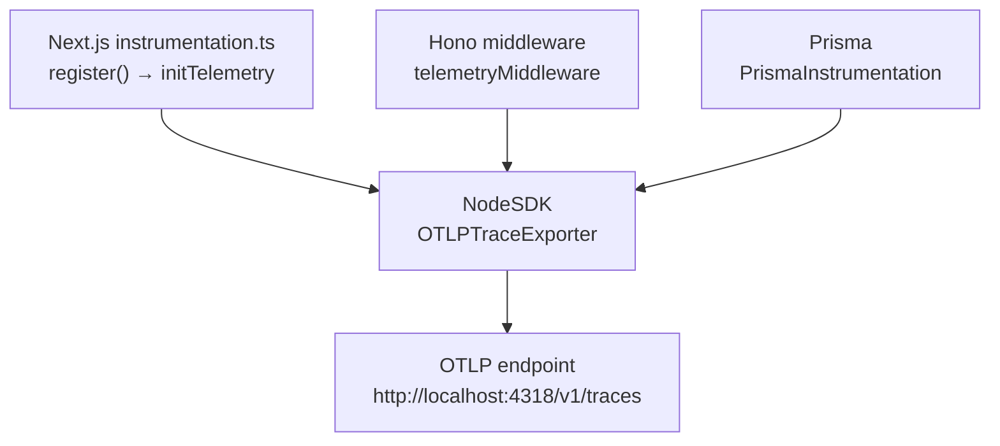

# @safrs/telemetry

## Purpose

`@safrs/telemetry` provides the shared OpenTelemetry instrumentation for the `Next.js → Hono → Prisma → PostgreSQL` chain. It initializes the Node SDK with an OTLP HTTP trace exporter, HTTP and Prisma auto-instrumentation, and exposes a Hono middleware that opens a root span per request. Tracing gives the whole request path a single correlatable timeline without coupling any caller to a specific collector.

## Key source files

| File | Role |
| --- | --- |
| `packages/telemetry/src/index.ts` | Barrel: exports config loader, middleware, init/shutdown |
| `packages/telemetry/src/config.ts` | `loadTelemetryConfig` (`TelemetryConfig`) |
| `packages/telemetry/src/instrumentation.ts` | `initTelemetry` / `shutdownTelemetry` (Node SDK) |
| `packages/telemetry/src/hono-middleware.ts` | `telemetryMiddleware` (root span per request) |
| `packages/telemetry/package.json` | Manifest with OpenTelemetry + Prisma instrumentation deps |
| `packages/telemetry/AGENTS.md` | Package policy (scope, rules, commands) |

## Configuration

`loadTelemetryConfig()` in `packages/telemetry/src/config.ts` reads environment variables with safe defaults:

| Field | Source | Default |
| --- | --- | --- |
| `serviceName` | `OTEL_SERVICE_NAME` | `safrs-app` |
| `otlpEndpoint` | `OTEL_EXPORTER_OTLP_ENDPOINT` | `http://localhost:4318/v1/traces` |
| `disabled` | `OTEL_SDK_DISABLED` (`1`/`true`) | `false` |

Overrides can be passed as a second argument. No credentials are accepted — the OTLP endpoint is a plain HTTP URL.

## Instrumentation

`initTelemetry()` in `packages/telemetry/src/instrumentation.ts` builds a `NodeSDK` with:

- `OTLPTraceExporter` exporting to `config.otlpEndpoint`.
- `HttpInstrumentation` (HTTP client/server).
- `PrismaInstrumentation` (Prisma query tracing).

It is idempotent (subsequent calls return the existing SDK) and returns `null` when disabled so callers can short-circuit. `shutdownTelemetry()` flushes and stops the SDK (used on server shutdown / `SIGTERM`).

`telemetryMiddleware()` in `packages/telemetry/src/hono-middleware.ts` starts a root span per request labelled with method and path, sets standard HTTP attributes (`ATTR_HTTP_REQUEST_METHOD`, `ATTR_HTTP_ROUTE`, `ATTR_URL_FULL`, `ATTR_HTTP_RESPONSE_STATUS_CODE`), and stores the `correlationId` as the `safrs.correlation_id` span attribute. No payload data, credentials, or PII is recorded.

## Integration points

- **Web boot**: `projects/golden-path/apps/web/src/instrumentation.ts` calls `loadTelemetryConfig()` then `initTelemetry()` in Next.js's `register()` hook — before any route or module is imported, so auto-instrumentation sees the whole chain.
- **API**: `packages/api/src/app.ts` applies `telemetryMiddleware()` after its correlation-ID middleware on every request.
- **Database**: `@prisma/instrumentation` traces queries made by `@safrs/database`.
- **Collector**: the local Jaeger collector starts via `docker compose -f compose.telemetry.yaml up -d jaeger` (default endpoint `http://localhost:4318/v1/traces`).
- **Config**: `@safrs/telemetry` extends `@safrs/config` presets. It is server-only; browser code must not import it.

## Related pages

- [@safrs/api](./api.md)
- [@safrs/database](./database.md)
- [System architecture and data flow](../overview/architecture.md)
- [Coding patterns and conventions](../how-to-contribute/patterns-and-conventions.md)
