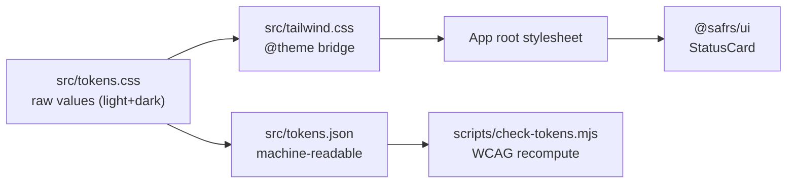

# @sentra/token

## Purpose

`@sentra/token` is the Sentra design-token package — the only place in the repository where a raw colour or radius value may appear. Every agent building UI (website, landing page, dashboard, email) must consume these tokens, and raw values anywhere else fail the governance gate. The package ships the token CSS, a machine-readable JSON mirror, a Tailwind v4 bridge, and self-hosted Geist fonts, with dark-theme values authored (never derived) and every contrast ratio measured against WCAG 2.2 AA.

## Key source files

| File | Role |
| --- | --- |
| `packages/token/src/tokens.css` | The only file with raw hex/radius values; light + dark themes |
| `packages/token/src/tokens.json` | Machine-readable mirror read by the contrast gate |
| `packages/token/src/tailwind.css` | Tailwind v4 `@theme inline` bridge (utilities from tokens) |
| `packages/token/src/fonts.ts` | `fontSans` / `fontMono` via `next/font/local` (self-hosted) |
| `packages/token/assets/fonts/` | Geist Sans + Geist Mono variable fonts (OFL) |
| `packages/token/AGENTS.md` | Package mandate and rules |
| `packages/token/UI-RULES.md` | Rules every agent reads before writing any UI |
| `packages/token/package.json` | Manifest; `test` runs `node ../../scripts/check-tokens.mjs` |

## Token structure

`packages/token/src/tokens.css` defines four layers:

1. **Primitives** (`--p-*`) — private raw values with measured contrast annotations. Never referenced directly by components.
2. **Semantic colour** (`--color-*`) — surfaces, text, line, chrome/accent, content/status, action, data ramp, focus ring. The only layer components may import.
3. **Typography / space / layout / shape / icons / interaction** — fonts, a 4px space scale, a 12-column grid, radius, motion, z-index, and a 44px minimum target.
4. **Dark theme** — a full `[data-theme="dark"]` block where every semantic token is re-authored and re-measured (never a filter over the light palette).

Consumption in an app's root stylesheet (see `packages/token/AGENTS.md`):

```css
@import "tailwindcss";
@import "@sentra/token/tokens.css";
@import "@sentra/token/tailwind.css";
```

## Enforcement

`node scripts/check-tokens.mjs` runs in the governance gate as `pnpm check:tokens`:

- Scans `.css`, `.ts`, `.tsx`, `.js`, `.jsx` files under `projects/`, `packages/`, and `tools/` for hex values and bare `border-radius` declarations, failing on anything not in `packages/token/src/tokens.css`.
- Recomputes WCAG 2.2 AA contrast from `packages/token/src/tokens.json`.

`packages/token/scope.txt` lists paths under this enforcement; paths are added when migrated and never removed. See [design tokens](../features/design-tokens.md). Changing a token value is an R2 change requiring re-measurement and designated review.

## Integration points

- **UI**: `@safrs/ui`'s `StatusCard` is styled with `status-card` classes backed by token variables.
- **Web app**: the golden-path web app imports `@sentra/token/tokens.css` + `tailwind.css` in its root layout and `fontSans`/`fontMono` from `@sentra/token/fonts` (requires `@sentra/token` in `next.config` `transpilePackages`).
- **Distribution**: `@sentra/token` re-exports `./tokens.css`, `./tokens.json`, `./tailwind.css`, and `./fonts` subpaths and has an optional `next` peer dependency.



## Related pages

- [Sentra design token system and WCAG enforcement](../features/design-tokens.md)
- [@safrs/ui](./ui.md)
- [Coding patterns and conventions](../how-to-contribute/patterns-and-conventions.md)
