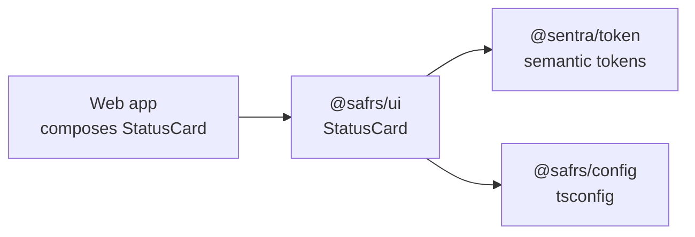

# @safrs/ui

## Purpose

`@safrs/ui` is the package of reusable presentation primitives shared across web surfaces. It keeps rendering components out of feature apps so composition stays consistent and design tokens are applied in one place. The current primitive is `StatusCard`, a semantic status panel that renders with token-driven classes and a state label.

## Key source files

| File | Role |
| --- | --- |
| `packages/ui/src/index.ts` | Barrel: exports `StatusCard` and `StatusCardState` |
| `packages/ui/src/status-card.tsx` | The `StatusCard` component |
| `packages/ui/package.json` | Manifest with React peer dependency and `@sentra/token` dependency |

## The component

**`StatusCard`** (`packages/ui/src/status-card.tsx`) renders an `<article className="status-card" data-state={state}>` with a heading (label + state badge) and a detail paragraph, plus optional children:

- **`state`**: `"ready"` or `"attention"`, rendered with Indonesian state labels (`Siap` / `Perlu perhatian`).
- **`label`**: the card's heading text.
- **`detail`**: the descriptive paragraph.
- **`children`**: optional extra content.

Styling is applied through `status-card` class names that map to Sentra design tokens. Following UI rules in `packages/token/UI-RULES.md`, no raw colour values appear in the component — they come from `@sentra/token`.

## Integration points

- **Token**: `@safrs/ui` depends on `@sentra/token` for semantic token classes (surfaces, status colours, shapes). See [design tokens](../features/design-tokens.md) and [@sentra/token](./token.md).
- **Web app**: the golden-path web app imports `@safrs/ui` and composes `StatusCard` on server-rendered pages along with `@sentra/token` styles loaded in the root layout.
- **Config**: `@safrs/ui` extends `@safrs/config` tsconfig presets and builds with `tsc` (`pnpm --filter @safrs/ui build`).
- **React peer**: React `^19.2.8` is a peer dependency; components are server-renderable.

## Related pages

- [Sentra design token system and WCAG enforcement](../features/design-tokens.md)
- [@sentra/token](./token.md)
- [@safrs/config](./config.md)
- [System architecture and data flow](../overview/architecture.md)
