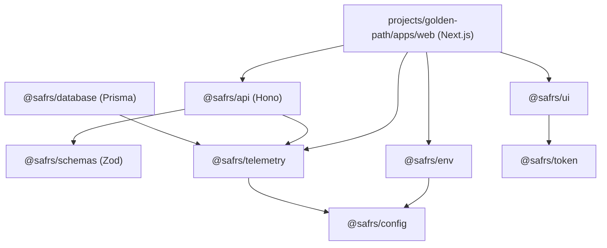

# Dependencies reference

This page documents the external dependency landscape: the central catalog, key pinned versions, and how packages relate.

## The version catalog

`pnpm-workspace.yaml` centralizes every dependency version in a `catalog:` block. Workspace members reference catalog entries with `catalog:` so the whole repo resolves against one version of each dependency. The catalog is the single source of truth for versions.

## Key dependencies and versions

| Dependency | Catalog version |
| --- | --- |
| `next` | 16.2.12 |
| `hono` | 4.13.1 |
| `zod` | 4.4.3 |
| `@hono/zod-validator` | 0.9.0 |
| `prisma` / `@prisma/client` | 7.9.1 |
| `@prisma/adapter-pg` | 7.9.1 |
| `@prisma/instrumentation` | 7.9.1 |
| `pg` | 8.16.3 |
| `typescript` | 7.0.2 |
| `turbo` | 2.10.9 |
| `vitest` | 4.1.10 |
| `@vitest/coverage-v8` | 4.1.10 |
| `@playwright/test` / `playwright` | 1.62.1 |
| `@biomejs/biome` | 2.5.7 |
| `react` / `react-dom` | 19.2.8 |
| `tailwindcss` | 4.3.3 |
| `@tailwindcss/postcss` | 4.3.3 |
| `@t3-oss/env-core` | 0.13.8 |
| `@t3-oss/env-nextjs` | 0.13.8 |
| `stripe` | 22.5.0 |
| `resend` | 6.19.0 |
| `react-email` | 6.9.2 |
| `@react-email/components` | 1.0.12 |
| `@react-email/ui` | 6.9.2 |
| `@faker-js/faker` | 10.5.0 |
| `fast-check` | 4.9.0 |
| `husky` | 9.1.7 |

### OpenTelemetry (telemetry)

| Dependency | Catalog version |
| --- | --- |
| `@opentelemetry/api` | 1.9.1 |
| `@opentelemetry/sdk-node` | 0.221.0 |
| `@opentelemetry/exporter-trace-otlp-http` | 0.221.0 |
| `@opentelemetry/instrumentation-http` | 0.221.0 |
| `@opentelemetry/resources` | 2.10.0 |
| `@opentelemetry/semantic-conventions` | 1.30.0 |

## Dependency relationships between packages

- **`projects/golden-path/apps/web`** is the deployable unit. It mounts `@safrs/api`, and uses `@safrs/env`, `@safrs/ui`, and `@safrs/telemetry`.
- **`@safrs/api`** owns the typed Hono API; it consumes `@safrs/schemas` for Zod contracts, applies `@safrs/telemetry` middleware, and talks to `@safrs/database`.
- **`@safrs/database`** wraps Prisma + PostgreSQL and depends on `@safrs/env` and `@safrs/telemetry`. It does **not** depend on `@safrs/schemas`.
- **`@safrs/env`** validates environment with `@t3-oss/env-core`/`@t3-oss/env-nextjs` and extends `@safrs/config` presets.
- **`@safrs/telemetry`** extends the `@safrs/config` presets and stays server-only.
- **`@safrs/ui`** is built on the `@safrs/token` design tokens.
- The **`tools/*`** packages (doctor, project-wizard, capabilities, codegen, deps-graph, safrs) are mostly standalone, with codegen depending on Zod via the catalog.

## Supply-chain posture

Root scripts include a supply-chain gate (`pnpm check:security` → `scripts/check-supply-chain.mjs`) that runs `pnpm audit` (and optional OSV scanner) and fails on high/critical advisories. `pnpm-workspace.yaml` restricts `allowBuilds` to a trusted allowlist and enforces a minimum release age. Dependency/lockfile changes are classified R2.

## Related pages

- [Configuration](configuration.md)
- [Reference overview](index.md)
- [Security](../security.md)
