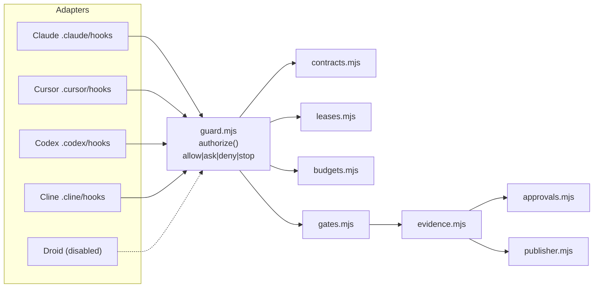

# SAFRS Automation Control Plane

## Purpose

`tools/automation/` is the dependency-free (Node built-ins only) implementation of the SAFRS automation control plane introduced in ADR 0002. It owns the canonical JSON contract encoding, monotonic risk computation, scope safety, the shared vendor-neutral policy guard, lease event chains, budget ledgers, the eight PR gates, evidence manifests, approval verification, and the restricted publisher. Every module fails closed: input policy cannot fully resolve is rejected, never guessed at.

The package is a **verification control** (classified in `.safrs/sensitive-paths.json`); every change is at least R2 and requires designated review. Canonical JSON and digest semantics are governed to stay byte-identical across Node and Python, Windows and Linux, with drift failing governance.

## Key source files

| File | Purpose |
| --- | --- |
| `tools/automation/src/canonical-json.mjs` | Deterministic canonical JSON serialization + SHA-256 digest |
| `tools/automation/src/contracts.mjs` | Schema loader, JSON Schema 2020-12 validator, task-contract compiler |
| `tools/automation/src/risk.mjs` | Monotonic risk computation (`effective = max(declared, dimensions)`) |
| `tools/automation/src/scopes.mjs` | Repository-relative scope normalization and overlap detection |
| `tools/automation/src/guard.mjs` | Shared vendor-neutral guard (`authorize`) |
| `tools/automation/src/leases.mjs` | Lease event chains, fencing tokens, verification, replay, reconciliation |
| `tools/automation/src/budgets.mjs` | Atomic task-wide budget ledger with circuit breaker |
| `tools/automation/src/gates.mjs` | The eight stable PR gate verdicts |
| `tools/automation/src/approvals.mjs` | Content-bound approval verification, no self-review |
| `tools/automation/src/evidence.mjs` | Evidence manifest build, redact, finalize, verify |
| `tools/automation/src/publisher.mjs` | Publication eligibility (`enable_auto_merge` only) |
| `tools/automation/src/redaction.mjs` | Deterministic evidence redaction |
| `tools/automation/src/cli.mjs` | `publish`-agnostic `saf` command-line entry point (`pnpm saf`) |
| `tools/automation/src/adapters/claude.mjs`, `cline.mjs`, `codex.mjs`, `cursor.mjs`, `droid.mjs` | Native hook payload → guard event translators |
| `tools/automation/AGENTS.md` | Package boundary rules and local verification commands |
| `tools/automation/package.json` | Package metadata; zero runtime dependencies |
| `.safrs/automation-policy.json` | Machine policy: operations, budgets, approvals, verification profile |
| `.safrs/adapter-capabilities.json` | Per-adapter activation and hook-capability manifest |
| `.safrs/schemas/*.v1.schema.json` | Seven JSON Schema 2020-12 contract documents |
| `.github/workflows/safrs-pr-gates.yml` | Runs the eight gates as a matrix |
| `.github/workflows/safrs-task-control.yml` | Serialized remote lease authority |
| `.github/workflows/safrs-publish.yml` | Publication eligibility evaluation |

## How it works

### Canonical JSON

`tools/automation/src/canonical-json.mjs` serializes values deterministically: UTF-8, lexicographically sorted object keys (code-unit order), preserved array order, no insignificant whitespace, safe integers only. Non-JSON-friendly values fail closed rather than being silently coerced (which would fork digests). `digestCanonical(value)` returns the content-addressed SHA-256; `writeForm(value)` is the stored-file form with exactly one trailing newline. Digests must be byte-identical with the Python mirror in `tools/safrs/check_task_contract.py`.

### Contracts

`tools/automation/src/contracts.mjs` loads all schemas from `.safrs/schemas/` plus the policy, tool inventory, and sensitive-path files, and provides a dependency-free validator for the JSON Schema 2020-12 subset they use. `compileTaskContract(input, context)` is the compiler: it deep-scans requester-controlled strings for secret-like content, normalizes and cross-checks scopes, verifies tool grants against `tool-inventory` allowlists, maps network grants to registered tool endpoints (HTTPS 443 only), requires every policy budget dimension, prevents approval-policy and verification-profile downgrades, classifies path/data/capability risk, and rejects any `computed_risk`/`effective_risk` below the computed value. The resulting contract is validated against `task-contract.v1.schema.json` and sealed with `contract_digest`.

The seven JSON Schema documents in `.safrs/schemas/` define the contract family:

| Contract | Schema | Role |
| --- | --- | --- |
| Task | `task-contract.v1.schema.json` | Scope, risk, operations, tools, network, budgets, approvals, rollback |
| Run | `run-contract.v1.schema.json` | One execution attempt bound to a contract and lease |
| Operation | `operation-contract.v1.schema.json` | Deterministic R3-preparatory operation with rollback contract |
| Lease | `lease-event.v1.schema.json` | Append-only chain event with fencing token |
| Approval | `approval-record.v1.schema.json` | Content-bound, time-limited reviewer approval |
| Evidence | `evidence-manifest.v1.schema.json` | Sealed, redacted lifecycle record |
| Platform | `platform-attestation.v1.schema.json` | Auditor attestation of remote platform controls |

### Monotonic risk

`tools/automation/src/risk.mjs` computes `effective_risk = max(declared, path, operation, data, capability, actual_diff)`. Risk can be raised, never lowered. Every contributed dimension — including R0 — must carry a non-empty reason so escalation is auditable. `compareRisk` and `maxRisk` are shared by gates, the compiler, and the publisher.

### Scopes

`tools/automation/src/scopes.mjs` normalizes repository-relative scopes: POSIX prefixes, trailing `/` marks a directory scope, case-insensitive matching (Windows filesystems are), and rejects absolute paths, wildcards, negations, and `..` escapes. `scopesOverlap` and `detectCaseCollisions` back the contract compiler and the `tools/task` ownership checks.

### Shared guard (vendor-neutral)

`tools/automation/src/guard.mjs` exposes `authorize(event, context)` returning a canonical `allow | ask | deny | stop` verdict with a reason code. Command rules block force-push, credential access and mention, destructive database commands (ask), and unrestricted-autonomy flags. Read and write events are checked for credential paths and (for writes) contracted write scopes and sensitive/verification-control paths, which are flagged as minimum-R2. The same verdicts are produced for every adapter.

### Leases (fencing tokens, event chains)

`tools/automation/src/leases.mjs` implements the LeaseEventV1 chain. The authority decision (`nextEvent`) runs only in the serialized remote workflow; it returns `{event}` on grant or `{denied}` otherwise. Fencing tokens increment only on successful `CLAIM`/`RECLAIM`; a writer holding an older token must stop before mutating or pushing. `verifyEventChain` checks digest, sequence, and token continuity; `replayState` reconstructs current state; `reconcileLease` is the local pre-push/pre-mutation gate that treats absence of remote confirmation as a stop.

### Budgets

`tools/automation/src/budgets.mjs` is an atomic task-wide ledger. Counters are shared across attempts and child agents; children inherit remaining budget and can never reset counters. Exhaustion or an explicit breaker trips the task into a stopped state that only recovery may clear. The file-backed wrapper uses the same `wx`-lock pattern as the task registry.

### Gates (8 PR gates)

`tools/automation/src/gates.mjs` defines the eight stable, individually named gates: `safrs.contract`, `safrs.lease`, `safrs.risk`, `safrs.budgets`, `safrs.verification`, `safrs.review`, `safrs.evidence`, `safrs.platform`. Each validates the artifacts present in the change set and reports `PASS`/`FAIL`/`not_applicable`. When artifacts are absent (for example, a human PR carries no run evidence) a gate reports `not_applicable` and passes; when artifacts exist but are invalid or inconsistent, the gate fails closed. The artifact-producing phases turn today's `not_applicable` gates into enforcing ones with no change here.

### Approvals (content-bound, no self-review)

`tools/automation/src/approvals.mjs` treats an approval as data bound to exact content, never a standing permission: task, contract digest, subject SHA, diff digest, reviewer authority, and expiry must all still match at the moment of use. Every failure path returns invalid — there is no "probably fine". R2 kinds require a diff-digest binding; R3 execution requires operation digest, target environment, and idempotency key. Self-review (reviewer equals author, or reviewer authored the change) is never a qualifying approval. `normalizeGitHubReview` turns current approving non-dismissed reviews on the exact head into R2 candidates.

### Evidence (redacted, content-addressed)

`tools/automation/src/evidence.mjs` assembles, redacts, hashes, and verifies EvidenceManifestV1. A manifest is finalized exactly once: redaction runs first, then the content-addressed digest is computed over the canonical body. Finalization refuses to emit a manifest that still contains secret-shaped content — evidence failure is operational failure. `verifyManifest` checks required fields, digest integrity, and absence of secret-shaped content. `correlationKeys` gives an auditor the key set to replay a lifecycle.

### Redaction

`tools/automation/src/redaction.mjs` provides deterministic redaction: same input, same output, always, because the redacted text is what gets hashed. Rules cover tokens, secret-name assignments, URL credentials, and private keys. `REDACTION_VERSION` bumps when rules change so old evidence stays interpretable; `containsSecret` detects secret-shaped content even inside already-redacted text.

### Publisher (enable_auto_merge only)

`tools/automation/src/publisher.mjs` decides publication eligibility. The publisher identity may do exactly one thing: request GitHub auto-merge for an exact, fully verified head. `evaluatePublication` never returns a merge action, only `enable_auto_merge`; it cannot merge, push, approve, bypass rules, or deploy. It requires every one of the eight gates to PASS, an exact-head and diff-digest match, a fresh platform attestation, a qualifying approval for R2/R3, and refuses to publish any R3 *execution* evidence.

### CLI usage

`tools/automation/src/cli.mjs` exposes `pnpm saf`:

```
pnpm saf contract compile <input.json> [--write <output.json>]
pnpm saf lease verify <events.ndjson>
pnpm saf lease replay <events.ndjson>
pnpm saf lease reconcile <events.ndjson> <local.json>
pnpm saf lease authority-apply   (workflow only, env-driven)
pnpm saf gate <gate-id|--all>
pnpm saf evidence verify <manifest.json>
pnpm saf publish evaluate <pull-request.json> <evidence.json> [platform.json]
```

The `gate` and `authority-apply` commands write to `GITHUB_STEP_SUMMARY` when present, and the control directory (contracts, budget ledger, lease ledger) resolves under `git-common-dir/safrs-control-plane`.

### Adapter parity

`tools/automation/src/adapters/` contains one translator per agent: `claude.mjs`, `cline.mjs`, `codex.mjs`, `cursor.mjs`, `droid.mjs`. Each maps a native hook payload to guard events (`{type: "command"|"read"|"write"}`) and renders a verdict back to the native protocol. Canonical verdicts are identical across adapters; an adapter without an "ask" channel renders ask as deny (fail closed), and one without any enforceable pre-action hook must stay read-only. Per `.safrs/adapter-capabilities.json`, Droid is `read_only_disabled` pending Activation Decision 4 because it exposes no enforceable pre-action hook.



## Integration points

- **Agent adapters** wire the shared guard into Claude, Cursor, Codex, and Cline pre-action hooks (see [Adapter parity](#adapter-parity)).
- **CI workflows** drive it: `.github/workflows/safrs-pr-gates.yml` runs all eight gates as a matrix; `.github/workflows/safrs-task-control.yml` is the serialized remote lease authority; `.github/workflows/safrs-publish.yml` evaluates publication eligibility.
- **Python governance mirror** in `tools/safrs/check_task_contract.py` and `check_automation_policy.py` must stay byte-identical with the Node canon (see [Automation](automation.md) verification commands in `tools/automation/AGENTS.md`).
- **Status and task CLIs** reuse the lease and control-plane primitives from this package — see [tools/status](status.md) and [tools/task](task.md).
- **Governance checkers** in `tools/safrs/` and tests in `tests/architecture/`, `tests/governance/`, and `tests/repository/` enforce the automation contracts.

## Verification

```bash
node --test tools/automation/test/canonical-json.test.mjs tools/automation/test/scopes.test.mjs tools/automation/test/risk.test.mjs tools/automation/test/contracts.test.mjs
python tools/safrs/check_automation_policy.py
python tools/safrs/check_task_contract.py
python tests/governance/test_automation_contracts.py
```

## Related pages

- [Automation control plane (features)](../features/automation-control-plane.md) — end-to-end lifecycle
- [Architecture](../overview/architecture.md) — control plane in the six-layer model
- [Task CLI](task.md) — claim, state, close, list
- [Status CLI](status.md) — registry, lease, and git summary
- [SAFRS governance](../features/safrs-governance.md) — risk model, roles, verification
- [SAFRS governance checkers](safrs.md) — 16 Python checkers
- [Patterns and conventions](../how-to-contribute/patterns-and-conventions.md) — canonical JSON and monotonic risk
- [Security](../security.md) — trust boundaries and secret policy
